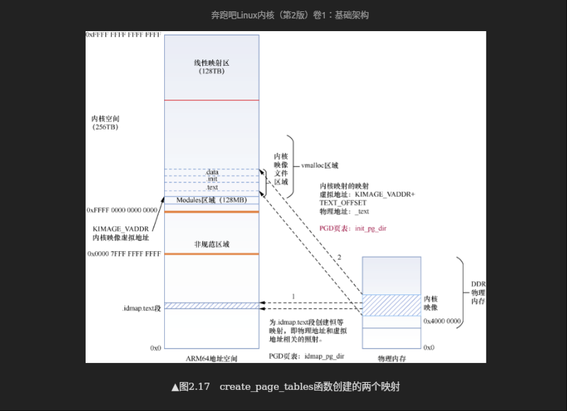
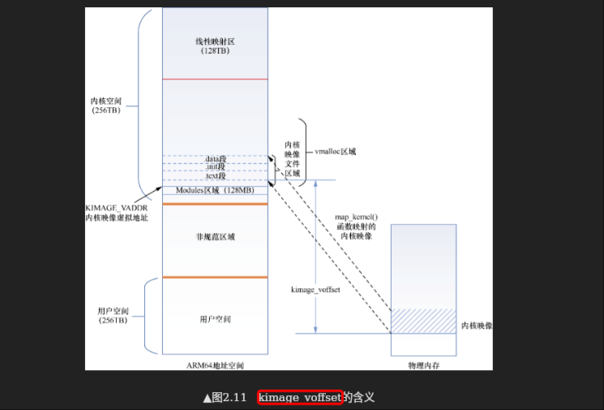

# 内核符号arm64
|符号名称|含义|值|定义|
|-|-|-|-|
|_text|内核镜像起始地址(虚拟地址)||arch/arm64/kernel/vmlinux.lds.S|
|_start|内核镜像开始地址(虚拟地址)||arch/arm64/kernel/vmlinux.lds.S|
|_end|内核镜像结束地址(虚拟地址)||arch/arm64/kernel/vmlinux.lds.S|
|__PHYS_OFFSET|物理内存的起始地址这个说法不对！！！adrp	x0, __PHYS_OFFSET 指令执行后，x0中存储的才是物理内存的起始地址，阅读:[000.SOURCE_CODE/000.LINUX-5.9/000.LINUX-5.9/arch/arm64/kernel/head.S.copy](../../../../../../000.SOURCE_CODE/000.LINUX-5.9/000.LINUX-5.9/arch/arm64/kernel/head.S.copy) kimage_voffset计算规则 即可理解|#define __PHYS_OFFSET	(KERNEL_START - TEXT_OFFSET)|arch/arm64/kernel/head.S|
|KERNEL_START||#define KERNEL_START		_text|arch/arm64/include/asm/memory.h|
|TEXT_OFFSET||TEXT_OFFSET := 0x0|arch/arm64/Makefile|
|init_pg_dir|内核页表基地址奔跑吧Linux内核（第2版）卷1·基础架构#2．创建内核映像的页表映射||arch/arm64/kernel/vmlinux.lds.S|
|init_pg_end|||arch/arm64/kernel/vmlinux.lds.S|
|idmap_pg_dir|恒等映射页表奔跑吧Linux内核（第2版）卷1·基础架构#2．创建内核映像的页表映射||arch/arm64/kernel/vmlinux.lds.S|
|__idmap_text_start|.idmap.text段的起始地址查看000.SOURCE_CODE/000.LINUX-5.9/000.LINUX-5.9/.tmp_System.map就可以知道这段区域有什么:汇编函数,如__enable_mmu||arch/arm64/kernel/vmlinux.lds.S|
|kimage_vaddr|内核镜像的虚拟地址|虚拟地址_text - 物理地址_text阅读:[000.SOURCE_CODE/000.LINUX-5.9/000.LINUX-5.9/arch/arm64/kernel/head.S.copy](../../../../../../000.SOURCE_CODE/000.LINUX-5.9/000.LINUX-5.9/arch/arm64/kernel/head.S.copy) kimage_voffset计算规则 即可理解|通过 vmlinux.lds.S发现,_text 与 (KIMAGE_VADDR + TEXT_OFFSET) 相等|
|KIMAGE_VADDR|内核镜像的虚拟地址|#define KIMAGE_VADDR		(MODULES_END)宏展开后,值: 0xFFFF800010000000|arch/arm64/include/asm/memory.h|
|kimage_voffset|内核映像虚拟地址和物理地址之间的偏移量|kimage_vaddr - __PHYS_OFFSET 从head.S 的 __primary_switched 分析得来|arch/arm64/kernel/head.S|
|swapper_pg_dir|内核页表的PGD页表基地址(虚拟地址)||arch/arm64/kernel/vmlinux.lds.S|

---

### 计算 kimage_voffset 
<pre>
kimage_voffset = kimage_vaddr - __PHYS_OFFSET   
               = _text - TEXT_OFFSET - (KERNEL_START - TEXT_OFFSET) 
               = _text - KERNEL_START 
               = _text - _text = 0 ? 
    绝对不可能!!!,但是问题出现在那里呢?

    问题出在 “__PHYS_OFFSET ” 这里,从 [000.SOURCE_CODE/000.LINUX-5.9/000.LINUX-5.9/arch/arm64/kernel/head.S.copy] 中发现,
    
    kimage_voffset = x4 - x0 , 这个x0寄存器存储值时的指令: adrp	x0, __PHYS_OFFSET , 这表示取的是标签 _text 所在物理页的基地址 (为什么?参考:[000.SOURCE_CODE/000.LINUX-5.9/000.LINUX-5.9/arch/arm64/kernel/head.S.copy] 宏: __primary_switched)
    
    而kimage_vaddr = _text - TEXT_OFFSET (head.S中定义)
    > 这里的 _text 表示虚拟地址 (为什么? 参考:[000.SOURCE_CODE/000.LINUX-5.9/000.LINUX-5.9/arch/arm64/kernel/head.S.copy] 宏: __primary_switched)
    
    所以，kimage_voffset = _text的虚拟地址 - _text的物理地址  = kimage_voffset就是内核起始(第一条指令)虚拟地址相对于内核起始(第一条指令)物理地址的偏移量
    > 所以，kimage_voffset 是一个偏移量，且他不等于0！

    _text = . = KIMAGE_VADDR + TEXT_OFFSET  (vmlinux.lds.S)

    更多内容，参考:[000.SOURCE_CODE/000.LINUX-5.9/000.LINUX-5.9/arch/arm64/kernel/head.S.copy] 宏: __primary_switched
</pre>

> 非常重要! 在 ARM64 Linux 内核启动过程中，**内核镜像可以被加载到物理内存的任意位置（KASLR）**，但编译时是基于一个固定的虚拟地址 ， 所以有时候为了处理这种情况(KASLR)，会设置TEXT_OFFSET的值,即设置后的TEXT_OFFSET则不为0

---

分析[arch/arm64/kernel/head.S](./head.S.copy)之后，在看如下的图，就很清晰了:
- 
- 