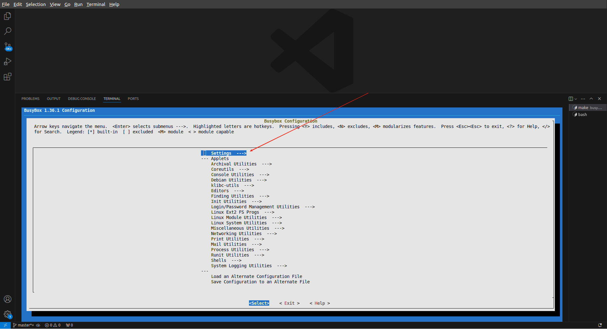
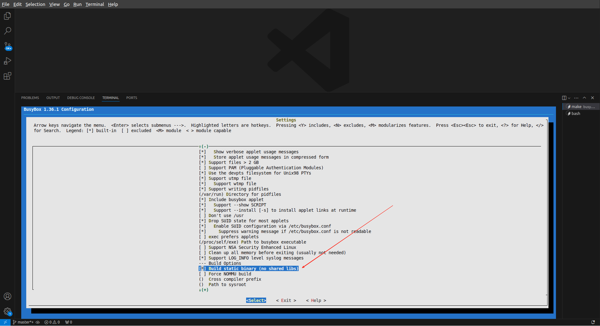

# 使用BusyBox制作最小文件系统
## 软件下载
```txt
   1. 下载busybox
      https://busybox.net/downloads/busybox-1.36.1.tar.bz2
```

## 制作最小文件系统
1. 进入 menuconfig
    ```shell
       wei@Berries-Wang:~/OPEN_SOURCE/Berries-Kernel/000.SOURCE_CODE/001.BUSYBOX/000.BUSYBOX-1.36.1$ cd BusyBox-1.36.1
    
       wei@Berries-Wang:~/OPEN_SOURCE/Berries-Kernel/000.SOURCE_CODE/001.BUSYBOX/000.BUSYBOX-1.36.1/BusyBox-1.36.1 export ARCH=arm
       wei@Berries-Wang:~/OPEN_SOURCE/Berries-Kernel/000.SOURCE_CODE/001.BUSYBOX/000.BUSYBOX-1.36.1/BusyBox-1.36.1 export CROSS_COMPILE=arm-linux-gnueabi-
       wei@Berries-Wang:~/OPEN_SOURCE/Berries-Kernel/000.SOURCE_CODE/001.BUSYBOX/000.BUSYBOX-1.36.1/BusyBox-1.36.1 make menuconfig
    ```

2. 会弹出一个框(menuconfig)，如下，选择 Settings 
  
  
3. 选择setting后，会跳到如下页面，选择 build BusyBox as a static binary (no shard libs) —— 配置为静态编译
  

4. 完成编译
   ```shell
      wei@Berries-Wang:~/OPEN_SOURCE/Berries-Kernel/000.SOURCE_CODE/001.BUSYBOX/000.BUSYBOX-1.36.1/BusyBox-1.36.1 make install 
   ```
5. 在busybox根目录下会有一个 _install 的目录,该文件是编译好的文件系统需要的一些命令集合
6. 把 _install 目录复制到内核文件目录的根目录下, 进入_install目录，先创建 etc , dev等目录
   ```shell
       wei@Berries-Wang:~/OPEN_SOURCE/Berries-Kernel/000.SOURCE_CODE/000.LINUX-5.9/000.LINUX-5.9/_install$ mkdir etc dev mnt 
       wei@Berries-Wang:~/OPEN_SOURCE/Berries-Kernel/000.SOURCE_CODE/000.LINUX-5.9/000.LINUX-5.9/_install$ mkdir -p etc/init.d/
   ```
7. 在_install/etc/init.d/ 目录下新创建一个rcS文件,并写入如下内容, 并赋予可执行权限
   ```txt
      mkdir -p /proc
      mkdir -p /tmp
      mkdir -p /sys
      mkdir -p /mnt
      /bin/mount -a
      mkdir -p /dev/pts
      mount -t devpts devpts /dev/pts
      echo /sbin/mdev > /proc/sys/kernel/hotplug
      mdev -s

      # 赋予可执行权限
      wei@Berries-Wang:~/OPEN_SOURCE/Berries-Kernel/000.SOURCE_CODE/000.LINUX-5.9/000.LINUX-5.9/_install/etc/init.d$ vim rcS
      wei@Berries-Wang:~/OPEN_SOURCE/Berries-Kernel/000.SOURCE_CODE/000.LINUX-5.9/000.LINUX-5.9/_install/etc/init.d$ chmod +x rcS
   ```
8. 在_install/etc 新建文件fstab文件，并写入如下内容
   ```txt
      proc /proc proc defaults 0 0
      tmpfs /tmp tmpfs defaults 0 0
      sysfs /sys sysfs defaults 0 0
      tmpfs /dev tmpfs defaults 0 0
      debugfs /sys/kernel/debug debugfs defaults 0 0
   ```
9. 在_install /etc 目录新创建一个 inittab 文件，并写入如下内容
   ```txt
      ::sysinit:/etc/init.d/rcS
      ::respawn:-/bin/sh
      ::askfirst:-/bin/sh
      ::ctrlaltdel:/bin/umount -a –r   
   ```
10. 在_install/dev 目录下创建如下设备节点，需要 root 权限
    ```txt
       wei@Berries-Wang:~/OPEN_SOURCE/Berries-Kernel/000.SOURCE_CODE/000.LINUX-5.9/000.LINUX-5.9/_install/dev$ sudo mknod console c 5 1 
       wei@Berries-Wang:~/OPEN_SOURCE/Berries-Kernel/000.SOURCE_CODE/000.LINUX-5.9/000.LINUX-5.9/_install/dev$ sudo mknod null c 1 3 
    ```
