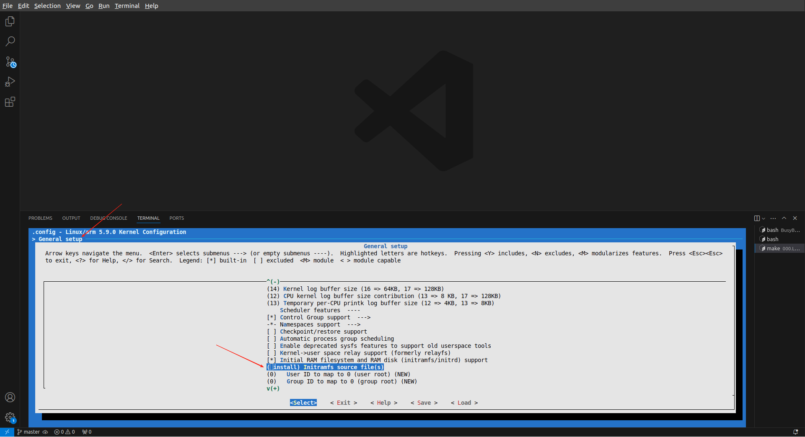
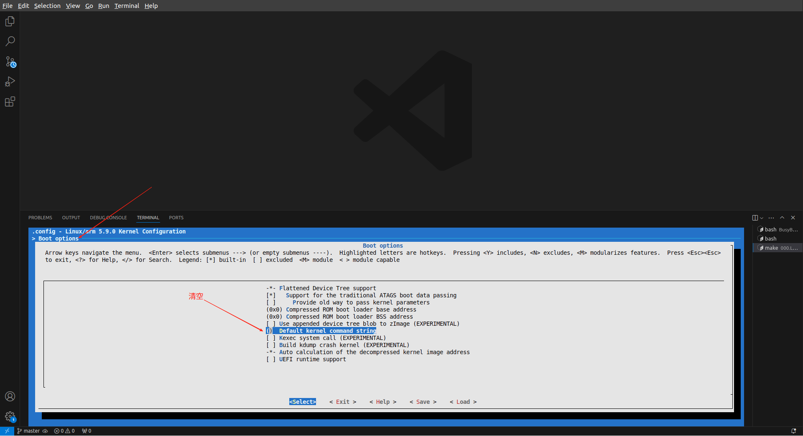
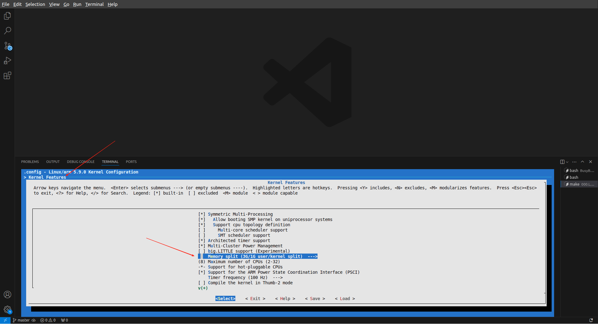
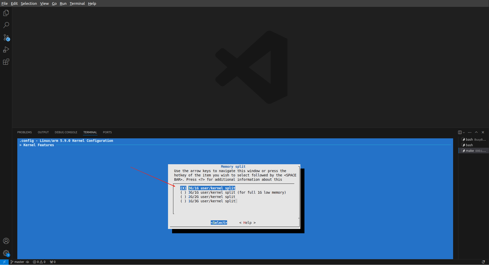

# 编译内核
基于[000.使用BusyBox制作最小文件系统](./000.使用BusyBox制作最小文件系统.md) , 开始编译内核

## 开始编译内核(32)<sub>内涵arm64操作逻辑</sub>
0. 将 [000.使用BusyBox制作最小文件系统](./000.使用BusyBox制作最小文件系统.md) 生成的_install 目录复制到内核文件的根目录下

1. 编译内核
   ```txt
    #1. 需要在内核文件目录
    wei@Berries-Wang:~/OPEN_SOURCE/Berries-Kernel/000.SOURCE_CODE/000.LINUX-5.9/000.LINUX-5.9$ export ARCH=arm  # arm64: export ARCH=arm64 
    wei@Berries-Wang:~/OPEN_SOURCE/Berries-Kernel/000.SOURCE_CODE/000.LINUX-5.9/000.LINUX-5.9$ export CROSS_COMPILE=arm-linux-gnueabi-  # arm64: export CROSS_COMPILE=aarch64-linux-gnu-
    wei@Berries-Wang:~/OPEN_SOURCE/Berries-Kernel/000.SOURCE_CODE/000.LINUX-5.9/000.LINUX-5.9$ make vexpress_defconfig # arm64 替换为 make ARCH=arm64 CROSS_COMPILE=aarch64-linux-gnu- defconfig
    wei@Berries-Wang:~/OPEN_SOURCE/Berries-Kernel/000.SOURCE_CODE/000.LINUX-5.9/000.LINUX-5.9$ make menuconfig // 执行之后，可以使用git diff对比一下，看看那些配置修改了 # arm64: make ARCH=arm64 CROSS_COMPILE=aarch64-linux-gnu-  menuconfig -j4
   ```

2. 配置 initramfs，在 initramfs source file 中填入_install，并把 Default kernel command string清空。
   - 
   - 

3. 配置 memory split 为“3G/1G user/kernel split”
   - 
   - 
4. 编译内核
   ```txt
      wei@Berries-Wang:~/OPEN_SOURCE/Berries-Kernel/000.SOURCE_CODE/000.LINUX-5.9/000.LINUX-5.9$ make bzImage ARCH=arm CROSS_COMPILE=arm-linux-gnueabi-  # arm64: make ARCH=arm64 CROSS_COMPILE=aarch64-linux-gnu- -j4
      wei@Berries-Wang:~/OPEN_SOURCE/Berries-Kernel/000.SOURCE_CODE/000.LINUX-5.9/000.LINUX-5.9$ make dtbs # arm64: 不需要这一步骤
   ```
5. 运行 QEMU 来模拟 4 核 Cortex-A9 的 Versatile Express 开发平台。
   ```txt
      sudo qemu-system-arm -M vexpress-a9 -smp 4 -m 1024M -kernel arch/arm/boot/zImage -append "rdinit=/linuxrc console=ttyAMA0 loglevel=8" -dtb arch/arm/boot/dts/vexpress-v2p-ca9.dtb -nographic

      # 查询支持的CPU类型
      # wei@Berries-Wang:~$ qemu-system-aarch64 -M virt -cpu help

      # arm64
      sudo qemu-system-aarch64 -M virt -cpu cortex-a57 -smp 4 -m 1024M -kernel arch/arm64/boot/Image -append "rdinit=/linuxrc console=ttyAMA0 loglevel=8"  -nographic
   ```
   - 输出日志如下
     ```txt
        drm-clcd-pl111 10020000.clcd: [drm] fb0: pl111drmfb frame buffer device
        ALSA device list:
          #0: ARM AC'97 Interface PL041 rev0 at 0x10004000, irq 24
        Freeing unused kernel memory: 2048K
        Run /linuxrc as init process
          with arguments:
            /linuxrc
          with environment:
            HOME=/
            TERM=linux
        mount: mounting debugfs on /sys/kernel/debug failed: No such file or directory
        /etc/init.d/rcS: line 8: can't create /proc/sys/kernel/hotplug: nonexistent directory
        input: ImExPS/2 Generic Explorer Mouse as /devices/platform/bus@4000000/bus@4000000:motherboard/bus@4000000:motherboard:iofpga@7,00000000/10007000.kmi/serio1/input/input2
        
        Please press Enter to activate this console. random: fast init done
        
        ~ # whoami
        whoami: unknown uid 0
        ~ # ls
     ```

##  问题
### 卡住
```txt
    1000c000.uart: ttyAMA3 at MMIO 0x1000c000 (irq = 32, base_baud = 0) is a PL011 rev1
    rtc-pl031 10017000.rtc: registered as rtc0
    rtc-pl031 10017000.rtc: setting system clock to 2024-12-15T10:59:25 UTC (1734260365)
    drm-clcd-pl111 1001f000.clcd: assigned reserved memory node vram@4c000000
    drm-clcd-pl111 1001f000.clcd: using device-specific reserved memory
    drm-clcd-pl111 1001f000.clcd: core tile graphics present
    drm-clcd-pl111 1001f000.clcd: this device will be deactivated
    drm-clcd-pl111 1001f000.clcd: Versatile Express init failed - -19
    drm-clcd-pl111 10020000.clcd: DVI muxed to daughterboard 1 (core tile) CLCD
    drm-clcd-pl111 10020000.clcd: initializing Versatile Express PL111
    drm-clcd-pl111 10020000.clcd: found bridge on endpoint 0
    drm-clcd-pl111 10020000.clcd: Using non-panel bridge
    input: AT Raw Set 2 keyboard as /devices/platform/bus@4000000/bus@4000000:motherboard/bus@4000000:motherboard:iofpga@7,00000000/10006000.kmi/serio0/input/input0
    [drm] Initialized pl111 1.0.0 20170317 for 10020000.clcd on minor 0
    Console: switching to colour frame buffer device 128x48
    drm-clcd-pl111 10020000.clcd: [drm] fb0: pl111drmfb frame buffer device
    ALSA device list:
      #0: ARM AC'97 Interface PL041 rev0 at 0x10004000, irq 24
    Warning: unable to open an initial console.   ## 注意
    Freeing unused kernel memory: 2048K
    Run /linuxrc as init process
      with arguments:
        /linuxrc
      with environment:
        HOME=/
        TERM=linux
    input: ImExPS/2 Generic Explorer Mouse as /devices/platform/bus@4000000/bus@4000000:motherboard/bus@4000000:motherboard:iofpga@7,00000000/10007000.kmi/serio1/input/input2
    random: fast init done  ## 注意 卡在这里了
    
    ## 解决方案
    1. 重新使用busybox构建文件系统

```

### 如何保留.i<sup>宏展开</sup> .S 文件
```shell
# 在Makefile文件中添加 KBUILD_CFLAGS += -save-temps ， 就可以将 .i (宏展开文件) .S 文件保存 ， 
# 注意，.h 不会生成。
```
