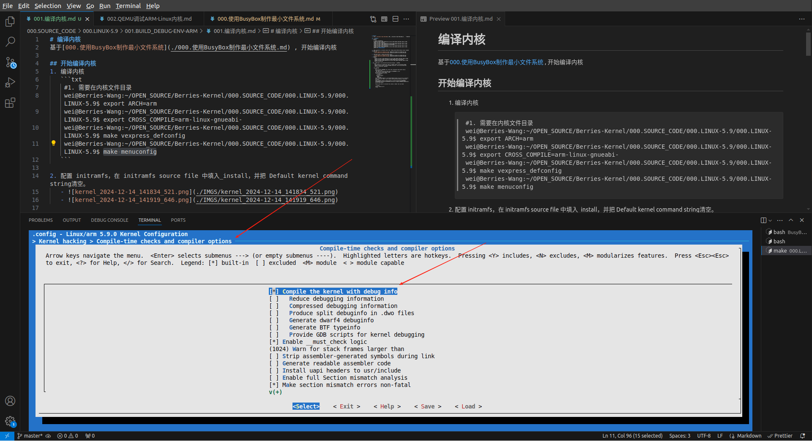
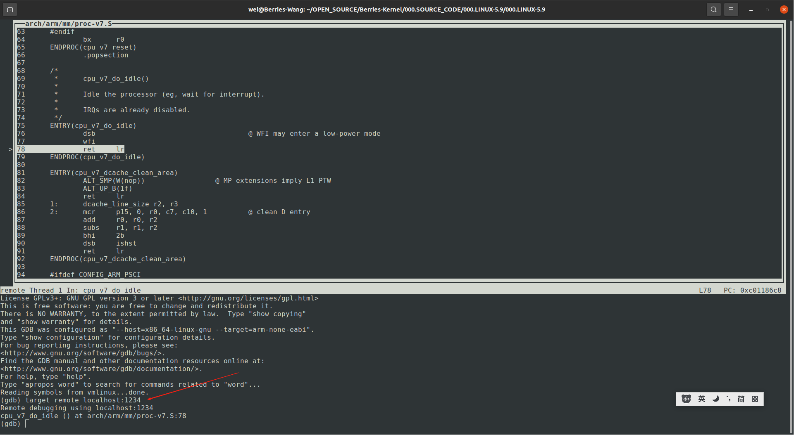
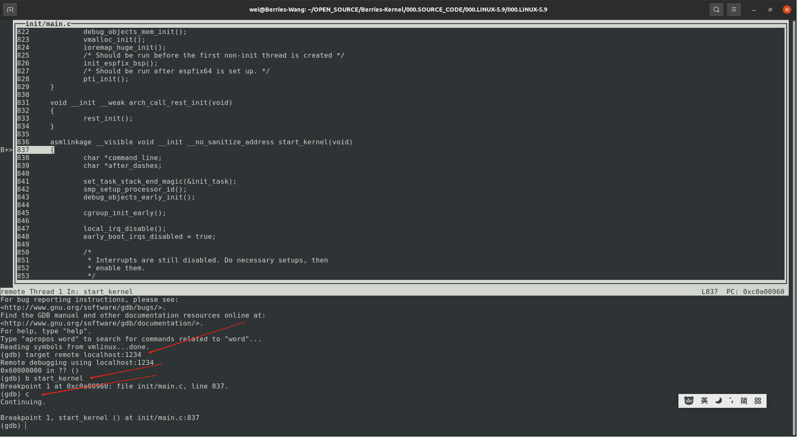

# QEMU 调试 ARM Linux 内核
基于[001.编译内核.md](./001.编译内核.md) , 开始调试内核

## 调试内核
1. 安装 ARM GDB 工具
   ```shell
      wei@Berries-Wang:~/OPEN_SOURCE/Berries-Kernel/000.SOURCE_CODE/000.LINUX-5.9/000.LINUX-5.9$ sudo apt-get install gdb-arm-none-eabi
   ```
2. 首先要确保编译的内核包含调试信息
   ```txt
     # a. 回到上一步，重新编译内核，并启动系统
   ```
   - 
3. 启动系统
   ```shell
      qemu-system-arm -nographic -M vexpress-a9 -m 1024M -kernel arch/arm/boot/zImage -append "rdinit=/linuxrc console=ttyAMA0 loglevel=8" -dtb arch/arm/boot/dts/vexpress-v2p-ca9.dtb -S -s

      -S：表示 QEMU 虚拟机会冻结 CPU，直到远程的 GDB 输入相应控制命令。
      -s：表示在 1234 端口接受 GDB 的调试连接。
   ```
4. 在另外一个超级终端中启动 ARM GDB
   ```shell
       wei@Berries-Wang:~/OPEN_SOURCE/Berries-Kernel/000.SOURCE_CODE/000.LINUX-5.9/000.LINUX-5.9$ arm-none-eabi-gdb --tui vmlinux
   ```
   
      + 通过1234端口远程连接到QEMU平台
   
5. 在内核的start_kernel处设置断点
    

6. 调试环境搭建完成
