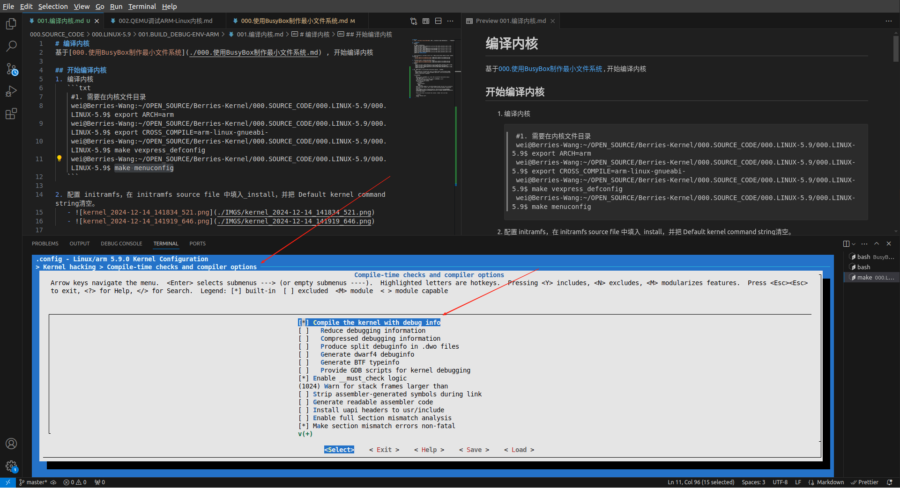
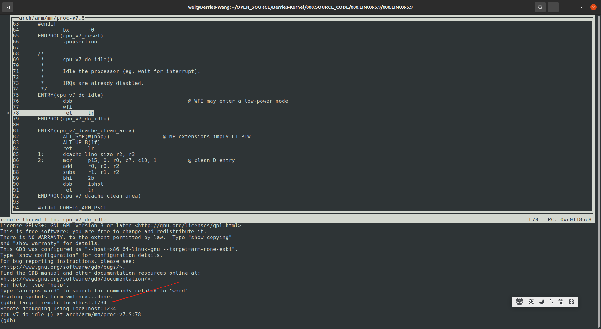
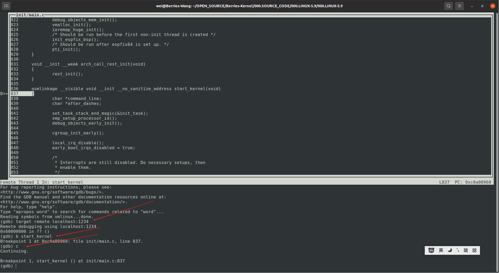

# QEMU 调试 ARM Linux 内核
基于[001.编译内核.md](./001.编译内核.md) , 开始调试内核

## 调试内核
1. 安装 ARM GDB 工具
   ```shell
      wei@Berries-Wang:~/OPEN_SOURCE/Berries-Kernel/000.SOURCE_CODE/000.LINUX-5.9/000.LINUX-5.9$ sudo apt-get install gdb-arm-none-eabi
   ```
2. 首先要确保编译的内核包含调试信息
   ```txt
     # a. 回到上一步，重新编译内核，并启动系统

       在 defconfig 基础上,必须做 2 件事:

       1. 开启调试信息:CONFIG_DEBUG_INFO=y(没有它 gdb 的 p/ptype 全是空的)、CONFIG_DEBUG_KERNEL=y、CONFIG_GDB_SCRIPTS=y(启用 lx-* 辅助命令)
       2. 关闭 KASLR:CONFIG_RANDOMIZE_BASE=n —— 不关的话 vmlinux 的链接地址和运行时地址对不上,符号断点全失效,这是新手最容易卡住的坑。
       
       make ARCH=arm64 CROSS_COMPILE=aarch64-none-linux-gnu- defconfig
       make ARCH=arm64 CROSS_COMPILE=aarch64-none-linux-gnu- menuconfig   # 勾选下面几项
       # Kernel hacking → Compile-time checks → [*] Compile the kernel with debug info
       # Kernel hacking → [*] Kernel debugging
       # Kernel hacking → [*] Provide GDB scripts for kernel debugging
       # Boot options  → [ ] Randomize the address of the kernel image (KASLR)  ← 取消勾选
       make ARCH=arm64 CROSS_COMPILE=aarch64-none-linux-gnu- -j8
   ```
   - 
3. 启动系统
   ```shell
      sudo qemu-system-arm -nographic -M vexpress-a9 -m 1024M -kernel arch/arm/boot/zImage -append "rdinit=/linuxrc console=ttyAMA0 loglevel=8" -dtb arch/arm/boot/dts/vexpress-v2p-ca9.dtb -S -s

      -S：表示 QEMU 虚拟机会冻结 CPU，直到远程的 GDB 输入相应控制命令。
      -s：表示在 1234 端口接受 GDB 的调试连接。

      # arm64
      sudo qemu-system-aarch64 -M virt -cpu cortex-a57 -smp 4 -m 1024M -kernel arch/arm64/boot/Image -append "rdinit=/linuxrc console=ttyAMA0 loglevel=8 nokaslr"  -nographic -S -s

     # 断点失效情况
      内核开启了 CONFIG_RELOCATABLE（可重定位内核）(.config文件)且未加 nokaslr：
      - 可重定位内核会动态调整加载地址，若未禁用 ASLR（nokaslr），start_kernel 的实际地址与符号表地址不匹配，断点无效；
      - 解决方案：启动参数必须加 nokaslr。

   ```
4. 在另外一个超级终端中启动 ARM GDB
   ```shell
       wei@Berries-Wang:~/OPEN_SOURCE/Berries-Kernel/000.SOURCE_CODE/000.LINUX-5.9/000.LINUX-5.9$ arm-none-eabi-gdb --tui vmlinux 

       # arm64
      sudo apt install gdb-multiarch
      gdb-multiarch --tui vmlinux 
   ```
   
      + 通过1234端口远程连接到QEMU平台 (gdb-multiarch使用之前需要设置CPU架构: set architecture aarch64)
   
5. 在内核的start_kernel处设置断点
    

6. 调试环境搭建完成
