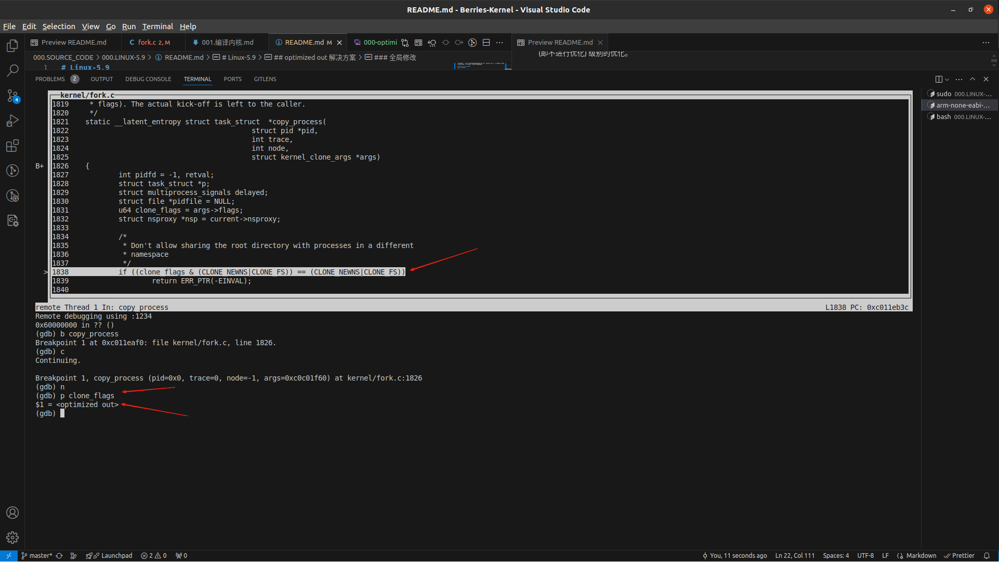
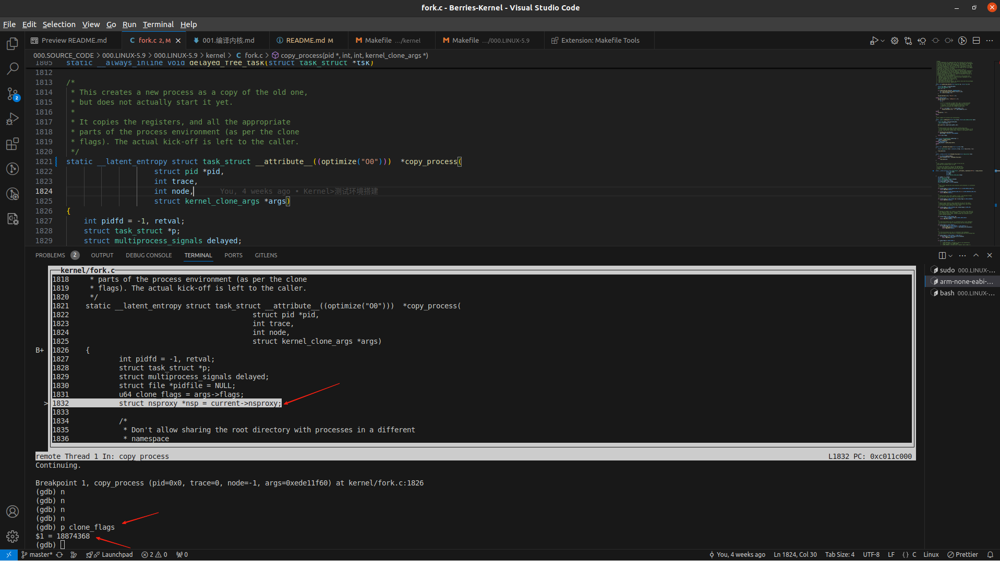

# Linux-5.9
本内核文件基于 GCC O2 级别优化编译（调试打印值会出现  'optimize out'） , 目前无法全局处理，使能如下方式对单个函数进行 O0 (即不进行优化) 级别的优化。

---

## 内核入口
> 传送门:[000.SOURCE_CODE/000.LINUX-5.9/000.LINUX-5.9/init/main.c#start_kernel](../000.LINUX-5.9/000.LINUX-5.9/init/main.c)

---

## optimized out 解决方案
### 单个函数优化
```c
// 添加编译优化修饰: __attribute__((optimize("O0"))) 
__attribute__((optimize("O0")))  static __latent_entropy struct task_struct  *copy_process(
					struct pid *pid,
					int trace,
					int node,
					struct kernel_clone_args *args)
```
##### 修改之前效果


##### 修改之后效果


---

### 全局修改
- [kernel hacking: GCC optimization for debug experience (-Og)](https://lwn.net/Articles/753201/)目前尚未研究出补丁应用方法

