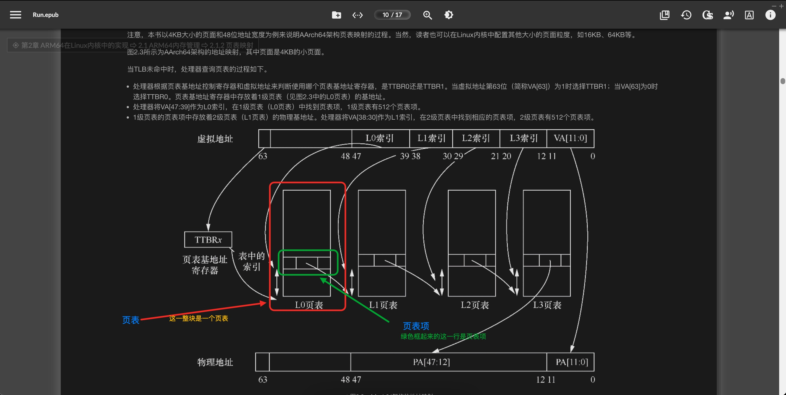
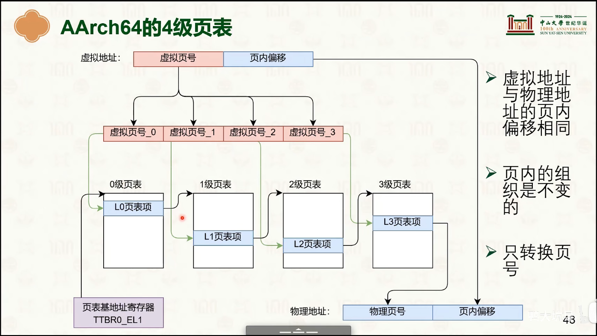
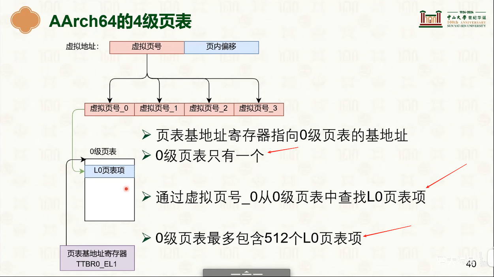
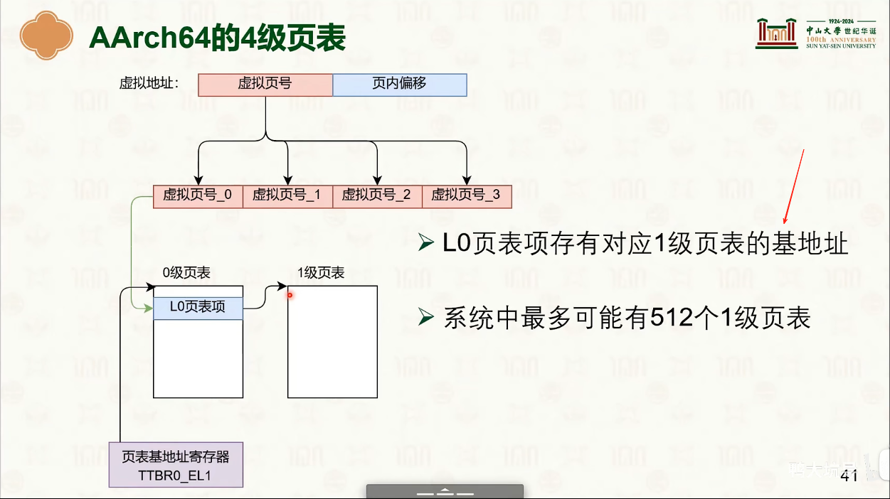
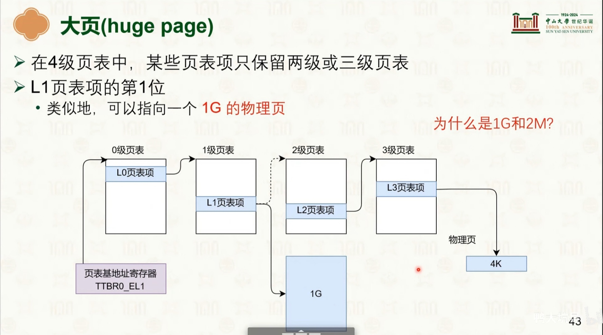
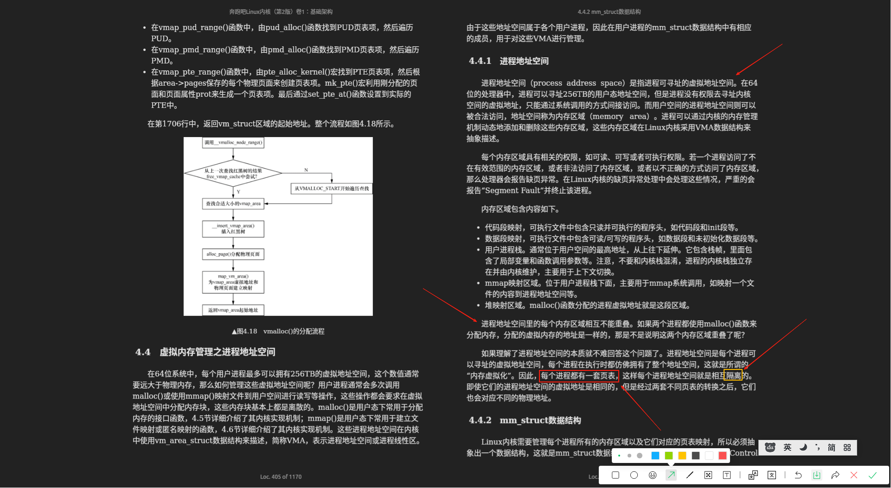
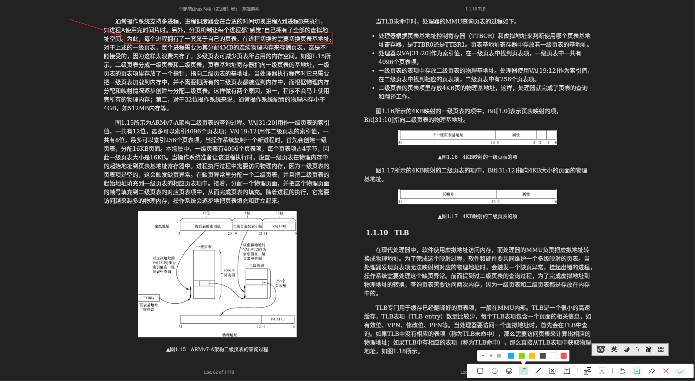
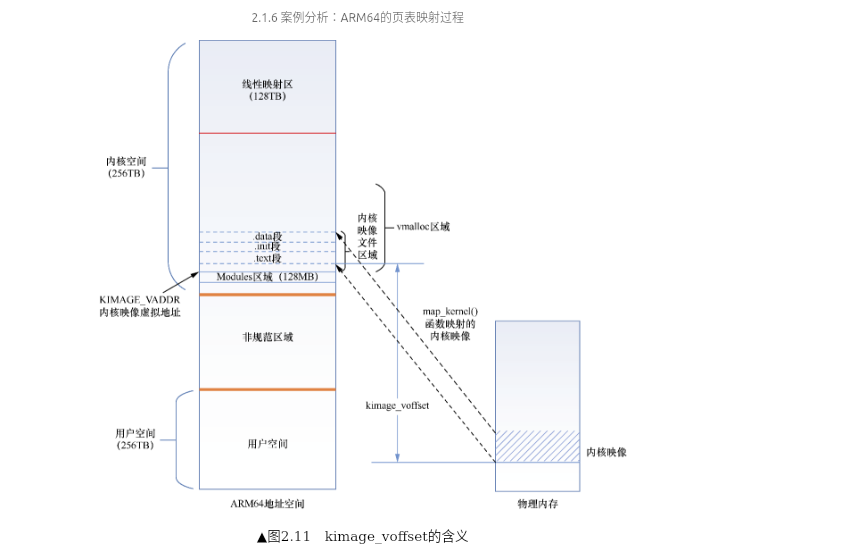

# arm64-内核中的页表
在 Linux 内核中，虚拟地址（Virtual Address, VA）到物理地址（Physical Address, PA）的映射是通过页表（Page Tables）机制实现的，整个过程涉及硬件（MMU/TLB）和软件（内核页表管理）的协同工作

结合[Run Linux Kernel (2nd Edition) Volume 1: Infrastructure.epub]#2.1　ARM64内存管理 来学习理解


## arm64的Linux内核的`4`级分页模型<sup>[Run Linux Kernel (2nd Edition) Volume 1: Infrastructure.epub]#2.1.4　Linux内核中的页表</sup>
PGD(Page Global Directory) -> PUD(Page Upper Directory) -> PMD(Page Middle Directory) -> PT(Page Table)

PT 即，PTE，用于寻找最终的物理页帧号(PFN)

 PTE中存储的物理页帧号 + 虚拟地址中的页内偏移量= 完整的物理地址

---

## 查找下一个页表基地址的虚拟地址
- [Run Linux Kernel (2nd Edition) Volume 1: Infrastructure.epub]#‘图2.20　查找下一个页表基地址的虚拟地址’

### Q&A
##### 1. 如何理解 ‘在Linux内核里，物理内存会线性映射到内核空间里，偏移量为PAGE_OFFSET’


##### 2. 如何理解 ‘无论是内核空间还是用户空间都可以通过处理器提供的页表机制映射到实际的物理地址’


##### 3. 如何区分用户空间和内核空间?


##### 5a. 如何理解分级页表 <sup>阅读: [Run Linux Kernel (2nd Edition) Volume 1: Infrastructure.epub#2.1.2　页表映射:"处理器查询页表的过程"](../../007.BOOKs/Run%20Linux%20Kernel%20(2nd%20Edition)%20Volume%201:%20Infrastructure.epub)</sup>

使用多级页表的优势:
- 减少内存占用： 如果某级页表中的某条目为空,那么对应的下一级页表就无需存在
- 减少内存碎片化

先弄清楚，页表&页表项&翻译过程： &  &  &  & [虚拟内存管理](./998.REFS/000.中山大学-操作系统/3-0310-virtual-mem-1.pdf) & 

- TTBRx 存储的是L0索引的基地址，即PGD(页全局目录 Page Global Directory)的基地址。 (即这个目录的起始地址)
- PGD的基地址 + 虚拟地址中的L0索引(PGD索引) = 获取到页表项的地址，PGD页表项中存储的是PUD(页上级目录 Page Upper Directory)页表的物理基地址<sup>物理基地址: 出现在[Run Linux Kernel (2nd Edition) Volume 1: Infrastructure.epub]#2.1.2　页表映射 标题下的 "处理器查询页表的过程" 可以搜这个引号扩起来的内容</sup> （即这个目录的起始地址）
- PUD的基地址 + 虚拟地址中的PUD索引(L1索引) = 获取到页表项的地址，PUD页表项中存储的是PMD(页面中间目录 Page Middle Directory)页表物理的基地址 （即 这个目录的起始地址）
- PMD的基地址 + 虚拟地址中的PMD索引(L2索引) = 获取到页表项的地址，PMD页表项中存储的是PT(即页表项)页表的物理基地址 （即这个目录的基地址）
- PT的基地址 +  虚拟地址中的PT索引(L3索引) = 物理页面的高地址段
- 物理页面的高地址段 + 虚拟地址中的VA[11,0]<sup>[Run Linux Kernel (2nd Edition) Volume 1: Infrastructure.epub]#▲图2.7　4级分页模型在64位虚拟地址的划分</sup>, VA:即页面中的偏移量
- 至此，完成了虚拟地址到物理地址的转换

> 重要！ 虚拟地址中的L0索引 、L1索引、L2索引 、 L3索引 分别是相对于PGD目录 、 PUD目录、PMD 目录、PT目录的偏移量, 即索引值就是偏移量

###### 用户空间大小计算
```txt

   按4K分页计算
   
   1. 单个页表可以存储多少个页表项
      = 4KB / 8byte(每一项所占内存空间) = 512

   2. 单个进程最大支持多大的内存空间
      512 * 512 * 512 * 512 * 4KB = 256TB

```

---

##### 每个进程的TTBRx(用户空间)中的值是不一样的
每个进程的TTBRx(用户空间)中的值是不一样的：
- 进程虚拟地址空间相互隔离;
- 
- 

---

## L0～L2页表项包含了指向下一级页表的基地址，那么这个下一级页表基地址采用的是物理地址还是虚拟地址？
> 物理地址，详见:[Run Linux Kernel (2nd Edition) Volume 1: Infrastructure.epub]#2.7.1　关于下一级页表基地址


---

## arm64页表映射过程 <sup>[Run Linux Kernel (2nd Edition) Volume 1: Infrastructure.epub]#2.1.6　案例分析：ARM64的页表映射过程</sup>
> 代码分析流程： start_kenrel()-> setup_arch()->paging_init()

### 页表映射，谁和谁进行映射，映射的数据存在哪里(怎么映射的),意义是什么
虚拟地址和物理地址之间的转换关系，映射关系是 由内核维护的页表实现虚拟地址到物理地址的转换。

意义： 1).内存保护； 2).虚拟内存实现; 3).内存共享机制(a.相同物理页可以映射到多个进程的虚拟空间;)

### 内核特殊映射
- 直接映射
   + 物理内存到内核虚拟空间的线性映射
- 高端内存映射
- 固定映射
   + 预留给特殊用途的固定虚拟地址区域

### 什么是 KIMAGE_VOFFSET
kimage_voffset表示内核映像虚拟地址和物理地址之间的偏移量 - 当系统刚初始化时，内核映像通过块映射的方式映射到KIMAGE_VADDR + TEXT_OFFSET的虚拟地址上

- 

## 页表项描述符<sup>Run Linux Kernel (2nd Edition) Volume 1: Infrastructure.epub#2.1.3　页表项描述符</sup>
通过这段内容可知，通过页表项描述符可以判断 当前页表项描述符表示的是内存块还是页表项  ， 在页表项映射的过程中，会优先尝试使用1G大页映射，即内存块映射，为什么这样，如下:
```txt
> From https://docs.kernel.org/mm/page_tables.html

Linux supports larger page sizes than the usual 4KB (i.e., the so called huge pages). When using these kinds of larger pages, higher level pages can directly map them, with no need to use lower level page entries (PTE). Huge pages contain large contiguous physical regions that usually span from 2MB to 1GB. They are respectively mapped by the PMD and PUD page entries.
Linux 支持比通常的 4KB 更大的页面大小（即所谓的 大页面 ）。使用这些类型的较大页面时，更高级别的页面可以直接映射它们，而无需使用较低级别的页面条目 （PTE）。大页面包含大型连续物理区域，通常跨度为 2MB 到 1GB。它们分别由 PMD 和 PUD 页面条目映射。

一次搞定1G size的address mapping，没有PMD和PTE的页表内存，没有对PMD 和PTE描述符的访问,简单高效

The huge pages bring with them several benefits like reduced TLB pressure, reduced page table overhead, memory allocation efficiency, and performance improvement for certain workloads. However, these benefits come with trade-offs, like wasted memory and allocation challenges.
大页面带来了多种好处，例如降低 TLB 压力、减少页表开销、内存分配效率以及某些工作负载的性能改进。然而，这些好处也伴随着权衡，例如浪费内存和分配挑战。
```

- 代码：
```c
// 000.LINUX-5.9/arch/arm64/mm/mmu.c
static void alloc_init_pud(pgd_t *pgdp, unsigned long addr, unsigned long end,
			   phys_addr_t phys, pgprot_t prot,
			   phys_addr_t (*pgtable_alloc)(int),
			   int flags);
```

---

## 参考资料
- [Run Linux Kernel (2nd Edition) Volume 1: Infrastructure.epub]#2.1.2　页表映射
- pte表示页表项
- [https://docs.kernel.org/mm/page_tables.html](https://docs.kernel.org/mm/page_tables.html)
- https://docs.kernel.org/translations/zh_CN/mm/physical_memory.html
- [05-虚拟内存管理：分页 [中山大学 操作系统原理]](https://www.bilibili.com/video/BV1Qx4y1271K/?spm_id_from=333.1007.top_right_bar_window_history.content.click&vd_source=9eef164b234175c1ae3ca71733d5a727)
