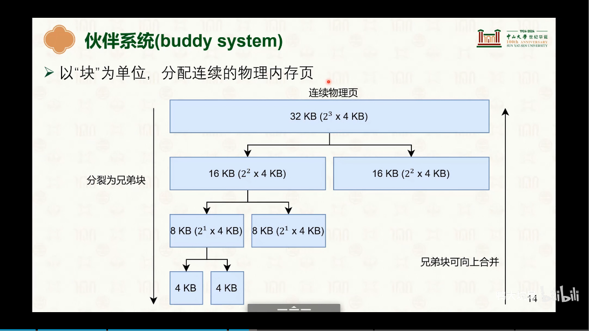
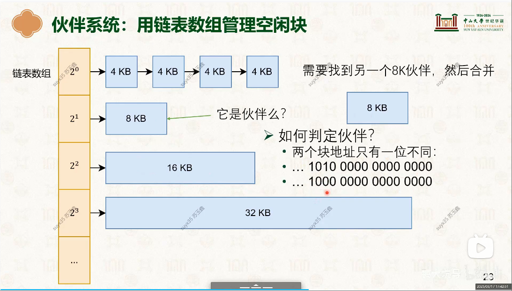
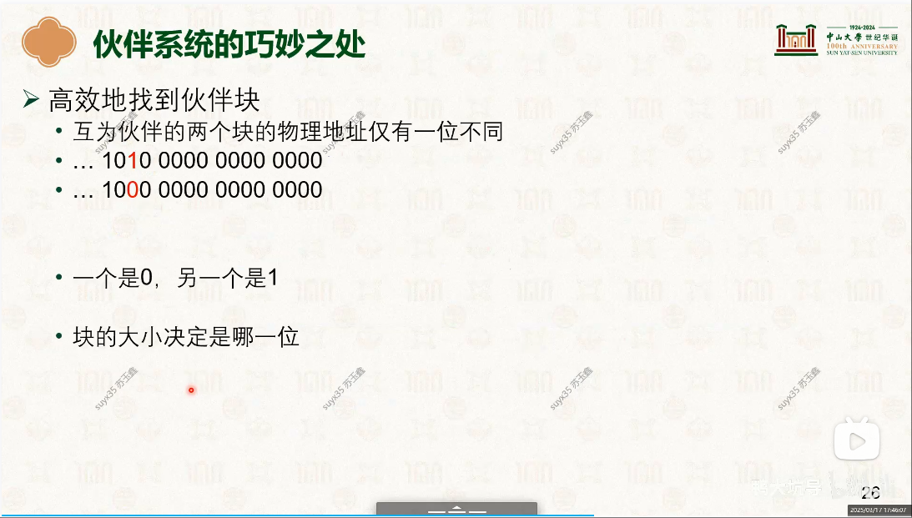

# 伙伴系统(Buddy System)
## “伙伴”是什么意思?
图1:伙伴系统：

两个能合并成一个更大内存块的内存块<sup>不是相邻就可以合并哦！</sup>，互称伙伴
- 如何判定是否是伙伴?
  + 两个块(起始地址?)地址只有一位不一样


## 合并的标准 <sup>伙伴判断依据</sup>
```c
 阅读:[static inline void __free_one_page(struct page *page, unsigned long pfn,
				   struct zone *zone, unsigned int order,
				   int migratetype, bool report)]   代码:[mm/page_alloc.c]
```


### 伙伴系统数据结构
```c
    // 伙伴系统核心数据结构
        struct zone {
          // *****
          	/**
             * free_area[0]： 由2^0个4K页组成的链表
             * 
    	       *  free areas of different sizes 
    	       * 
    	       * [Run Linux Kernel (2nd Edition) Volume 1: Infrastructure.epub]#图3.12　伙伴系统的空闲页块的管理
    	       * 
    	       * 看示意图就可以明白
    	       * 伙伴系统的核心数据结构，管理空闲页块（page block）链表的数组
             * 
             * 应用:
             * 1. [华为云欧拉操作系统 (HCE) 用户指南 (for 华为云Stack 8.5.0) 01.pdf](001.UNIX-DOCS/000.内存管理/998.REFS/华为云欧拉操作系统 (HCE) 用户指南 (for 华为云Stack 8.5.0) 01.pdf)
    	      */
    	      struct free_area	free_area[MAX_ORDER];
            
            // ....
      } ____cacheline_internodealigned_in_smp;

    // 000.LINUX-5.9/mm/page_alloc.c : zonelists构建函数
    static void build_zonelists(pg_data_t *pgdat);
```

###### 使用链表数组管理空闲块


- 对应上图的: free_area
- 链表数组操作: <sup>对应 ‘图1:伙伴系统’</sup>
   +  当**分配页面**时，例如，分配2*4K页面，就会从链表数组(2^1)中寻找空闲的页，没有，那就从更大内存块(2^2 、2^3、...、2(MAX_ORDER-1))切割，并维护链表数组
   +  当**释放页面**时，先释放，释放后，如果有内存块可以合并，那就合并成更大的内存块，并维护链表数组。


---

## 参考
- [07-物理内存管理I：伙伴系统 [中山大学 操作系统原理]](https://www.bilibili.com/video/BV1jq421P7f7/?spm_id_from=333.1007.top_right_bar_window_history.content.click&vd_source=9eef164b234175c1ae3ca71733d5a727)
   - [000.中山大学-操作系统/4-0317-physical-mem-1.pdf](../../998.REFS/000.中山大学-操作系统/4-0317-physical-mem-1.pdf)
   - [000.中山大学-操作系统/4-0320-physical-mem-2.pdf](../../998.REFS/000.中山大学-操作系统/4-0320-physical-mem-2.pdf)
