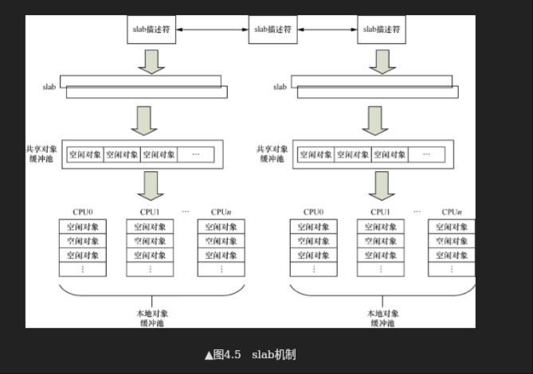

# slab
> 学习:[Run Linux Kernel (2nd Edition) Volume 1: Infrastructure.epub]#4.2　slab分配器

- slab架构图: [Run Linux Kernel (2nd Edition) Volume 1: Infrastructure.epub]#图4.17　slab系统的架构
   + 
   + 

- kmalloc()基于slab分配器，slab缓冲区建立在一个物理地址连续的大内存块之上，所以其缓存对象也是物理地址连续的。如果在内核中不需要连续的物理地址，而仅仅需要内核空间的虚拟地址是连续的内存块则使用vmalloc

## 背景
内核常常需要分配几十字节的小内存块，若为其分配一个物理页面，则非常浪费内存。而slab就是管理一块内存，`预留好空间`，当需要为变量分配内存时，直接通过slab中获取。

## slab组织方式&数据结构
+ slab描述符：kmem_cache(000.LINUX-5.9/include/linux/slab_def.h)
+ 创建slab描述符: kmem_cache_create (mm/slab_common.c) <sup>在这个函数中，尚未给slab分配器分配物理页面</sub>
  - 创建流程
  - 内存布局
   ```c
    // 伪代码如下

    // 创建 task_struct 专用的 slab cache
    struct kmem_cache *  task_struct_cachep = kmem_cache_create("task_struct",
                        arch_task_struct_size,          // 架构相关的对象大小
                        ARCH_MIN_TASKALIGN,            // 对齐要求
                        SLAB_PANIC | SLAB_ACCOUNT,     // 标志：失败时 panic + 内存记账
                        NULL);                         // 无构造函数
    // 则，后续需要为进程分配 task_struct时，直接从该salb中分配即可

    // #创建slab描述符
    struct kmem_cache *
    kmem_cache_create(const char *name, size_t size, size_t align,
          unsigned long flags, void (*ctor)(void *))
    　
    // #释放slab描述符
    void kmem_cache_destroy(struct kmem_cache *s)
    　
    // #分配缓存对象
    void *kmem_cache_alloc(struct kmem_cache *, gfp_t flags);
    　
    // #释放缓存对象
    void kmem_cache_free(struct kmem_cache *, void *);
    
   ```
+ 从slab中分配对象
  - static __always_inline void * slab_alloc(struct kmem_cache *cachep, gfp_t flags, unsigned long caller); slab.c

+ 释放对象
  - void kmem_cache_free(struct kmem_cache *cachep, void *objp); slab.c