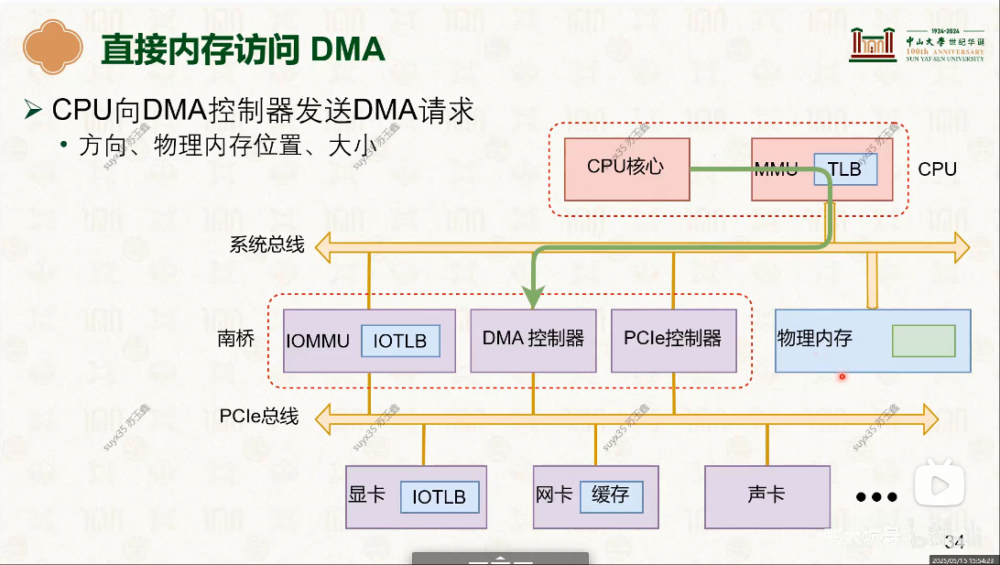
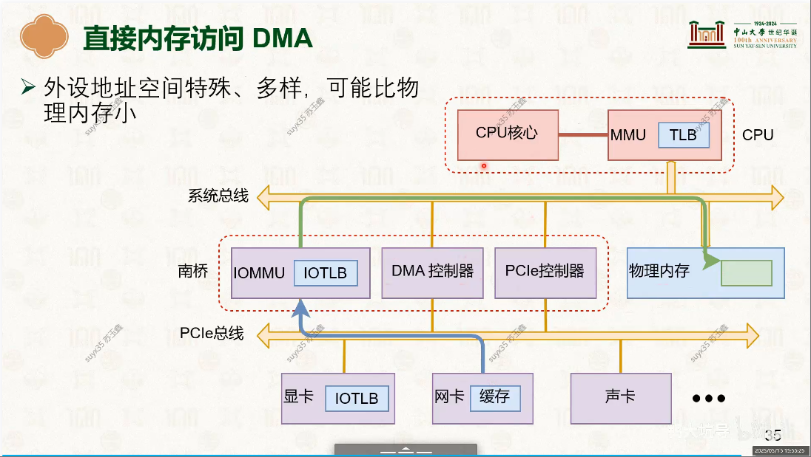

# DMA（Direct Memory Access）
直接内存访问（Direct Memory Access，DMA）是计算机科学中的一种内存访问技术。它允许某些电脑内部的硬件子系统（电脑外设），可以独立地直接读写系统内存，而不需中央处理器（CPU）介入处理 。在同等程度的处理器负担下，DMA是一种快速的数据传送方式。很多硬件的系统会使用DMA，包含硬盘控制器、绘图显卡、网卡和声卡。

DMA是所有现代电脑的重要特色，它允许不同速度的硬件设备来沟通，而不需要依于中央处理器的大量中断负载。否则，中央处理器需要从来源把每一片段的资料复制到寄存器，然后把它们再次写回到新的地方。在这个时间中，中央处理器对于其他的工作来说就无法使用。

## 流程
### 1. DMA请求
- 
### 2. 执行DMA操作
- 
   + 注意，DMA也不会直接访问物理地址，也是需要进行地址转换的(IOMMU) -- 为了安全 

## 参考资料
- [21-设备管理：设备分类 [中山大学 操作系统原理]](../998.REFS/000.中山大学-操作系统/12-0515-device-1.pdf)
- [22-设备管理：设备驱动模型 [中山大学 操作系统原理]](../998.REFS/000.中山大学-操作系统/13-0519-device-2.pdf)