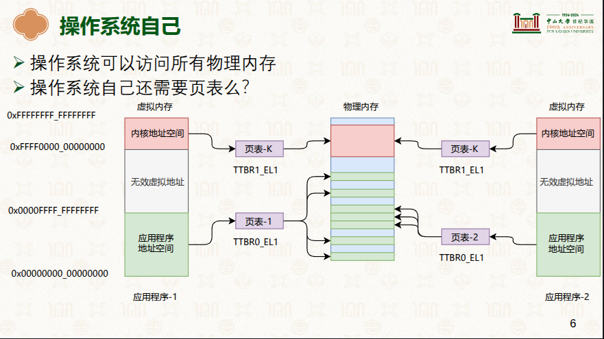
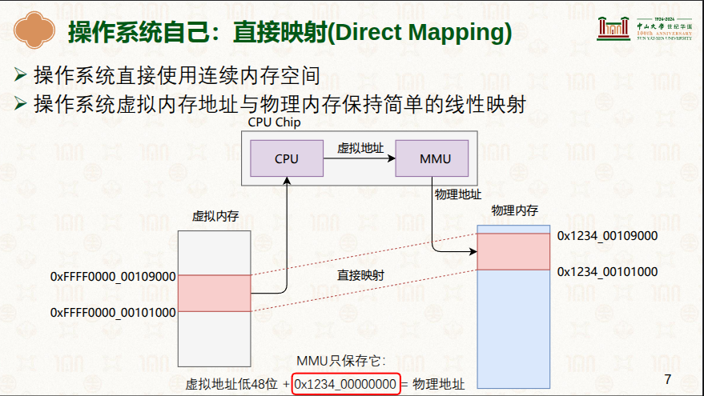
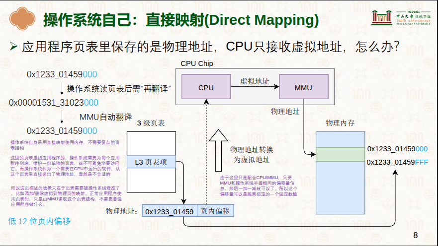

# 操作系统OS与MMU
> 学习:   - [虚拟内存管理II](../998.REFS/000.中山大学-操作系统/3-0313-virtual-mem-2.pdf)：操作系统自己：直接映射(Direct Mapping)操作系统直接使用连续内存空间；操作系统虚拟内存地址与物理内存保持简单的线性映射

|核心摘要|说明|备注|
|-|-|-|
|- 四级页表（虚拟地址）设计初衷|- 为了隔离，让应用程序无法访问到对方的数据|-|
|-|-|-|
|- 所有汇编语言指令涉及的地址都是虚拟地址|- 操作系统所有指令`应该`也是虚拟地址   - 操作系统也是软件,也是由汇编指令组成|- 参考:[000.arm64-内核中的页表.md](./000.arm64-内核中的页表.md):   - 页表项中存储的是物理地址，而OS接受的是虚拟地址，怎么回事?|
|-|-|-|
|-四级页表虽然是由MMU直接使用，但是是由操作系统创建和维护的|- 结合上一条,操作系统怎么填页表里的物理地址?|-|
|-|-|-|
|-运行在操作系统上的程序有多个需要页表进行隔离，  但操作系统（内核）应用程序只有一个无需隔离,一份就行|- |- 在物理内存划分一块空间给操作系统使用  - 页表也是数据结构，存储在操作系统内核内存空间,由操作系统维护;|
|-|-|-|
|- 则，操作系统不使用四级页表,但是为了保证内核和应用程序一致(应用程序&内核均使用MMU虚拟地址转换为物理地址)通过线性加减法: 加/减物理地址&虚拟地址偏移量：   - 频繁打开/关闭MMU不可行|-   -  + 这里是应用程序|- 让CPU假装使用虚拟地址: 虚拟地址&物理地址偏移量|
|-|-|-|
|-|-|-|
|-|-|-|
|-|-|-|
