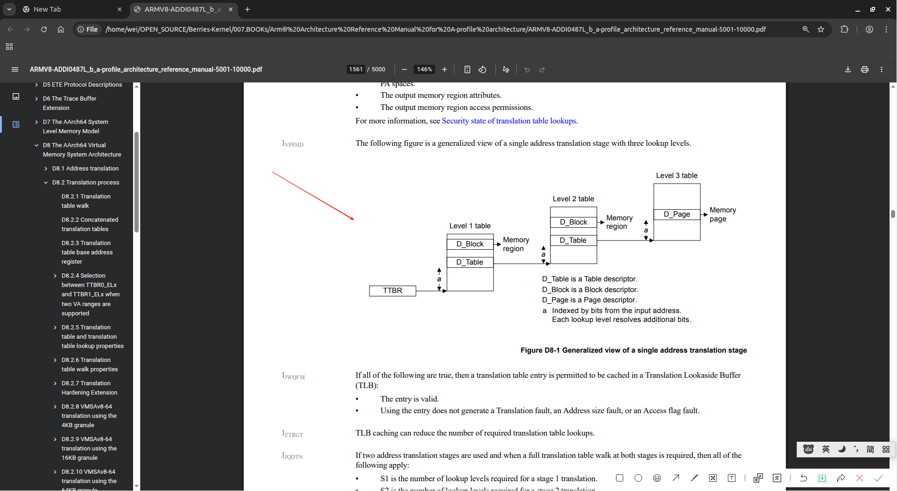

# Memory Management Unit (内存管理单元)

In AArch64 state, the ARMv8 address translation system resembles an extension to the Long Descriptor Format address translation system to support the expanded virtual and physical address spaces. （在AArch64状态下，ARMv8地址转换系统则类似于长描述符格式地址转换系统的扩展，以支持更大的虚拟和物理地址空间）

## 资料阅读
关于MMU翻译流程，最生动形象的就是[Arm® Architecture Reference Manualfor A-profile architecture#Chapter D8 The AArch64 Virtual Memory System Architecture](../../../007.BOOKs/Arm®%20Architecture%20Reference%20Manual%20for%20A-profile%20architecture/ARMV8-ADDI0487L_b_a-profile_architecture_reference_manual-5001-10000.pdf)下的 “D8.2 Translation process“包含虚拟地址翻译完整过程,如下图(详细请查看文档):
- 
   + 阅读完成这一章节，就知道为什么Linux内核在启动时会那样初始化页表了

---

## 参考资料
- Cortex_A57手册[DDI0488H_cortex_a57_mpcore_trm.pdf](../../../007.BOOKs/DDI0488H_cortex_a57_mpcore_trm.pdf) # Chapter 5 Memory Management Unit
- [Arm® Architecture Reference Manualfor A-profile architecture#Chapter D8 The AArch64 Virtual Memory System Architecture](../../../007.BOOKs/Arm®%20Architecture%20Reference%20Manual%20for%20A-profile%20architecture/ARMV8-ADDI0487L_b_a-profile_architecture_reference_manual-5001-10000.pdf)