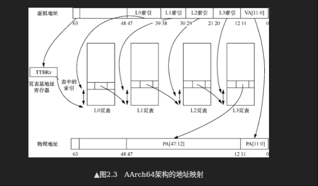
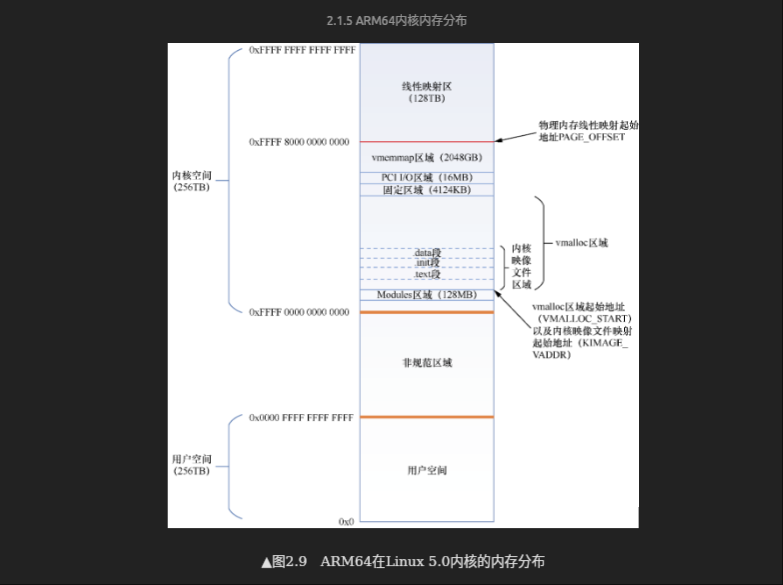

# Memory Management Unit (内存管理单元)
> 阅读:[Run Linux Kernel (2nd Edition) Volume 1: Infrastructure.epub#2.1　ARM64内存管理](../../../007.BOOKs/Run%20Linux%20Kernel%20(2nd%20Edition)%20Volume%201:%20Infrastructure.epub)

In AArch64 state, the ARMv8 address translation system resembles an extension to the Long Descriptor Format address translation system to support the expanded virtual and physical address spaces. （在AArch64状态下，ARMv8地址转换系统则类似于长描述符格式地址转换系统的扩展，以支持更大的虚拟和物理地址空间）

对于多任务操作系统，每个进程都拥有独立的进程地址空间。这些进程地址空间在虚拟地址空间内是相互隔离的，但是在物理地址空间可能映射到同一个物理页面。那么进程的地址空间(虚拟地址)如何映射到物理地址空间的呢?  答案就是CPU MMU提供的页表映射和管理功能。

## MMU工作流程
- 

---

## 资料阅读
关于MMU翻译流程，最生动形象的就是[Arm® Architecture Reference Manualfor A-profile architecture#Chapter D8 The AArch64 Virtual Memory System Architecture](../../../007.BOOKs/Arm®%20Architecture%20Reference%20Manual%20for%20A-profile%20architecture/ARMV8-ADDI0487L_b_a-profile_architecture_reference_manual-5001-10000.pdf)下的 “D8.2 Translation process“包含虚拟地址翻译完整过程,如下图(详细请查看文档):
- 
   
   + 阅读完成这一章节，就知道为什么Linux内核在启动时会那样初始化页表了
   
   + 图中的TTBR存放页表的基地址 有 TTBR0 、 TTBR1,那么在实际的时候怎么选择呢?
     - 处理器根据页表基地址控制寄存器和虚拟地址来判断使用哪个页表基地址寄存器，是TTBR0还是TTBR1。当虚拟地址第63位（简称VA[63]）为1时选择TTBR1；当VA[63]为0时选择TTBR0。页表基地址寄存器中存放着1级页表（见图2.3中的L0页表）的基地址 这里涉及到VA被划分为两个地址空间: 内核空间 ， 用户空间
        + 
     - 虚拟地址空间的划分:
        + 

### 如何理解上图: 'Figure D8-1 Generalized view of a single address translation stage'
##### 5a. 如何理解分级页表 阅读: [Run Linux Kernel (2nd Edition) Volume 1: Infrastructure.epub#2.1.2　页表映射:"处理器查询页表的过程"](../../../007.BOOKs/Run%20Linux%20Kernel%20(2nd%20Edition)%20Volume%201:%20Infrastructure.epub)

先弄清楚，页表&页表项&翻译过程：

- TTBRx 存储的是L0索引的基地址，即PGD(页全局目录 Page Global Directory)的基地址。 (即这个目录的起始地址)
- PGD的基地址 + 虚拟地址中的L0索引(PGD索引) = 获取到页表项的地址，PGD页表项中存储的是PUD(页上级目录 Page Upper Directory)页表的物理基地址物理基地址: 出现在[Run Linux Kernel (2nd Edition) Volume 1: Infrastructure.epub]#2.1.2　页表映射 标题下的 "处理器查询页表的过程" 可以搜这个引号扩起来的内容 （即这个目录的起始地址）
- PUD的基地址 + 虚拟地址中的PUD索引(L1索引) = 获取到页表项的地址，PUD页表项中存储的是PMD(页面中间目录 Page Middle Directory)页表物理的基地址 （即 这个目录的起始地址）
- PMD的基地址 + 虚拟地址中的PMD索引(L2索引) = 获取到页表项的地址，PMD页表项中存储的是PT(即页表项)页表的物理基地址 （即这个目录的基地址）
- PT的基地址 +  虚拟地址中的PT索引(L3索引) = 物理页面的高地址段
- 物理页面的高地址段 + 虚拟地址中的VA[11,0][Run Linux Kernel (2nd Edition) Volume 1: Infrastructure.epub]#▲图2.7　4级分页模型在64位虚拟地址的划分, VA:即页面中的偏移量
- 至此，完成了虚拟地址到物理地址的转换

> 重要！ 虚拟地址中的L0索引 、L1索引、L2索引 、 L3索引 分别是相对于PGD目录 、 PUD目录、PMD 目录、PT目录的偏移量, 即索引值就是偏移量

## 页表描述符通用
> 阅读 [Run Linux Kernel (2nd Edition) Volume 1: Infrastructure.epub#2.1.1　页表 & 2.1.2　页表映射 & 2.1.3　页表项描述符](../../../007.BOOKs/Run%20Linux%20Kernel%20(2nd%20Edition)%20Volume%201:%20Infrastructure.epub) &  [Arm® Architecture Reference Manualfor A-profile architecture#Chapter D8 The AArch64 Virtual Memory System Architecture & Chapter D7 The AArch64 System Level Memory Model](../../../007.BOOKs/Arm®%20Architecture%20Reference%20Manual%20for%20A-profile%20architecture/ARMV8-ADDI0487L_b_a-profile_architecture_reference_manual-5001-10000.pdf)在文档中，会涉及到页表描述符：输出地址(Output Address)...,需要仔细阅读

---

## 参考资料
- Cortex_A57手册[DDI0488H_cortex_a57_mpcore_trm.pdf](../../../007.BOOKs/DDI0488H_cortex_a57_mpcore_trm.pdf) # Chapter 5 Memory Management Unit
- [Arm® Architecture Reference Manualfor A-profile architecture#Chapter D8 The AArch64 Virtual Memory System Architecture](../../../007.BOOKs/Arm®%20Architecture%20Reference%20Manual%20for%20A-profile%20architecture/ARMV8-ADDI0487L_b_a-profile_architecture_reference_manual-5001-10000.pdf)