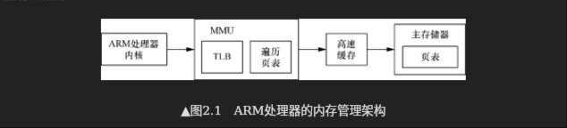

# Memory Management Unit (内存管理单元)
> 阅读:[Run Linux Kernel (2nd Edition) Volume 1: Infrastructure.epub#2.1　ARM64内存管理](../../../007.BOOKs/Run%20Linux%20Kernel%20(2nd%20Edition)%20Volume%201:%20Infrastructure.epub)

In AArch64 state, the ARMv8 address translation system resembles an extension to the Long Descriptor Format address translation system to support the expanded virtual and physical address spaces. （在AArch64状态下，ARMv8地址转换系统则类似于长描述符格式地址转换系统的扩展，以支持更大的虚拟和物理地址空间）

对于多任务操作系统，每个进程都拥有独立的进程地址空间。这些进程地址空间在虚拟地址空间内是相互隔离的，但是在物理地址空间可能映射到同一个物理页面。那么进程的地址空间(虚拟地址)如何映射到物理地址空间的呢?  答案就是CPU MMU提供的页表映射和管理功能。

## MMU工作流程
- 

## 资料阅读
关于MMU翻译流程，最生动形象的就是[Arm® Architecture Reference Manualfor A-profile architecture#Chapter D8 The AArch64 Virtual Memory System Architecture](../../../007.BOOKs/Arm®%20Architecture%20Reference%20Manual%20for%20A-profile%20architecture/ARMV8-ADDI0487L_b_a-profile_architecture_reference_manual-5001-10000.pdf)下的 “D8.2 Translation process“包含虚拟地址翻译完整过程,如下图(详细请查看文档):
- 
   + 阅读完成这一章节，就知道为什么Linux内核在启动时会那样初始化页表了

## 页表描述符通用
> 阅读 [Run Linux Kernel (2nd Edition) Volume 1: Infrastructure.epub#2.1.1　页表 & 2.1.2　页表映射 & 2.1.3　页表项描述符](../../../007.BOOKs/Run%20Linux%20Kernel%20(2nd%20Edition)%20Volume%201:%20Infrastructure.epub) &  [Arm® Architecture Reference Manualfor A-profile architecture#Chapter D8 The AArch64 Virtual Memory System Architecture & Chapter D7 The AArch64 System Level Memory Model](../../../007.BOOKs/Arm®%20Architecture%20Reference%20Manual%20for%20A-profile%20architecture/ARMV8-ADDI0487L_b_a-profile_architecture_reference_manual-5001-10000.pdf)在文档中，会涉及到页表描述符：输出地址(Output Address)...,需要仔细阅读

---

## 参考资料
- Cortex_A57手册[DDI0488H_cortex_a57_mpcore_trm.pdf](../../../007.BOOKs/DDI0488H_cortex_a57_mpcore_trm.pdf) # Chapter 5 Memory Management Unit
- [Arm® Architecture Reference Manualfor A-profile architecture#Chapter D8 The AArch64 Virtual Memory System Architecture](../../../007.BOOKs/Arm®%20Architecture%20Reference%20Manual%20for%20A-profile%20architecture/ARMV8-ADDI0487L_b_a-profile_architecture_reference_manual-5001-10000.pdf)