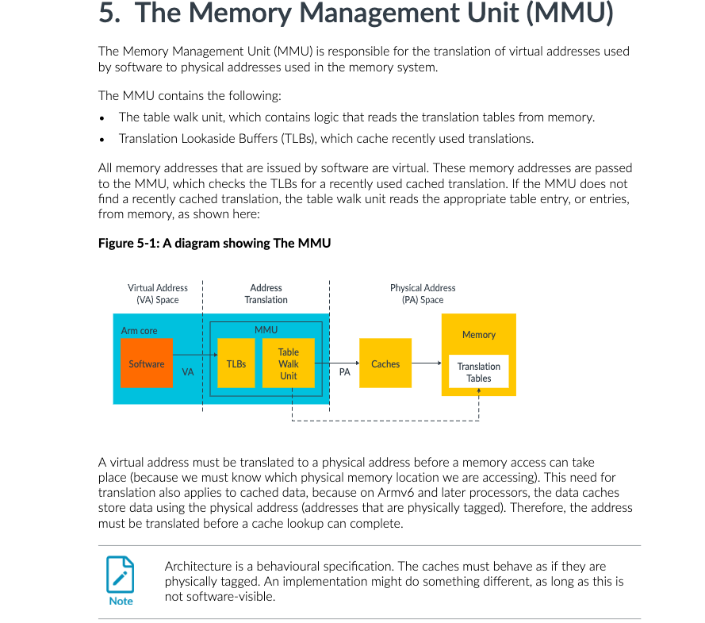
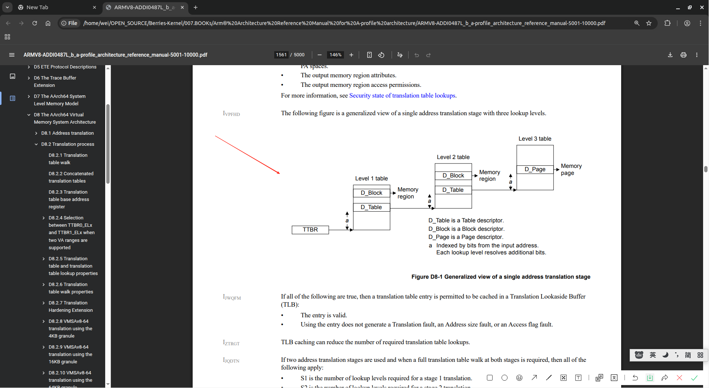
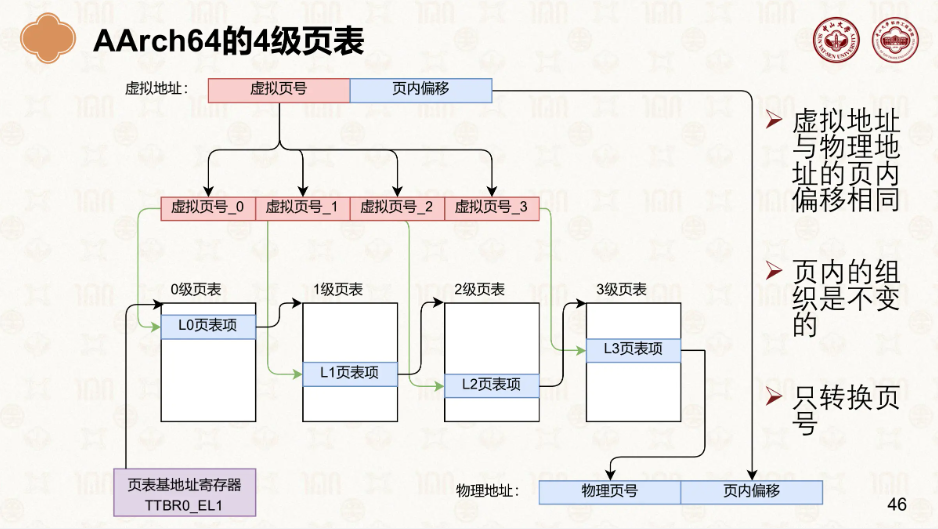
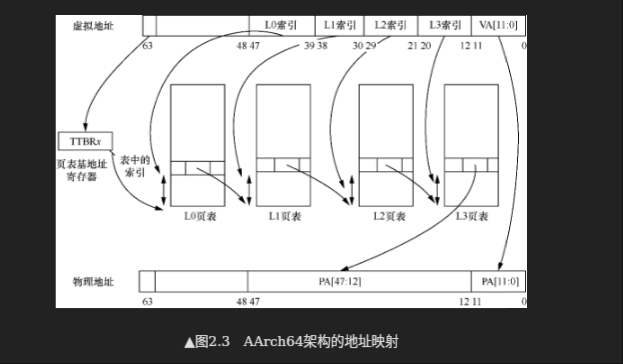
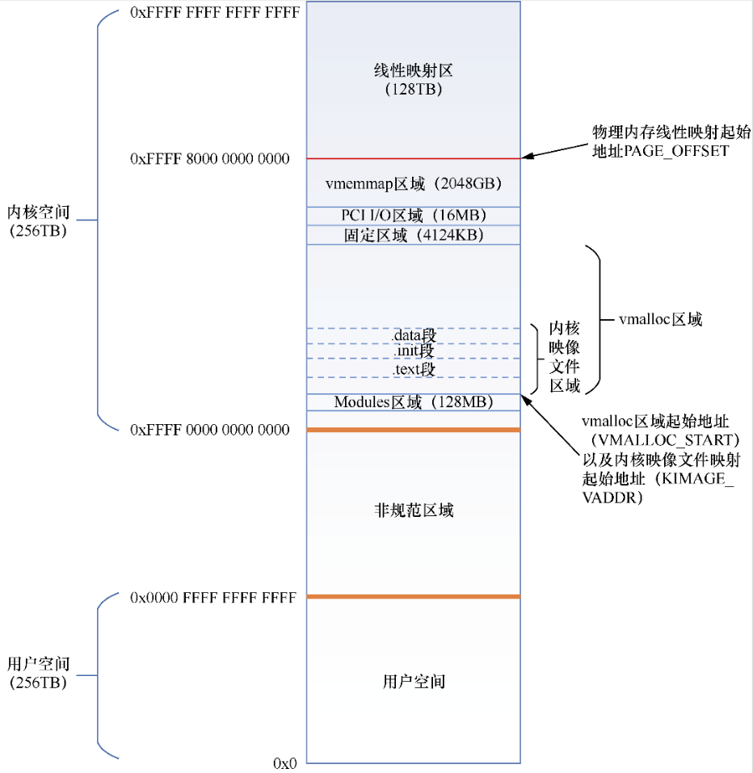
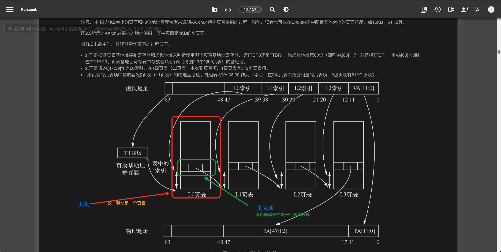

# Memory Management Unit (内存管理单元)
> 阅读:[Run Linux Kernel (2nd Edition) Volume 1: Infrastructure.epub#2.1　ARM64内存管理](../../../007.BOOKs/Run%20Linux%20Kernel%20%282nd%20Edition%29%20Volume%201%3A%20Infrastructure.epub)<br/>- [001.UNIX-DOCS/001.操作系统课程/001.中山大学-操作系统2026/第三周：虚拟内存管理 I.pdf](../../../001.UNIX-DOCS/001.操作系统课程/001.中山大学-操作系统2026/第三周：虚拟内存管理%20I.pdf) <br/> - [007.BOOKs/learn_the_architecture_aarch64_memory_management_guide_101811_0105_00_en.pdf](../../../007.BOOKs/learn_the_architecture_aarch64_memory_management_guide_101811_0105_00_en.pdf)

In AArch64 state, the ARMv8 address translation system resembles an extension to the Long Descriptor Format address translation system to support the expanded virtual and physical address spaces. （在AArch64状态下，ARMv8地址转换系统则类似于长描述符格式地址转换系统的扩展，以支持更大的虚拟和物理地址空间）

对于多任务操作系统，每个进程都拥有独立的进程地址空间。这些进程地址空间在虚拟地址空间内是相互隔离的，但是在物理地址空间可能映射到同一个物理页面。那么进程的地址空间(虚拟地址)如何映射到物理地址空间的呢?  答案就是CPU MMU提供的页表映射和管理功能。

## MMU工作流程



  + From: [007.BOOKs/learn_the_architecture_aarch64_memory_management_guide_101811_0105_00_en.pdf](../../../007.BOOKs/learn_the_architecture_aarch64_memory_management_guide_101811_0105_00_en.pdf)
---

## 资料阅读
关于MMU翻译流程，最生动形象的就是[Arm® Architecture Reference Manualfor A-profile architecture#Chapter D8 The AArch64 Virtual Memory System Architecture](../../../007.BOOKs/Arm%20Architecture%20Reference%20Manual%20for%20A-profile%20architecture/DDI0487_M_a_a_a-profile_architecture_reference_manual-6001-9000.pdf)下的 “D8.2 Translation process“<sup>包含虚拟地址翻译完整过程</sup>,如下图(详细请查看文档):
 <br/> [001.UNIX-DOCS/001.操作系统课程/001.中山大学-操作系统2026/第三周：虚拟内存管理 I.pdf#>=P35](../../../001.UNIX-DOCS/001.操作系统课程/001.中山大学-操作系统2026/第三周：虚拟内存管理%20I.pdf) <br/>- 
   
   + 阅读完成这一章节，就知道为什么Linux内核在启动时会那样初始化页表了
   
   + 图中的TTBR<sup>存放页表的基地址</sub> 有 TTBR0 、 TTBR1,那么在实际的时候怎么选择呢?
     - 处理器根据页表基地址控制寄存器和虚拟地址来判断使用哪个页表基地址寄存器，是TTBR0还是TTBR1。当虚拟地址第63位（简称VA[63]）为1时选择TTBR1；当VA[63]为0时选择TTBR0。页表基地址寄存器中存放着1级页表（见图2.3中的L0页表）的基地址 <sup>这里涉及到VA被划分为两个地址空间: 内核空间 ， 用户空间</sup>
        + 
     - 虚拟地址空间的划分<sup>这本书[Run Linux Kernel (2nd Edition) Volume 1: Infrastructure.epub#2.1　ARM64内存管理](../../../007.BOOKs/Run%20Linux%20Kernel%20%282nd%20Edition%29%20Volume%201%3A%20Infrastructure.epub)是这样写的，只能参考，不同版本的内核，可能不一样，参考:[000.SOURCE_CODE/003.LINUX-7.1.3/000.LINUX-7.1.3/Documentation/arch/arm64/memory.rst](../../../000.SOURCE_CODE/003.LINUX-7.1.3/000.LINUX-7.1.3/Documentation/arch/arm64/memory.rst)<sup>:
        + 

### 如何理解上图: 'Figure D8-1 Generalized view of a single address translation stage'
##### 5a. 如何理解分级页表 <sup>阅读: [Run Linux Kernel (2nd Edition) Volume 1: Infrastructure.epub#2.1.2　页表映射:"处理器查询页表的过程"](../../../007.BOOKs/Run%20Linux%20Kernel%20%282nd%20Edition%29%20Volume%201%3A%20Infrastructure.epub)</sup>

先弄清楚，页表&页表项&翻译过程：

> **前提**:以下以 4KB 页面粒度、48 位 VA、4 级页表为例;且**仅在 TLB 未命中时**才走这条遍历链([奔跑吧卷1 §2.1.2 页表映射](../../../007.BOOKs/Run%20Linux%20Kernel%20%282nd%20Edition%29%20Volume%201%3A%20Infrastructure.epub) 每处均写"当TLB未命中时,处理器查询页表的过程如下")。
> PGD/PUD/PMD/PT 是 Linux 的叫法,与 ARM64 的 L0/L1/L2/L3 一一对应:PGD=L0、PUD=L1、PMD=L2、PT(其表项为 PTE)=L3——[奔跑吧卷1 §2.1.2](../../../007.BOOKs/Run%20Linux%20Kernel%20%282nd%20Edition%29%20Volume%201%3A%20Infrastructure.epub) 原文只写 L0~L3,这套对应关系出自 [§2.1.4 Linux内核中的页表](../../../007.BOOKs/Run%20Linux%20Kernel%20%282nd%20Edition%29%20Volume%201%3A%20Infrastructure.epub);硬件视角全程见 [§2.1.2 页表映射](../../../007.BOOKs/Run%20Linux%20Kernel%20%282nd%20Edition%29%20Volume%201%3A%20Infrastructure.epub)。

- TTBRx 存储的是 **L0 页表(即 PGD,页全局目录 Page Global Directory)本身**的基地址——注意不是"索引的基地址"(即这张表的起始物理地址)
- **L0 索引 = VA[47:39]**。表项地址 = PGD 基地址 + **L0索引 × 8**(每个页表项描述符占 8 字节,[奔跑吧卷1 §2.1.3 页表项描述符](../../../007.BOOKs/Run%20Linux%20Kernel%20%282nd%20Edition%29%20Volume%201%3A%20Infrastructure.epub);每级 512 项)。PGD 页表项(表类型描述符)中存储的是 PUD(页上级目录 Page Upper Directory,即 L1 表)的物理基地址(即下一张表的起始地址)
- **L1 索引 = VA[38:30]**。表项地址 = PUD 基地址 + L1索引 × 8,PUD 页表项中存储的是 PMD(页中间目录 Page Middle Directory,即 L2 表)的物理基地址
- **L2 索引 = VA[29:21]**。表项地址 = PMD 基地址 + L2索引 × 8,PMD 页表项中存储的是 PT(页表 Page Table,即 L3 表;其**表项**才叫 PTE/Page Table Entry)的物理基地址
- **L3 索引 = VA[20:12]**。表项地址 = PT 基地址 + L3索引 × 8。L3 页表项是页描述符,其**输出地址位域 Bit[47:12]** 给出 4KB 物理页面的基地址([奔跑吧卷1 §2.1.3 页表项描述符](../../../007.BOOKs/Run%20Linux%20Kernel%20%282nd%20Edition%29%20Volume%201%3A%20Infrastructure.epub) 原话:"最终物理页面的高地址段")
- 物理页面基地址(Bit[47:12]) + **VA[11:0]**(页内偏移) = 物理地址
- 至此完成虚拟地址到物理地址的转换;翻译结果**回填 TLB**,同一页的后续访问直接命中、不再遍历

##### 页表遍历流程图

```
64 位 VA 划分(4KB 粒度 / 48 位 VA / 4 级页表):
┌ VA[63] ┬ VA[62:48] ┬ VA[47:39] ┬ VA[38:30] ┬ VA[29:21] ┬ VA[20:12] ┬ VA[11:0] ┐
│TTBR 选择│ 保留/标签 │  L0 索引  │  L1 索引  │  L2 索引  │  L3 索引  │ 页内偏移 │
└────────┴───────────┴───────────┴───────────┴───────────┴───────────┴──────────┘
 每级索引 9 位 → 每级 512 项;描述符 8 字节 → 512×8=4KB,一张页表恰好占一页

【入口:TLB 未命中】(TLB 命中则直接返回缓存结果,不走本图)
        │
        ▼
   按 VA[63] 选基地址寄存器:VA[63]=0(用户空间)──► TTBR0_EL1
                          VA[63]=1(内核空间)──► TTBR1_EL1
        │  TTBRx 内容 = L0 页表(即 PGD)本身的物理基地址
        ▼
┌ L0(Linux:PGD)────────────────────────────────────────────┐
│ 表项地址 = PGD 基地址 + L0索引(VA[47:39])× 8              │
│ 判断描述符类型:                                            │
│   Bit[0]=0 无效 ──► Translation Fault(缺页异常)──► 出口 ① │
│   Bit[1]=1 表类型 ──► 内容 = L1 表(PUD)物理基地址 ────┐    │
│   块类型:架构规定 L0 不支持块描述符                    │    │
└───────────────────────────────────────────────────────┬────┘
                                                        ▼
┌ L1(Linux:PUD)────────────────────────────────────────────┐
│ 表项地址 = PUD 基地址 + L1索引(VA[38:30])× 8              │
│   无效 ──► Translation Fault ──► 出口 ①                   │
│   块类型 ──► 输出地址[47:30] = 1GB 大页物理基地址 ──► 出口 ②│
│   表类型 ──► 内容 = L2 表(PMD)物理基地址 ────────────┐    │
└───────────────────────────────────────────────────────┬────┘
                                                        ▼
┌ L2(Linux:PMD)────────────────────────────────────────────┐
│ 表项地址 = PMD 基地址 + L2索引(VA[29:21])× 8              │
│   无效 ──► Translation Fault ──► 出口 ①                   │
│   块类型 ──► 输出地址[47:21] = 2MB 大页物理基地址 ──► 出口 ②│
│   表类型 ──► 内容 = L3 表(PT)物理基地址 ─────────────┐    │
└───────────────────────────────────────────────────────┬────┘
                                                        ▼
┌ L3(Linux:PT,表项 = PTE)──────────────────────────────────┐
│ 表项地址 = PT 基地址 + L3索引(VA[20:12])× 8               │
│ L3 只有页描述符(Bit[1]=1)或无效:                         │
│   无效 ──► Translation Fault ──► 出口 ①                   │
│   页描述符 ──► 输出地址位域 Bit[47:12] = 4KB 页面基地址    │
└───────────────────────────────────────────────────────┬────┘
                                                        ▼
【拼接】PA = 页面/大页基地址(输出地址位域) : VA[11:0] (页内偏移)
        │
        ▼
【回填 TLB】同一页后续访问直接命中,不再遍历

出口 ①:Translation Fault → 内核缺页处理 handle_mm_fault() 建好映射后重新执行指令(见「容易漏掉的边界」)
出口 ②:块描述符提前终止——不必走到 L3,直接拿大页基地址去拼接(L1 块=1GB / L2 块=2MB)
```

> **重要!索引 ≠ 字节偏移量**:L0~L3 索引是**表项的序号**(9 位,每级 512 项),换算成字节偏移必须 **× 8**(512 项 × 8 字节 = 4KB,一张页表恰好占一个页面)。位域划分:VA[47:39]=L0、VA[38:30]=L1、VA[29:21]=L2、VA[20:12]=L3、VA[11:0]=页内偏移,见 [图2.7 4级分页模型在64位虚拟地址的划分](../../../007.BOOKs/Run%20Linux%20Kernel%20%282nd%20Edition%29%20Volume%201%3A%20Infrastructure.epub)。

##### 容易漏掉的边界

1. **TLB 未命中才走这条链**([奔跑吧卷1 §2.1.2 页表映射](../../../007.BOOKs/Run%20Linux%20Kernel%20%282nd%20Edition%29%20Volume%201%3A%20Infrastructure.epub));TLB 命中则零遍历,直接用缓存好的翻译结果;
2. **无效描述符的出口**:遍历中任一级表项 Bit[0]=0(无效描述符)→ 触发 Translation Fault(缺页异常)→ 内核 `handle_mm_fault()` 分配物理页/建立映射 → **重新执行该指令**,流程见 [003.缺页异常处理](../013.进程内存管理/003.缺页异常处理/README.md);
3. **块描述符可提前终止**:L0~L2 的表项还可能是块类型(4KB 粒度下 L1 块 = 1GB、L2 块 = 2MB 大页),命中块描述符即得到最终物理地址,不必走到 L3——[奔跑吧卷1 §2.1.3 页表项描述符](../../../007.BOOKs/Run%20Linux%20Kernel%20%282nd%20Edition%29%20Volume%201%3A%20Infrastructure.epub),详见下文「页表描述符」小节。

## 页表描述符<sup>通用</sup>
> 阅读 [Run Linux Kernel (2nd Edition) Volume 1: Infrastructure.epub#2.1.1　页表 & 2.1.2　页表映射 & 2.1.3　页表项描述符](../../../007.BOOKs/Run%20Linux%20Kernel%20%282nd%20Edition%29%20Volume%201%3A%20Infrastructure.epub) &  [Arm® Architecture Reference Manualfor A-profile architecture#Chapter D8 The AArch64 Virtual Memory System Architecture & Chapter D7 The AArch64 System Level Memory Model](../../../007.BOOKs/Arm%20Architecture%20Reference%20Manual%20for%20A-profile%20architecture/DDI0487_M_a_a_a-profile_architecture_reference_manual-6001-9000.pdf)<sup>在文档中，会涉及到页表描述符：输出地址(Output Address)...,需要仔细阅读</sup>


---


## 参考资料
- Cortex_A57手册[DDI0488H_cortex_a57_mpcore_trm.pdf](../../../007.BOOKs/DDI0488H_cortex_a57_mpcore_trm.pdf) # Chapter 5 Memory Management Unit
- [Arm® Architecture Reference Manualfor A-profile architecture#Chapter D8 The AArch64 Virtual Memory System Architecture](../../../007.BOOKs/Arm%20Architecture%20Reference%20Manual%20for%20A-profile%20architecture/DDI0487_M_a_a_a-profile_architecture_reference_manual-6001-9000.pdf)

---

## 附录:描述符(descriptor)到底是什么

> 一句话:**"描述符"就是页表项这个"格子"里存的那个 64 位值本身**。先区分三个容易混的说法:
> - **页表**:一张 512 个格子的数组,恰好占一页(4KB);
> - **页表项**(PTE,广义):其中一个格子(位置 = 表基地址 + 索引×8,见下一节附录);
> - **描述符**:格子里写的**内容**——一个 64 位整数。ARM 手册叫 *translation table descriptor*;C 里就是 `pgd_t/pud_t/pmd_t/pte_t` 各自包裹的那个 `u64`;汇编里就是 head.S 那条 `str` 写进去的数。

### 64 位值的内部结构(4KB 粒度)

[奔跑吧卷1 §2.1.3 页表项描述符](../../../007.BOOKs/Run%20Linux%20Kernel%20%282nd%20Edition%29%20Volume%201%3A%20Infrastructure.epub)把它拆成"中间是地址、两头是属性、低两位说类型":

```
表/页描述符(低两位 = 0b11):
 63          52/51                12 11        2  1   0
┌──────────────┬─────────────────────┬──────────┬───┬───┐
│  高位属性     │ 下一级页表/物理页基地址 │  低位属性 │ 1 │ 1 │
│ [63:52]      │     [47:12]         │  [11:2]  │类型│有效│
└──────────────┴─────────────────────┴──────────┴───┴───┘

块描述符(低两位 = 0b01,L0 不支持):
  L1 块: [47:30] = 1GB 大页基地址      L2 块: [47:21] = 2MB 大页基地址

无效描述符: Bit[0] = 0  → 硬件触发 Translation Fault(「页表遍历流程图」的"出口 ①")
```

也就是说:**"基地址"和"属性"打包在同一个 64 位里**——中间位域是地址,两头是属性,低两位说"我是哪种"。

### 每一段具体是什么(内核宏一一对应)

定义在 [arch/arm64/include/asm/pgtable-hwdef.h](../../../000.SOURCE_CODE/000.LINUX-5.9/000.LINUX-5.9/arch/arm64/include/asm/pgtable-hwdef.h):

**① 低两位(类型)** — L170-L211:

```c
#define PUD_TYPE_TABLE   (3 << 0)   // 0b11 表描述符 → Bit[47:12] = 下一级表基地址
#define PMD_TYPE_SECT    (1 << 0)   // 0b01 块描述符 → Bit[47:21] = 2MB 大页基地址
#define PTE_TYPE_PAGE    (3 << 0)   // 0b11 页描述符 → Bit[47:12] = 4KB 页基地址
#define PTE_VALID        (1 << 0)   // Bit[0] 有效位
```

**② 低位属性 Bit[11:2]** — 「页表遍历流程图」中"判断内存属性"一环的来源:

```c
#define PTE_ATTRINDX_MASK (7 << 2)  // Bit[4:2] AttrIndx → 索引 MAIR_EL1 → Normal 还是 Device
#define PTE_AF            (1 << 10) // Access Flag,MMU 访问过置位
#define PTE_NG            (1 << 11) // nG(非全局,配 ASID)
```

再加上 SH(共享域)、AP(读写权限)也在这段。

**③ 高位属性** — L219-L222:`PTE_PXN`(Bit[53],内核态不可执行)、`PTE_UXN`(Bit[54],用户态不可执行)、`PTE_DBM`(Bit[51],硬件脏位)等。

### 串回本文两条线索

- **×8 定位格子,描述符是格子里的内容**:head.S 里 `orr \tmp2, \tmp2, #PMD_TYPE_TABLE` 把"下一级表物理地址 | 0b11"拼成一个描述符,`str \tmp2, [\tbl, \index, lsl #3]` 写进第 index 个格子——寻址是 ×8,写进去的 `\tmp2` 就是描述符(见下一节附录);
- **AttrIndx 在 Bit[4:2]**:遍历到 L3 读出描述符后,`(descriptor >> 2) & 7` 查 MAIR_EL1,才有"Normal/Device 分岔"——「页表遍历流程图」的属性判断,物理上就是从描述符的这几位读出来的。

---

## 附录:为什么是"索引 × 8"(源码证据)

> ×8 的原因只有一个:**每个页表项描述符是 64 位 = 8 字节**,页表就是一张 `u64 array[512]`——取第 i 个元素 = 表基地址 + i×sizeof(u64),等价于"索引左移 3 位"(每级 512 项 × 8B = 4KB,一张页表恰好占一页)。MMU 硬件遍历单元和内核软件用的是同一套算法。

**注意一个容易搞反的因果关系**:不是"低 3 位被用作标志位,所以统一左移 3 位",而是——**"8 字节/槽"是因,"×8"和"低位可复用"是同一个因的两个果**:

```
描述符 64 位 = 8 字节/槽 ──┬──► 槽内字节偏移 = 索引×8(×8 的来源)
                          └──► 槽地址低 3 位恒为 0 → 描述符低位可挪作标志(Bit[1] 类型、Bit[0] 有效)
```

- 精确地说:表/页描述符的地址字段从 **Bit[12]** 开始([47:12])——下一级表和物理页都是 4KB 对齐,低 12 位全为零,所以 Bit[11:2] 一整段(AttrIndx、SH、AP、AF、nG)都能放低位属性;"低 3 位被使用"只能解释 Bit[2:0],解释不了 [11:2] 整段;
- 位拼接视角:本级索引 = VA[s+8 : s](9 位),索引 <<3 后恰好填满一页(9 位 × 2³ = 12 位)——`ARM64_HW_PGTABLE_LEVEL_SHIFT(n) = (PAGE_SHIFT-3)×(4-n)+3` 里反复出现的"3"就是 8 字节 = 2³;head.S 里"右移进、左移出"(`lsr` 取索引 → `str [\tbl, \idx, lsl #3]` 得字节偏移),中间那个 3 也是它。

源码(Linux 5.9)中有三处体现:

### ① 汇编:显式 `lsl #3`(内核启动自建页表)

[arch/arm64/kernel/head.S#L155-L164 `create_table_entry`](../../../000.SOURCE_CODE/000.LINUX-5.9/000.LINUX-5.9/arch/arm64/kernel/head.S#L155):

```asm
lsr  \tmp1, \virt, #\shift          // VA 右移,得到本级索引
sub  \ptrs, \ptrs, #1
and  \tmp1, \tmp1, \ptrs            // 掩出索引(ptrs = 512)
str  \tmp2, [\tbl, \tmp1, lsl #3]   // 写入 表基地址 + 索引<<3 处 ★
```

- `[\tbl, \tmp1, lsl #3]` 是 ARM64 的寻址模式,机器层面即 `tbl + 索引×8`——与上文「页表遍历流程图」的"表项地址 = 基地址 + 索引×8"一字不差;`populate_entries` 宏([head.S#L185](../../../000.SOURCE_CODE/000.LINUX-5.9/000.LINUX-5.9/arch/arm64/kernel/head.S#L185))同一写法:`str \tmp1, [\tbl, \index, lsl #3]`。

### ② C 层:指针算术隐式 ×8(软件遍历页表)

[include/linux/pgtable.h#L88](../../../000.SOURCE_CODE/000.LINUX-5.9/000.LINUX-5.9/include/linux/pgtable.h#L88) / [#L131-L134](../../../000.SOURCE_CODE/000.LINUX-5.9/000.LINUX-5.9/include/linux/pgtable.h#L131):

```c
#define pgd_index(a)  (((a) >> PGDIR_SHIFT) & (PTRS_PER_PGD - 1))

static inline pgd_t *pgd_offset_pgd(pgd_t *pgd, unsigned long address)
{
    return (pgd + pgd_index(address));   // pgd_t* + n → 前进 n × sizeof(pgd_t)
}
```

- Linux 的 C 代码从不写"×8":`pgd + index` 是**指针运算**,自动乘 `sizeof(pgd_t)`;而 arm64 上 `pgd_t = struct { u64 pgd; }`([arch/arm64/include/asm/pgtable-types.h#L14-L39](../../../000.SOURCE_CODE/000.LINUX-5.9/000.LINUX-5.9/arch/arm64/include/asm/pgtable-types.h#L14)),sizeof 恰为 8。`pte_offset_kernel()`(pgtable.h#L92-95,`(pte_t *)pmd_page_vaddr(*pmd) + pte_index(address)`)同理。软件遍历实战见 [012.软件遍历页表](012.软件遍历页表.md)。

### ③ 移位公式里的"-3"(每级 512 项的来源)

[arch/arm64/include/asm/pgtable-hwdef.h#L46](../../../000.SOURCE_CODE/000.LINUX-5.9/000.LINUX-5.9/arch/arm64/include/asm/pgtable-hwdef.h#L46)、[#L74](../../../000.SOURCE_CODE/000.LINUX-5.9/000.LINUX-5.9/arch/arm64/include/asm/pgtable-hwdef.h#L74):

```c
#define ARM64_HW_PGTABLE_LEVEL_SHIFT(n)  ((PAGE_SHIFT - 3) * (4 - (n)) + 3)
#define PTRS_PER_PTE                     (1 << (PAGE_SHIFT - 3))   // = 1<<9 = 512
```

- 那个 **`- 3` 就是"每项 8 字节 = 2³"**:4KB ÷ 8B = 512 项 → 每级 9 位索引,由此而来;
- 同一思想的显式写法:IOMMU 的软件遍历 [drivers/iommu/io-pgtable-arm.c#L40](../../../000.SOURCE_CODE/000.LINUX-5.9/000.LINUX-5.9/drivers/iommu/io-pgtable-arm.c#L40) 用 `ilog2(sizeof(arm_lpae_iopte))` 换算"每级多少位索引"。

> **与本文两张图的呼应**:×8 定位到"第 index 个格子"(页表项);格子里写的那个 64 位值就是**描述符**——低两位是类型(0b11 表/页、0b01 块、Bit[0]=0 无效),Bit[4:2] 是 AttrIndx(即「页表遍历流程图」中"判断内存属性"那一环的输入)。描述符的完整位布局与各属性位含义,见上一节附录「描述符到底是什么」;原书对应 [奔跑吧卷1 §2.1.3 页表项描述符](../../../007.BOOKs/Run%20Linux%20Kernel%20%282nd%20Edition%29%20Volume%201%3A%20Infrastructure.epub)。