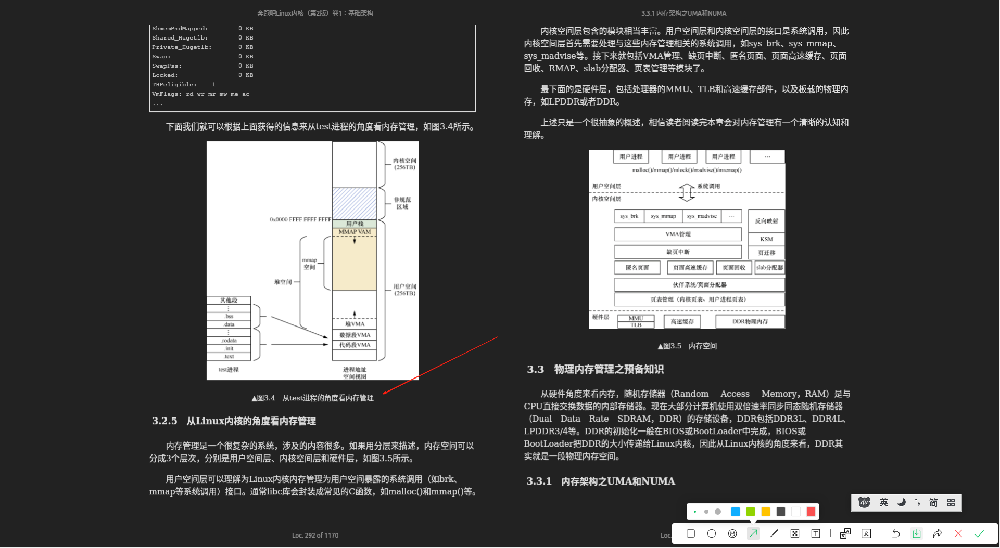
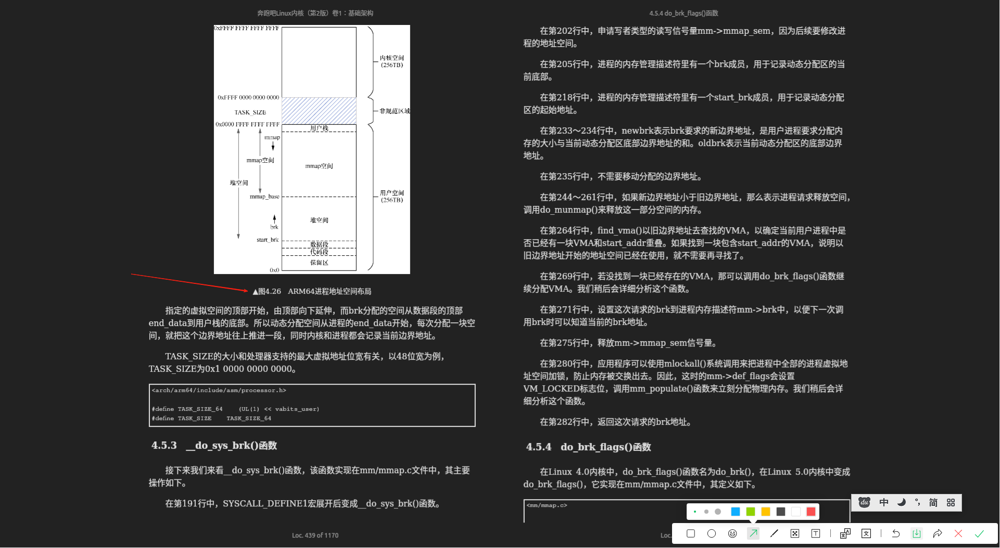
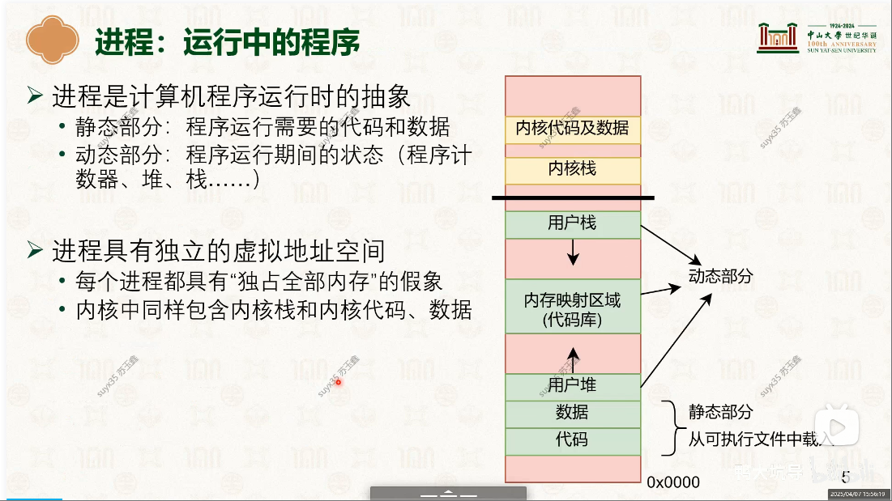
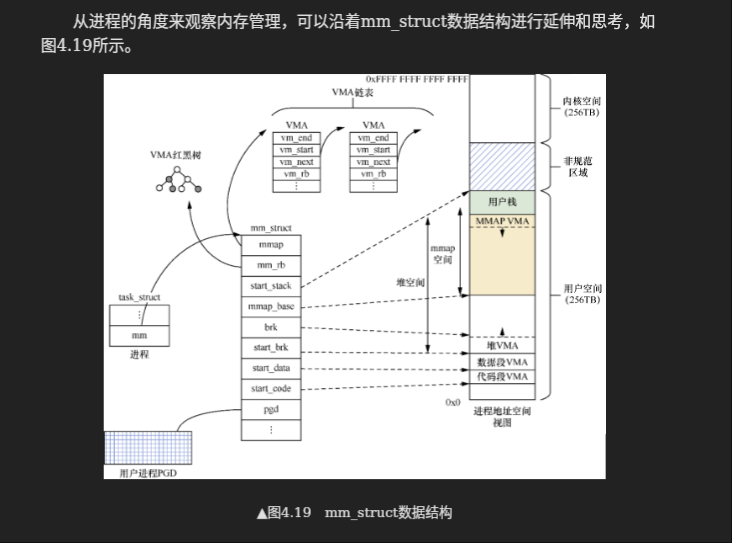
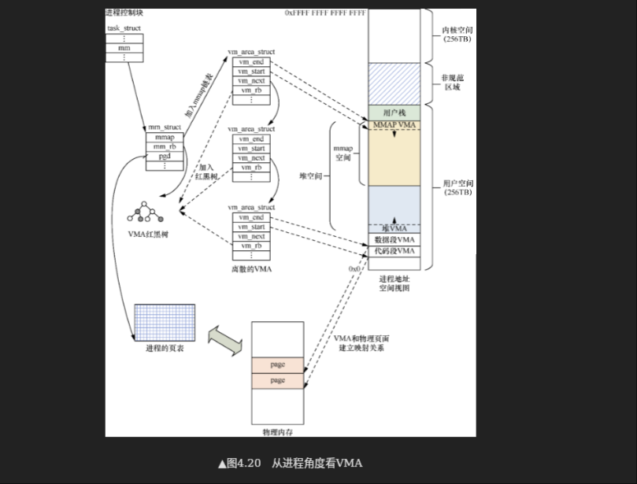
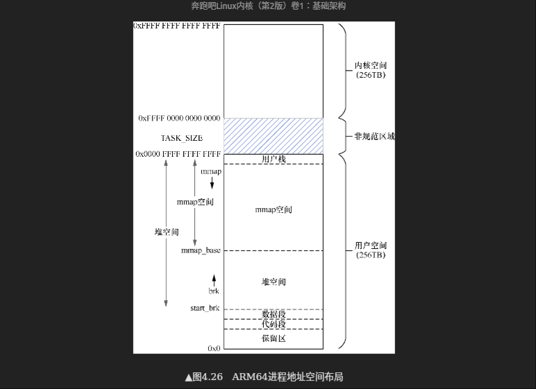

# 进程地址空间
> [#4.4　虚拟内存管理之进程地址空间](../../../007.BOOKs/Run%20Linux%20Kernel%20(2nd%20Edition)%20Volume%201:%20Infrastructure.epub)

## 进程地址空间（process address space）是指进程可寻址的虚拟地址空间
在64位的处理器中，进程可以寻址256TB的用户态地址空间，但是进程没有权限去寻址内核空间的虚拟地址，只能通过系统调用的方式间接访问。而用户空间的进程地址空间则可以被合法访问，地址空间称为内存区域（memory area）,进程可以通过内核的内存管理机制动态地添加和删除这些内存区域，这些内存区域在Linux内核采用VMA(struct vm_area_struct , struct mm_struct成员)数据结构来抽象描述

### 缺页异常
每个内存区域具有相关的权限，如可读、可写或者可执行权限。若一个进程访问了不在有效范围的内存区域，或者非法访问了内存区域，或者以不正确的方式访问了内存区域，那么处理器会报告缺页异常。
- 在Linux内核的缺页异常处理中会处理这些情况
- 当CPU第一次访问虚拟地址空间时会触发缺页异常。在缺页异常处理中，分配物理页面，利用分配的物理页面来创建页表项并且填充页表，完成虚拟地址到物理地址的映射关系的建立。FROM: [Run Linux Kernel (2nd Edition) Volume 1: Infrastructure.epub](#4.4.3　VMA数据结构)
---

## 内存区域划分
+ 参考: 
+ 参考: 
  - 注意事项:
    1. 各个区域的增长方向

+ 
|名称|功能/含义|备注|
|-|-|-|
| 代码段映射| 可执行文件中包含只读并可执行的程序头，如代码段和init段等。||
| 数据段映射| 可执行文件中包含可读/可写的程序头，如数据段和未初始化数据段等。||
| 用户进程栈| 通常位于用户空间的最高地址，从上往下延伸。它包含栈帧，里面包含了局部变量和函数调用参数等。注意，不要和内核栈混淆，进程的内核栈独立存在并由内核维护，主要用于上下文切换。||
| mmap映射区域 | 位于用户进程栈下面，主要用于mmap系统调用，如映射一个文件的内容到进程地址空间等。||
| 堆映射区域 | malloc()函数分配的进程虚拟地址就是这段区域。||
|其他|||

进程地址空间是每个进程可以寻址的虚拟地址空间，每个进程在执行时都仿佛拥有了整个地址空间，这就是所谓的“内存虚拟化”。因此，每个进程都有一套页表，这样每个进程地址空间就是相互隔离的。即使它们的进程地址空间的虚拟地址是相同的，但是经过两套不同页表的转换之后，它们也会对应不同的物理地址

### 关键数据结构-- struct mm_struct
结合上述表格，内存区域是这样的: 

### struct mm_struct 中有多个 struct vm_area_struct 一段一段的，会合并： ‘4.4.7　合并VMA’

|关键项名称|备注1|备注2|备注3|
|-|-|-|-|
|VMA通过哪些数据结构和物理页面建立映射关系|通过mm_struct中的pgd?通过缺页异常去申请页表|有可能||

### 用户态地址空间划分含有堆&栈地址增长方向
