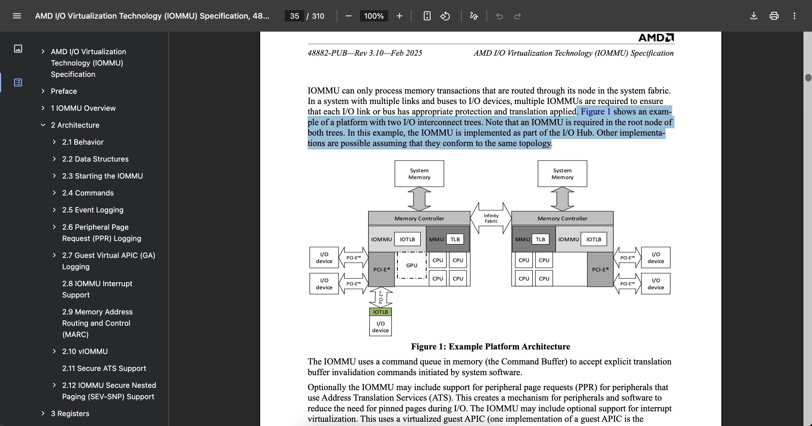
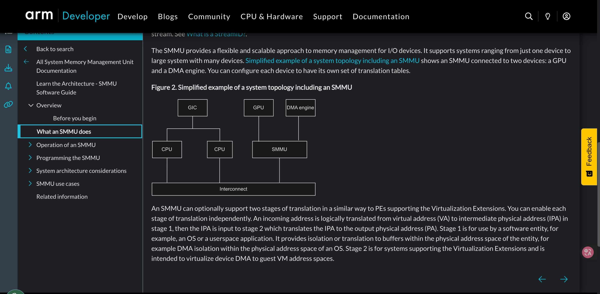

# IOMMU / SMMU
在计算机体系结构中IOMMU（Input Output Memory Management Unit）是将设备直接内存访问（DMA）的IO总线和物理内存连接的内存管理单元，和传统的MMU一样，`IOMMU将设备可见的虚拟地址（IOVA）映射到物理地址`场景:DMA。**不同的平台有不同的IOMMU**，如**Intel的IOMMU**，PCIE图形卡使用的图形重映射表（GART），**ARM平台的IOMMU是SMMU**（System Memory Management），它们主要功能都是完成设备可见的IOVA到物理地址的映射

|名称|说明|参考资料|示意图|
|-|-|-|-|
|IOMMU(Input-Output Memory Management Unit)|x86 架构（Intel 和 AMD）的称呼|- [AMD I/O Virtualization Technology (IOMMU) Specification](../../../007.BOOKs/AMD-48882_IOMMU.pdf)#'Figure 1: Example Platform Architecture'|- |
|-|-|-|-|
|SMMU(System Memory Management Unit)|ARM 架构|- [ARM:Learn the Architecture - SMMU Software Guide](../../../007.BOOKs/learn_the_architecture_-_smmu_software_guide_109242_0100_01_en.pdf)|- |

---

## 摘要
The IOMMU is similar to the processor's memory management unit, except that it provides address translation and page protection for direct memory accesses (DMA) by peripheral devices rather than memory accesses by the processor. (IOMMU 与处理器的内存管理单元（MMU）类似，不同之处在于它为外设的直接内存访问（DMA）提供地址转换和页保护，而不是针对处理器的内存访问。) [AMD I/O Virtualization Technology (IOMMU) Specification](../../../007.BOOKs/AMD-48882_IOMMU.pdf)

The IOMMU provides no direct indication to an I/O device of a failed translation when processing an untranslated posted request. This is in contrast to the page fault mechanism employed by CPU’s MMU.(在处理未翻译的发布请求（Untranslated Posted Request）时，如果转换失败，IOMMU 不会向 I/O 设备提供直接指示。这与 CPU MMU 所采用的缺页异常（Page Fault）机制形成了鲜明对比。)[AMD I/O Virtualization Technology (IOMMU) Specification](../../../007.BOOKs/AMD-48882_IOMMU.pdf)
- 发送出去就不管了 , 静默失败(与MMU的不同，MMU会 page fault)： IOMMU发现地址不对，会直接丢掉,不会反馈

The IOMMU uses a command queue in memory (the Command Buffer) to accept explicit translation buffer invalidation commands initiated by system software.(IOMMU（输入输出内存管理单元）利用内存中的命令队列（即命令缓冲区）来接收由系统软件发起的显式转换缓冲区无效化命令)

The I/O Memory Management Unit (IOMMU) extends the AMD64 system architecture by adding support for address translation and system memory access protection on DMA transfers from peripheral devices. IOMMU also helps filter and remap interrupts from peripheral devices.（I/O 内存管理单元（IOMMU）通过为外设的 DMA（直接内存访问）传输增加地址转换和系统内存访问保护支持，扩展了 AMD64 系统架构。同时，IOMMU 还有助于对来自外设的中断进行过滤与重定向（Remap））[AMD I/O Virtualization Technology (IOMMU) Specification](../../../007.BOOKs/AMD-48882_IOMMU.pdf)

## 参考资料
- [IOMMU和Arm SMMU介绍](https://www.openeuler.openatom.cn/zh/blog/wxggg/2020-11-21-iommu-smmu-intro.html)
  + [IOMMU和Arm SMMU介绍:png](../999.IMGS/Screenshot%202026-01-27%20at%2019-40-54%20IOMMU和Arm%20SMMU介绍%20openEuler社区.png)