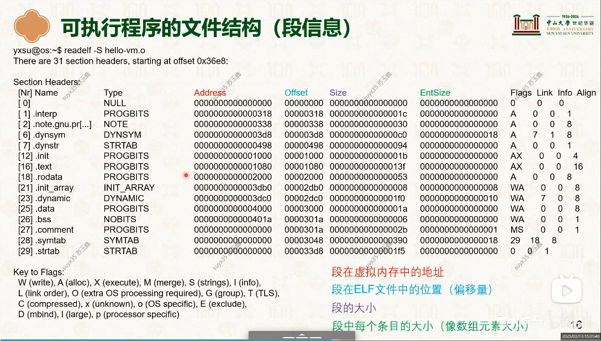
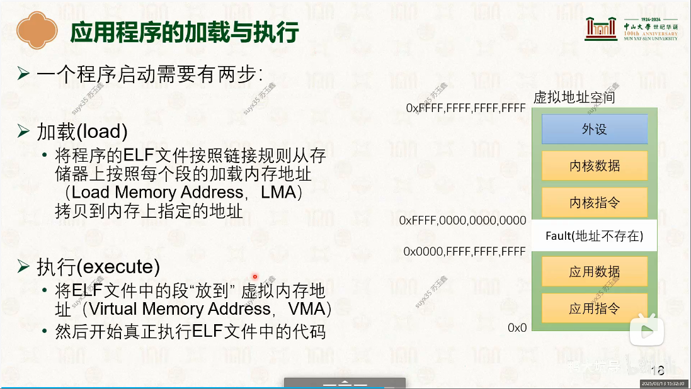

# 可执行文件信息
> 学习:[06-虚拟内存管理：内存映射 [中山大学 操作系统原理]](./998.REFS/000.中山大学-操作系统/3-0313-virtual-mem-2.pdf)

## 段信息
- 

## 应用程序的加载与执行
- 


## 附录
### 怎么理解 'cat /proc/PID/maps' 输出的信息
```txt
/proc/[pid]/maps 是一个非常重要的伪文件，它展示了该进程当前占用的所有虚拟内存区域（VMAs - Virtual Memory Areas）。

当你执行 cat /proc/1115/maps 时，你实际上是在查看进程 ID 为 1115 的进程的“内存布局图”。

每一行代表一个连续的虚拟地址范围，典型的输出格式如下：
00400000-0040c000 r-xp 00000000 08:01 123456 /usr/bin/cat
我们可以将其拆解为 6 列：
    地址范围 (Address Range): 00400000-0040c000
        该虚拟内存段的起始和结束地址（十六进制）。
    权限 (Permissions): r-xp
        r = read（读）
        w = write（写）
        x = execute（执行）
        p/s = private（私有，写时复制）或 shared（共享）。
    偏移量 (Offset): 00000000
        如果该区域映射自文件，这里表示从文件起始位置开始的偏移量。
    设备号 (Device): 08:01
        挂载文件的设备主/次设备号（通常是磁盘分区）。
    Inode: 123456
        映射文件的节点号。如果是 0，表示没有关联文件（匿名内存）。
    路径名 (Pathname): /usr/bin/cat
        映射的文件路径。常见的特殊标记包括：
            [stack]: 进程的主线程栈。
            [heap]: 堆内存。
            [vdso]: 虚拟动态共享对象（用于加速系统调用）。
            (empty): 匿名映射（Anonymous Mapping），例如通过 malloc 分配的大块内存。
```