# 内存映射IO （CPU如何与设备通信）
> 学习: <br/> - [007.BOOKs/现代操作系统.epub](../../../007.BOOKs/现代操作系统.epub)


- 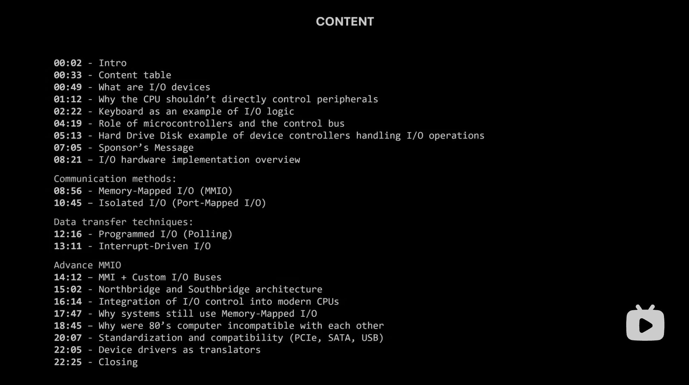

## The CPU doesn`t control  I/O devices,it communicates with them
CPU不是对设备进行微观管理，而是简单地发送请求，然后由设备控制器来执行。


## 微控制器（microcontroller）
- 「微控制器」专为与硬件交互而设计，则CPU专注于运行程序，
- 微控制器的性能足以扫描电路（这里是以键盘为例子），由微控制器检测到按键动作，并将结果简单的传递到CPU，通过称之为控制总线的物理连接;
  - 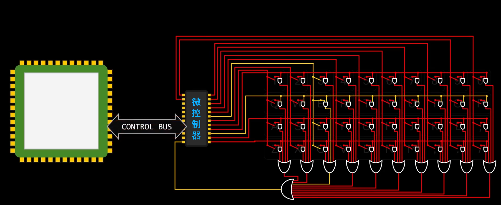

### 以操作文件为例
```c
file = open("data.txt");
buffer = read(file,4);
```
当程序执行这样的代码的时候，CPU并不会执行指令来旋转磁盘并移动磁头来搜索文件，他通过向控制总线发送指令，要求磁盘找到data.txt 。请求一旦发出，则CPU可以继续处理其他任务。与此同时，控制器负责处理旋转磁盘和移动磁头的机械操作，当文件被定位后，控制器会返回文件所在的地址，
  - 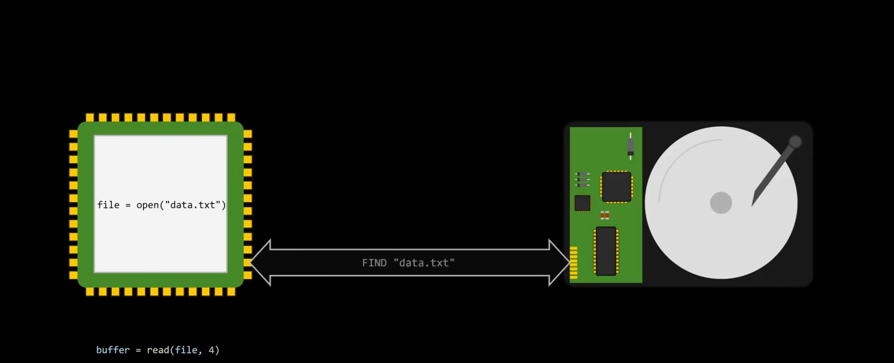

之后，如果程序想读取该文件中的4个字节，CPU会发送一个请求，告诉设备从之前返回的地址开始，读取4个字节。类似的，磁盘控制器执行定位磁头和读取数据的实际工作，而CPU则可以自由执行其他指令，一旦请求就绪，控制器就会通过总线，将其发送到CPU
  - 发送文件读取指令
    + 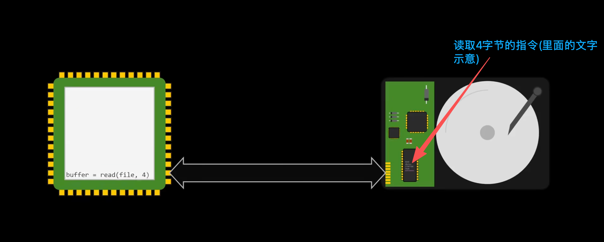
  - 返回数据
    + 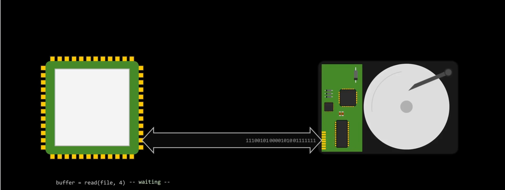


## 内部工作原理解析
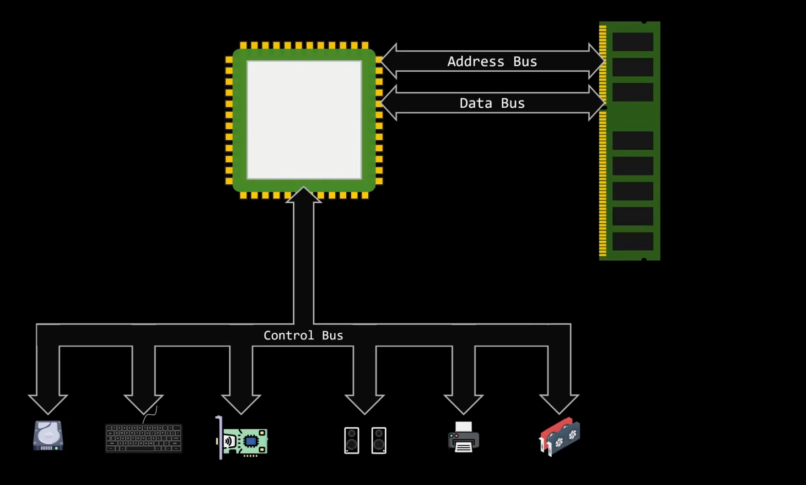
- 控制总线用于发送指令和数据

设计输入输出时，需要考虑：
+ Communication Method .（通信方法）
  - How the CPU physically talks to devices.
+ Data transfer technique (数据传输技术)
  - How and when the data moves.

- 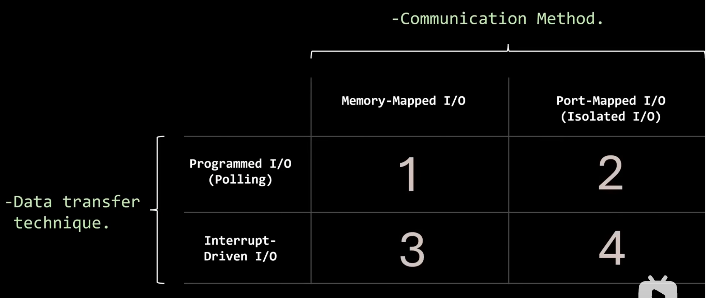
   + 实现两者（通信方法 和 数据传输技术）都有多种方法，在实践中，硬件可以使用它们的任意组合。

### 通信方法
#### Memory-Mapped I/O <sup>有一条定制总线</sup>
- 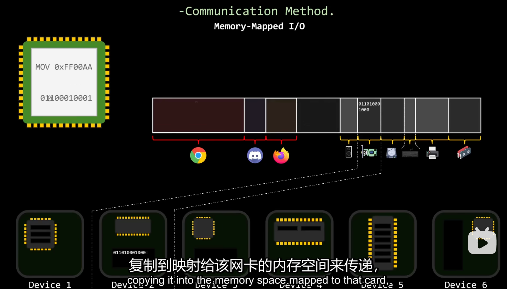
由于输入输出设备有自己的微控制器，也有某种形式的板载内存，可以简单到是锁寄存器、 触发器、或者控制器内部的小型寄存器文件，对于更复杂的设备，可能包含专用的DRAM芯片，内存映射IO的工作原理，就是暴露该板载内存，或至少是其中一部分，使得CPU可以像读写主存的另一部分一样进行读写，就行进程被分配地址空间一样，内存映射方法为IO设备在系统地址空间中，分配了特定的内存区域，通过CPU的角度来看，与设备通信和读写内存中的变量并无区别，因此他可以使用常规的加载、存储，和移动指令来与设备通信。

CPU和设备之间，仍然需要物理连接，需要一些额外的电路来判断通过地址总线传递的内存地址是属于主存还是I/O设备，
- 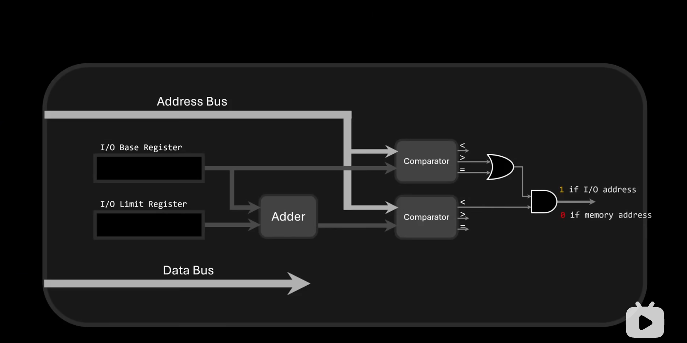
- 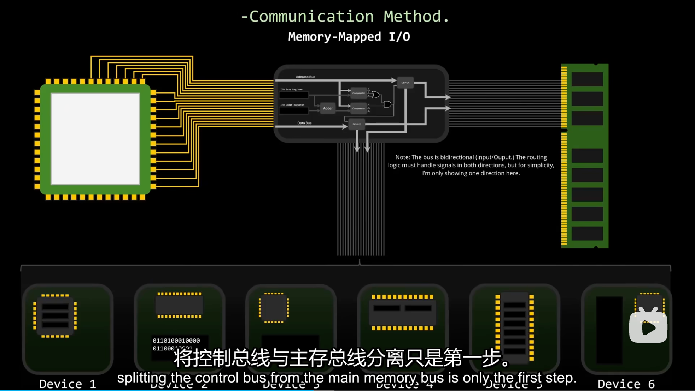

###### 使用内存映射I/O作为抽象层,类似于PCI这种标准化的专用总线


---

#### Isolated I/O
设备不映射到内存中，则是通过一条与内存完全分离的专用总线连接，与设备的通信通过自定义协议进行，最大优点是内存和IO操作互不干扰，这使得系统更有利于并行处理，但缺点是，CPU现在需要特殊指令，才能通过这条总线和设备通信。这意味着CPU内部需要更多的电路，导致CPU体积更大，制造成本更高，并且能效更低，
- 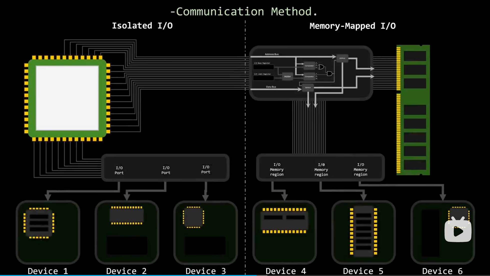


#### 数据传输技术
###### 轮询

###### 中断
- 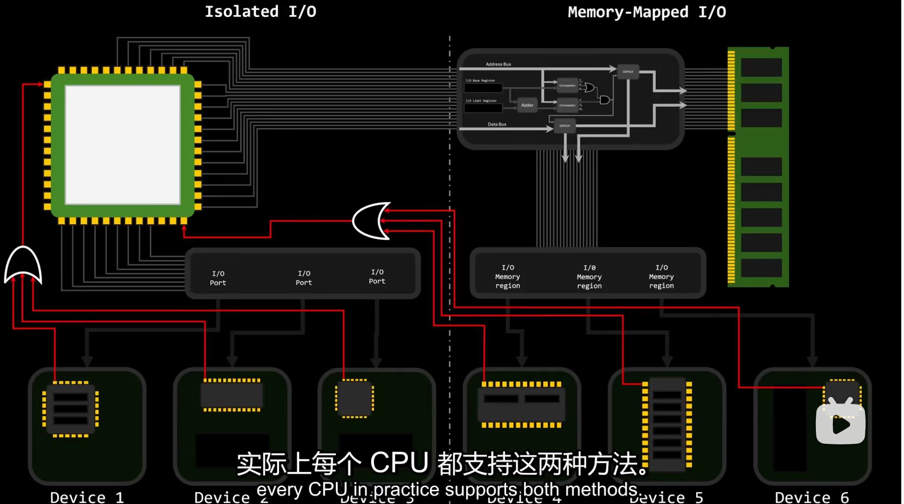

## 注意事项
- CPU执行快,I/O设备执行慢;


## 参考资料
- [CPU是如何与千奇百怪的设备交互的？ | Core Dumped](https://www.bilibili.com/video/BV1RVEF6uEzb/?spm_id_from=333.1007.top_right_bar_window_history.content.click&vd_source=9eef164b234175c1ae3ca71733d5a727)


