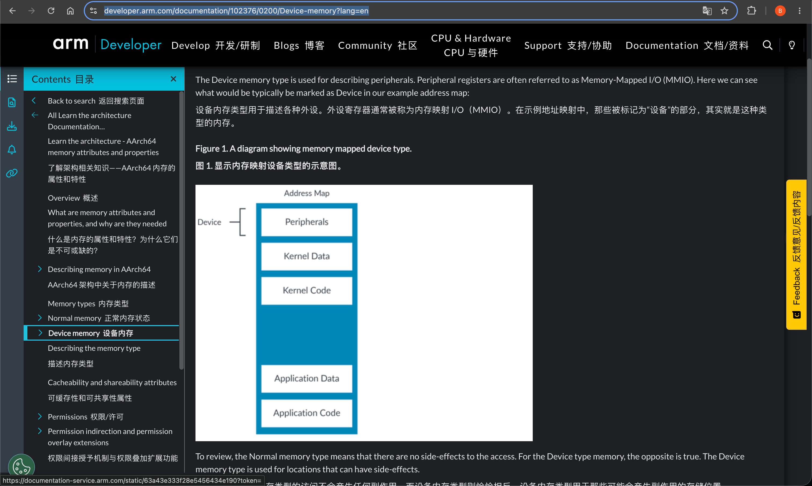
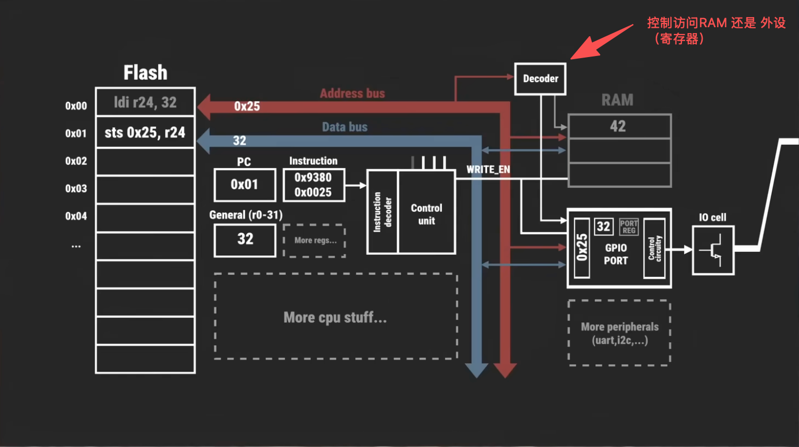
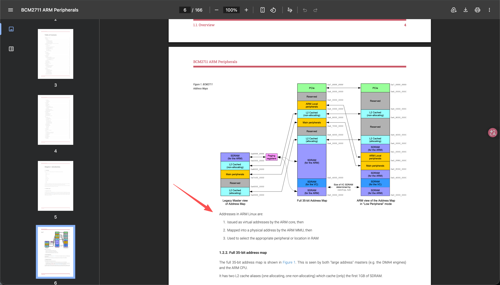
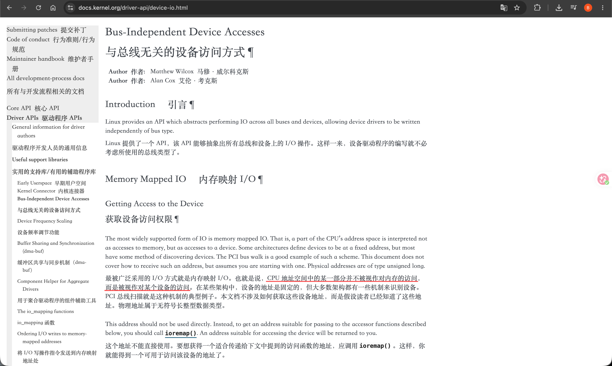

# Memory Mapped Input Output(MMIO)
- “**设备的寄存器映射到内存。只需读取和写入特定地址即可写入设备的寄存器**”
- “内存映射I/O与内存驻留的地址空间相同。内核使用通常由RAM（实际上是HIGH_MEM）使用的部分地址空间来映射设备寄存器，所以在该地址上不是实际内存（RAM），而是I/O设备。因此，**与I/O设备通信变得像读取和写入内存地址一样**，该地址专用于I/O设备”
   + MMIO是一种将外设寄存器映射到CPU统一地址空间的编址方式。从处理器角度看，访问设备就像访问普通内存一样

- “内存映射I/O与内存驻留的地址空间相同。内核使用通常由RAM（实际上是HIGH_MEM）使用的部分地址空间来映射设备寄存器，所以在该地址上不是实际内存（RAM），而是I/O设备。因此，与I/O设备通信变得像读取和写入内存地址一样，该地址专用于I/O设备。”摘录来自 [Linux设备驱动开发 （法）约翰·马迪厄（John Madieu）# “11.4.2　MMIO设备访问”](../../../007.BOOKs/Linux设备驱动开发)

- 
   + 将设备的寄存器，映射到内存地址空间中。

## MMIO工作原理
> 流程： 1. 将设备寄存器，映射到内存地址空间中  2. ARM内存访问 虚拟地址 -> MMU -> 物理地址 -> 地址译码(属于RAM区域走DRAM控制器 / 属于MMIO区域走外设总线)

- 

- 
   + Addresses in ARM Linux are:
     1. Issued as virtual addresses by the ARM core, then （由 ARM 内核发出虚拟地址，接着）
     2. Mapped into a physical address by the ARM MMU, then（经 ARM MMU（内存管理单元）映射为物理地址，然后）
     3. Used to select the appropriate peripheral or location in RAM（用于选中相应的外设或 RAM 中的特定位置。）

- 
   + Linux内核映射函数: ioremap() 

## 参考资料
- [Linux设备驱动开发#“11.4　使用I/O内存访问硬件”](../../../007.BOOKs/Linux设备驱动开发)
- [learn_the_architecture_-_aarch64_memory_attributes_and_properties_102376_0200_01_en.pdf#6. Device memory](../../../007.BOOKs/learn_the_architecture_-_aarch64_memory_attributes_and_properties_102376_0200_01_en.pdf)
- [软件控制硬件的终极原理：内存映射I/O (MMIO)](https://www.bilibili.com/video/BV1QrptzBErT/?spm_id_from=333.1007.top_right_bar_window_history.content.click&vd_source=9eef164b234175c1ae3ca71733d5a727)
- [树莓派·BCM2711 ARM Peripherals#P4](../../../007.BOOKs/RP-008248-DS-1-bcm2711-peripherals.pdf)
- [https://docs.kernel.org/driver-api/device-io.html](https://docs.kernel.org/driver-api/device-io.html)