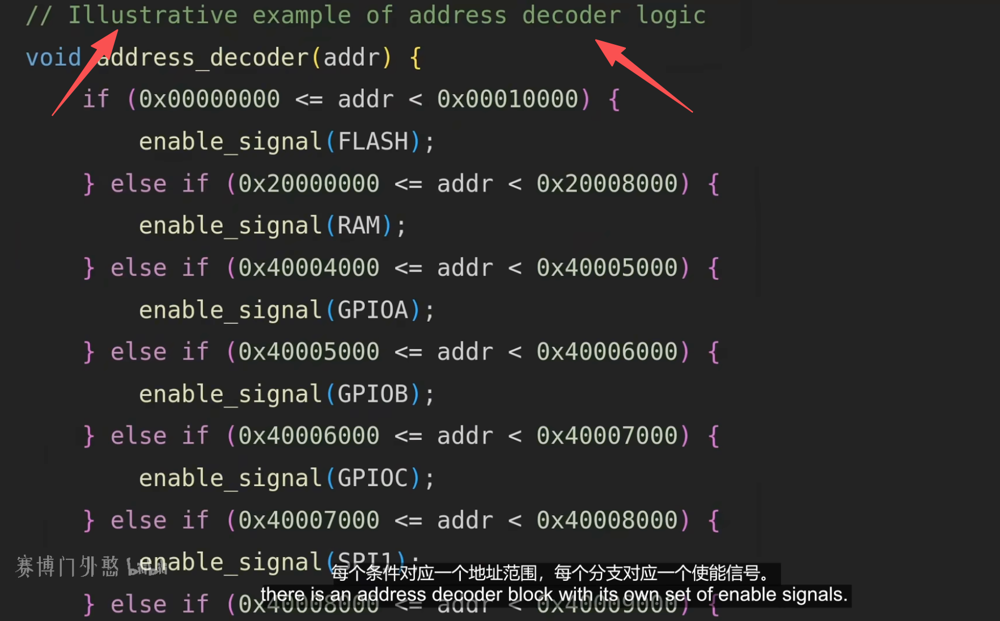
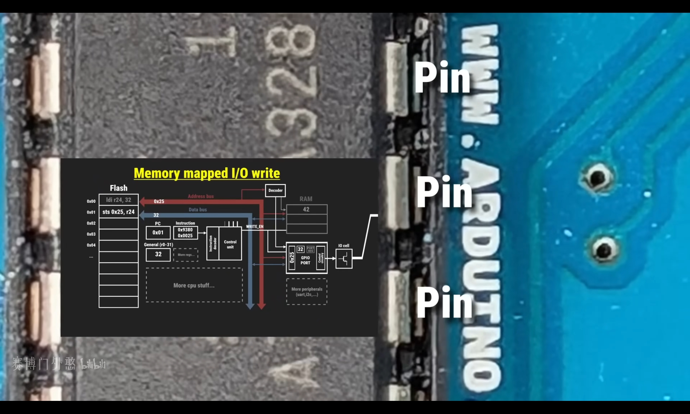

# Memory Mapped Input Output(MMIO)
- “**设备的寄存器映射到内存。只需读取和写入特定地址即可写入设备的寄存器**”
- “内存映射I/O与内存驻留的地址空间相同。内核使用通常由RAM（实际上是HIGH_MEM）使用的部分地址空间来映射设备寄存器，所以在该地址上不是实际内存（RAM），而是I/O设备。因此，**与I/O设备通信变得像读取和写入内存地址一样**，该地址专用于I/O设备”
   + MMIO是一种将外设寄存器映射到CPU统一地址空间的编址方式。从处理器角度看，访问设备就像访问普通内存一样

- “内存映射I/O与内存驻留的地址空间相同。内核使用通常由RAM（实际上是HIGH_MEM）使用的部分地址空间来映射设备寄存器，所以在该地址上不是实际内存（RAM），而是I/O设备。因此，与I/O设备通信变得像读取和写入内存地址一样，该地址专用于I/O设备。”<sup>摘录来自 [Linux设备驱动开发 （法）约翰·马迪厄（John Madieu）# “11.4.2　MMIO设备访问”](../../../007.BOOKs/Linux设备驱动开发)</sup>


- 
   + 将设备的寄存器，映射到内存地址空间中。


## MMIO工作原理
> 流程：<br/>1. 将设备寄存器，映射到内存地址空间中<br/> 2. ARM内存访问 虚拟地址 -> MMU -> 物理地址 -> 地址译码(属于RAM区域走DRAM控制器 / 属于MMIO区域走外设总线)

- 
   + 地址译码器模块（Decoder）：   拥有自己的使能信号，每个条件对应一个地址范围，每个分支对应一个使能信号： 他们不将（芯片设计者）所有内存地址映射到RAM这样的常规内存，而是将其中一部分映射到其他设备，例如 IO（视频中的示例是控制GPIO引脚）
      - 
        + 以地址作为输入，然后激活相应的使能信号。
      - 

- 
   + Addresses in ARM Linux are:
     1. Issued as virtual addresses by the ARM core, then （由 ARM 内核发出虚拟地址，接着）
     2. Mapped into a physical address by the ARM MMU, then（经 ARM MMU（内存管理单元）映射为物理地址，然后）
     3. Used to select the appropriate peripheral or location in RAM（用于选中相应的外设或 RAM 中的特定位置。）

- 
   + Linux内核映射函数: ioremap() 


## 参考资料
- [Linux设备驱动开发#“11.4　使用I/O内存访问硬件”](../../../007.BOOKs/Linux设备驱动开发)
- [learn_the_architecture_-_aarch64_memory_attributes_and_properties_102376_0200_01_en.pdf#6. Device memory](../../../007.BOOKs/learn_the_architecture_-_aarch64_memory_attributes_and_properties_102376_0200_01_en.pdf)
- [软件控制硬件的终极原理：内存映射I/O (MMIO)](https://www.bilibili.com/video/BV1QrptzBErT/?spm_id_from=333.1007.top_right_bar_window_history.content.click&vd_source=9eef164b234175c1ae3ca71733d5a727)
- [树莓派·BCM2711 ARM Peripherals#P4](../../../007.BOOKs/RP-008248-DS-1-bcm2711-peripherals.pdf)
- [https://docs.kernel.org/driver-api/device-io.html](https://docs.kernel.org/driver-api/device-io.html)

---

# ARM64 MMIO 映射与访问 — 文档索引

## 文档列表

| 文档 | 内容 |
|------|------|
| [01-MMIO核心调用链.md](01-MMIO核心调用链.md) | ioremap/iounmap 完整代码路径、页表建立、MAIR 属性、readl/writel 实现 |
| [02-平台设备MMIO映射.md](02-平台设备MMIO映射.md) | 平台设备(platform_device)从 Device Tree 到 ioremap 的完整流程 |
| [03-PCI设备MMIO映射.md](03-PCI设备MMIO映射.md) | PCI 设备 BAR 映射、pci_iomap/pcim_iomap 调用链 |
| [04-MMIO硬件交互流程图.md](04-MMIO硬件交互流程图.md) | CPU→MMU→Cache→总线→设备 完整硬件交互流程图与时间线 |

## 核心要点速查

### ioremap 核心路径

```
ioremap(phys, size)
  → __ioremap(phys, size, PROT_DEVICE_nGnRE)        [arch/arm64/include/asm/io.h:169]
    → __ioremap_caller(phys, size, prot, caller)     [arch/arm64/mm/ioremap.c:20]
      → get_vm_area_caller(size, VM_IOREMAP, ...)   [mm/vmalloc.c:2121]
      → ioremap_page_range(vaddr, vend, phys, prot)  [mm/ioremap.c:222]
        → ioremap_p4d_range → pud → pmd → pte
          → pfn_pte(pfn, prot) | set_pte_at()        [mm/ioremap.c:76-77]
      → return (void __iomem *)(offset + vaddr)
```

### 普通内存 vs MMIO 的关键差异

| 维度 | 普通内存 | MMIO |
|------|---------|------|
| 虚拟地址来源 | 线性映射 `PAGE_OFFSET + PA - PHYS_OFFSET` | vmalloc 区域动态分配 |
| 映射建立 | 启动时 `map_mem()` 一次性 | 驱动加载时 `ioremap()` 按需 |
| MAIR 属性 | 0xff (WBWA, cacheable) | 0x04 (Device nGnRE, non-cacheable) |
| PTE AttrIndx | 4 (MT_NORMAL) | 1 (MT_DEVICE_nGnRE) |
| Cache 行为 | 经过 L1/L2/L3 | 绕过所有 Cache |
| 页表层级 | 通常用 block/section 映射 (PMD/PUD) | 通常用 PTE 级别逐页映射 |
| 访问接口 | 直接指针解引用 | readl/writel (含内存屏障) |

### 平台设备 MMIO 推荐用法

```c
// 推荐：一行搞定
void __iomem *base = devm_platform_ioremap_resource(pdev, 0);
if (IS_ERR(base))
    return PTR_ERR(base);
```

### PCI 设备 MMIO 推荐用法

```c
// 推荐：自动管理
void __iomem *base = pcim_iomap(pdev, BAR0, 0);
if (!base)
    return -ENOMEM;
```

### MMIO 访问

```c
// 读取状态寄存器 (有读屏障)
u32 status = readl(base + STATUS_REG_OFFSET);

// 写入命令寄存器 (有写屏障)
writel(CMD_START, base + CMD_REG_OFFSET);

// 不需要屏障时使用 relaxed 版本
u32 val = readl_relaxed(base + DATA_REG_OFFSET);
```

## ARM64 关键内存属性速查

| 属性 | MAIR 编码 | 用途 |
|------|----------|------|
| `PROT_DEVICE_nGnRnE` | AttrIndx=0, MAIR=0x00 | PCI 配置空间 |
| `PROT_DEVICE_nGnRE` | AttrIndx=1, MAIR=0x04 | 普通 MMIO (默认 ioremap) |
| `PROT_NORMAL_NC` | AttrIndx=3, MAIR=0x44 | ioremap_wc, 显存 |
| `PROT_NORMAL` | AttrIndx=4, MAIR=0xff | 普通内存, 线性映射 |