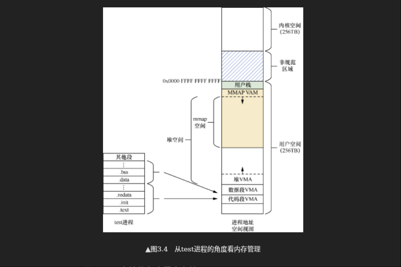
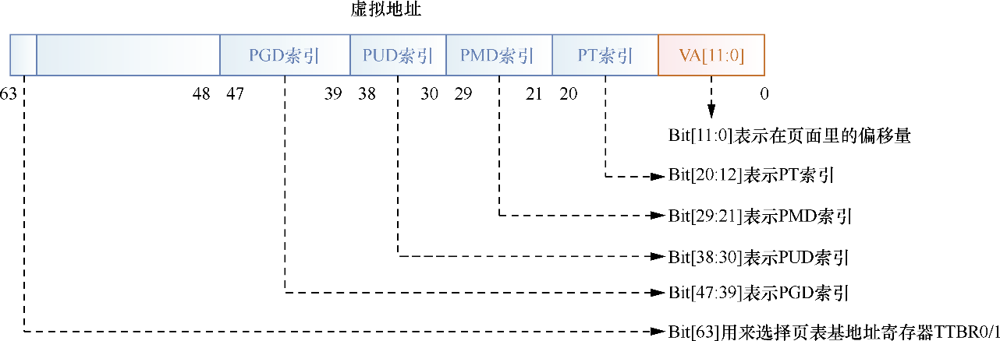

# 内存管理
- 学习:[Run Linux Kernel (2nd Edition) Volume 1: Infrastructure.epub]#2.1　ARM64内存管理
- 学习: 000.LINUX-5.9/Documentation/translations/zh_CN/arm64/memory.txt (Linux 在 AArch64 中的内存布局)

## ARM64内存管理

> 学习:[奔跑吧Linux内核（第2版）卷1：基础架构#2.1　ARM64内存管理](../../007.BOOKs/Run%20Linux%20Kernel%20(2nd%20Edition)%20Volume%201:%20Infrastructure.epub)
- MMU 提供进程空间（虚拟地址空间） 到 物理地址空间的映射
- 对于多任务操作系统，每个进程都拥有独立的进程地址空间。这些进程地址空间在虚拟地址空间内是相互隔离的，但是在物理地址空间可能映射同一个物理页面,需要使用`MMU提供的映射和管理功能`完成`进程地址空间`到`物理空间`的映射

---

## 从进程的角度分析内存



---

## 使能分页机制
在没有使能分页机制的系统中，处理器直接寻址物理地址，把物理地址发送到内存控制器中；而在使能了分页机制的系统中，处理器直接寻址虚拟地址，这个地址不会直接发给内存控制器，而是先发送给MMU的硬件单元。MMU负责虚拟地址到物理地址的转换和翻译工作。

## 内存管理数据结构
在大部分Linux操作系统中，内存设备的初始化一般在BIOS或BootLoader中完成，然后把DDR存储设备的大小传递给Linux内核，因此从Linux内核的角度来看，DDR存储设备其实就是一段物理内存空间 <sub>[Run Linux Kernel (2nd Edition) Volume 1: Infrastructure.epub]#3.3.2　内存管理之数据结构</sub>


Linux内核为每个物理页面都分配了一个page数据结构，采用mem_map[]数组来存放这些page数据结构，并且它们和物理页面是一对一的映射关系<sub>[Run Linux Kernel (2nd Edition) Volume 1: Infrastructure.epub]#图3.9　mem_map[]数组和物理页面的关系</sub>

###  pglist_data
pglist_data数据结构用来描述一个内存节点的所有资源

在UMA架构中，只有一个内存节点，即系统有一个全局的变量contig_page_data来描述这个内存节点。在NUMA架构中，整个系统的内存由一个pglist_data *的指针数组node_data[ ]来管理，在系统初始化时通过枚举BIOS固件（ACPI）来完成

---

---
## UMA & NUMA
在现在广泛应用的计算机系统中，以内存为研究对象可以分成两种架构，一种是统一内存访问（Uniform Memory Access，UMA）架构，另外一种是非统一内存访问（Non-Uniform Memory Access，NUMA）架构

- UMA架构：内存有统一的结构并且可以统一寻址。目前大部分嵌入式系统、手机操作系统以及台式机操作系统等采用UMA架构。如图3.6所示，该系统使用UMA架构，有4个CPU，它们都有L1高速缓存，其中CPU0和CPU1组成一个簇（Cluster0），它们共享一个L2高速缓存。另外，CPU2和CPU3组成另外一个簇（Cluster1），它们共享另外一个L2高速缓存。4个CPU都共享同一个L3的高速缓存。最重要的一点，它们可以通过系统总线来访问物理内存DDR。
- NUMA架构：系统中有多个内存节点和多个CPU簇，CPU访问本地内存节点的速度最快，访问远端的内存节点的速度要慢一点。如图3.7所示，该系统使用NUMA架构，有两个内存节点，其中CPU0和CPU1组成一个节点（Node0），它们可以通过系统总线访问本地DDR物理内存，同理，CPU2和CPU3组成另外一个节点（Node1），它们也可以通过系统总线访问本地的DDR物理内存。如果两个节点通过超路径互连（Ultra Path Interconnect，UPI）总线连接，那么CPU0可以通过这个内部总线访问远端的内存节点的物理内存，但是访问速度要比访问本地物理内存慢很多。

> 示意图请参考: [Run Linux Kernel (2nd Edition) Volume 1: Infrastructure.epub]#3.3.1　内存架构之UMA和NUMA

## 物理内存映射
在内核使用内存钱，需要初始化内核的页表，即 paging_init 函数

## Linux内核中的页表
4级分页模型在64位虚拟地址的划分:

## Linux 在 AArch64 中的内存布局
> [000.LINUX-5.9/Documentation/translations/zh_CN/arm64/memory.txt](../../000.SOURCE_CODE/000.LINUX-5.9/000.LINUX-5.9/Documentation/translations/zh_CN/arm64/memory.txt)


---

## Linux 中，struct vm_area_struct  mm_struct page pgd 之间的关系
> 结合上图虚拟地址来分析

| **数据结构** | **描述**  | **所在头文件** |
|-----------|-----------|-----------|
| `struct vm_area_struct` | 描述进程的**虚拟内存区域（VMA）**，如代码段、堆、栈或文件映射。  | `linux/mm_types.h`         |
| `struct mm_struct`      | 描述进程的**完整内存布局**，包含所有 VMA、页表、堆信息等。      | `linux/mm_types.h`         |
| `struct page`           | 描述**物理内存页**的元数据（如归属、状态、引用计数）。           | `linux/mm_types.h`         |
| `pgd` (Page Global Directory) | **页全局目录**，是进程页表的顶级结构，用于虚拟地址到物理地址的转换。 | `asm/pgtable.h`    |


```txt
// 暂时记录，待分析
进程任务控制块 (task_struct)
  |
  |---> mm_struct (进程内存描述符)
         |
         |---> vm_area_struct (VMA 链表/红黑树)  —— 描述虚拟内存区域
         |       |---> vm_start, vm_end (虚拟地址范围)
         |       |---> vm_flags (权限: READ/WRITE/EXEC)
         |       |---> vm_file (关联的文件，如文件映射)
         |
         |---> pgd (页全局目录)  —— 指向页表层级结构
                 |
                 |---> 页表遍历 (PGD → P4D → PUD → PMD → PTE)
                         |
                         |---> struct page (物理页帧)
```
