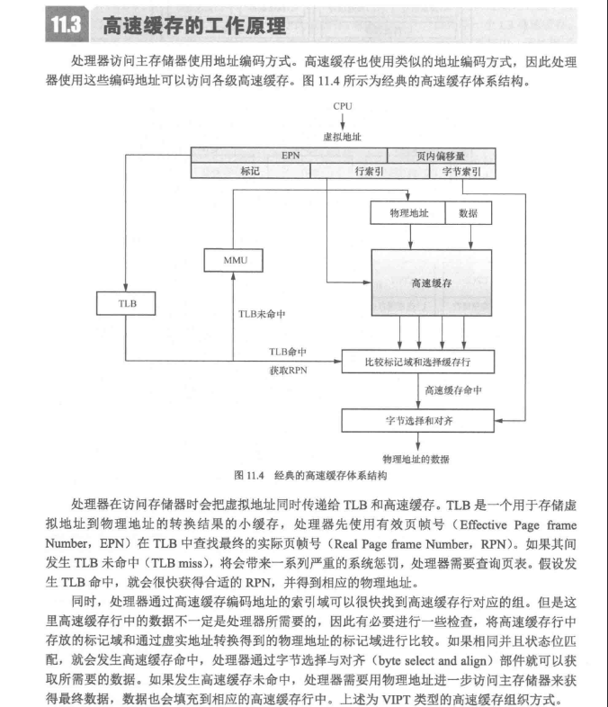
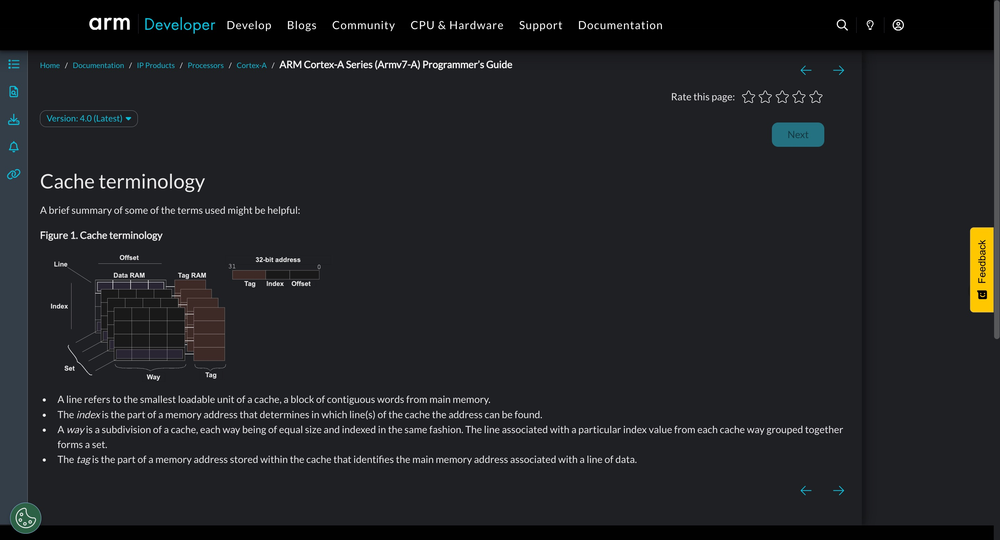
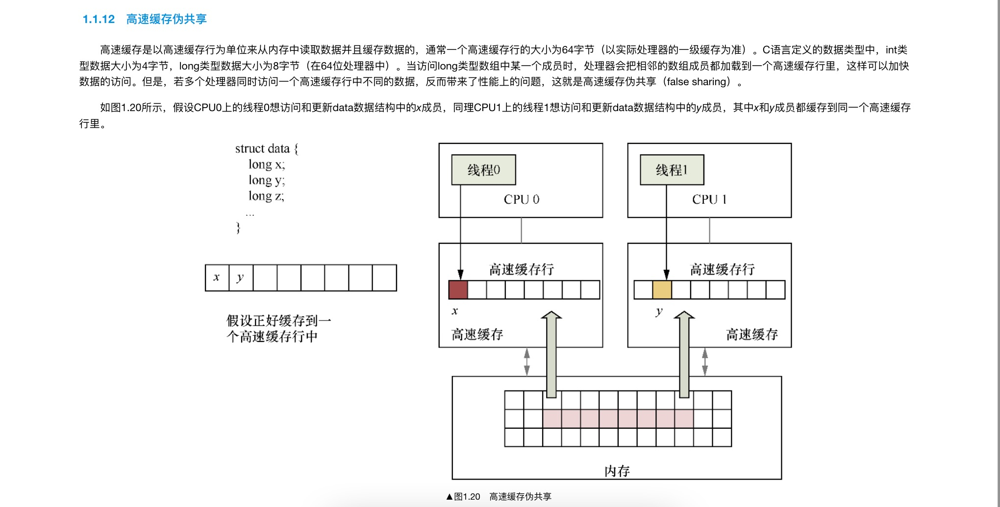
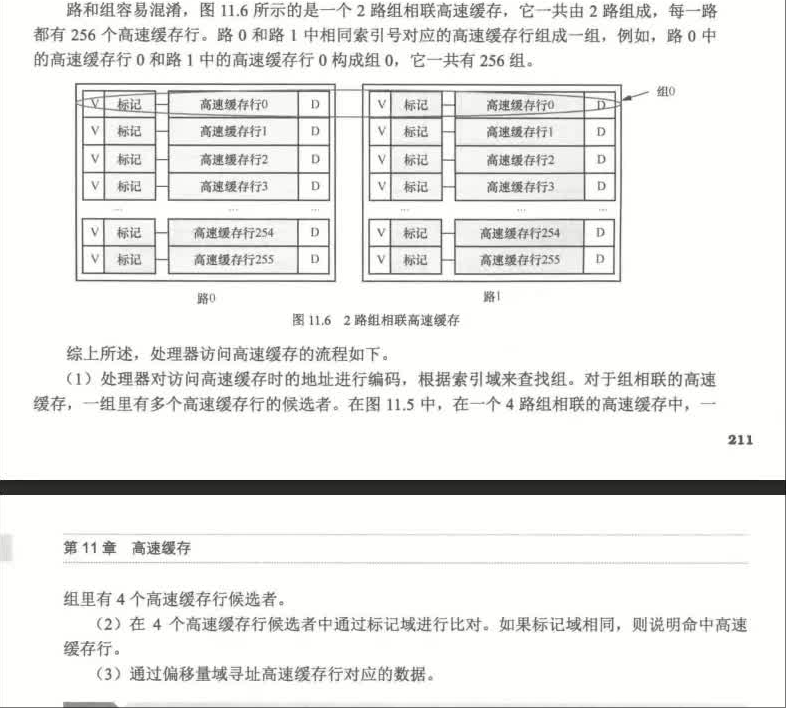
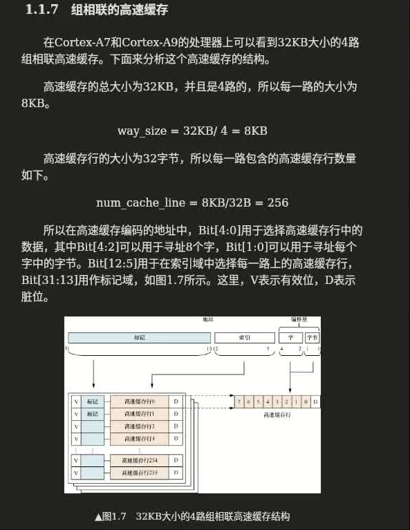
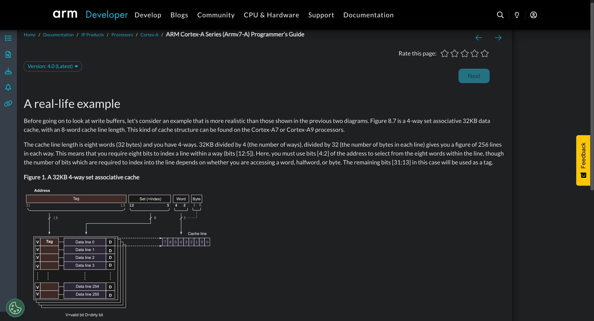
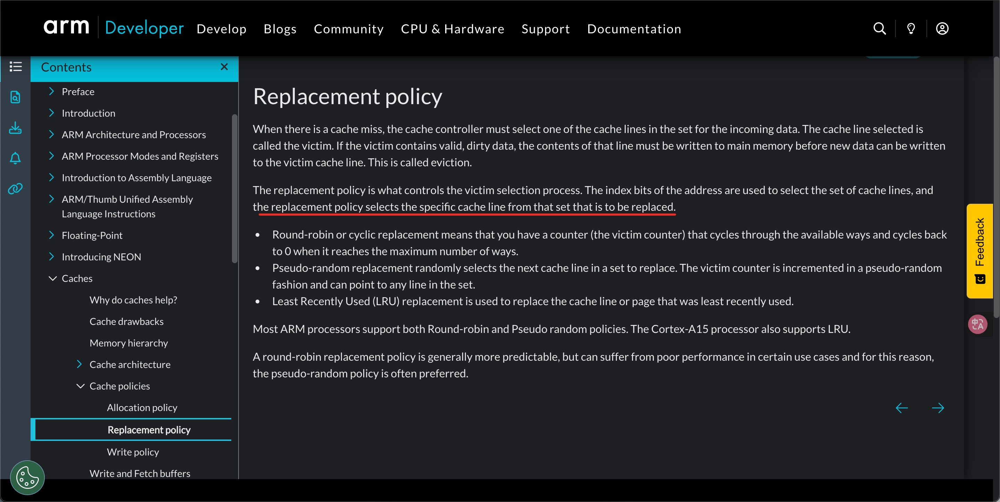

# 高速缓存结构
请阅读:[奔跑吧Linux内核（第2版）卷1：基础架构#1.1.5　高速缓存的工作方式](../006.BOOKs/Run%20Linux%20Kernel%20(2nd%20Edition)%20Volume%201:%20Infrastructure.epub)  && [《RISC-V体系结构编程与实践（第2版）》<sup>笨叔·著</sup>#11.3高速缓存的工作原理](../006.BOOKs/RISC-V%20Architecture%20Programming%20and%20Practice.pdf)

## 缓存行（Cache Line）解释：
缓存行 是 CPU 高速缓存中的最小数据传输单元。在 CPU 中，高速缓存是通过将内存中的数据块分割成一定大小的块进行存储的，这些块就是缓存行。

## 高速缓存工作原理


来自于[《RISC-V体系结构编程与实践（第2版）》<sup>笨叔·著</sup>#11.3高速缓存的工作原理](../006.BOOKs/RISC-V%20Architecture%20Programming%20and%20Practice.pdf) 对比 [奔跑吧Linux内核（第2版）卷1：基础架构#1.1.5　高速缓存的工作方式](../006.BOOKs/Run%20Linux%20Kernel%20(2nd%20Edition)%20Volume%201:%20Infrastructure.epub) 来学习:
- 虚实地址转换： MMU
- 虚拟地址同时传给 TLB 和 高速缓存 
- 多个地址可能使用同一个缓存行，因此，还需要对比 ‘标记域 ’

### 高速缓存结构




### 处理器访问高速缓存的流程
[《RISC-V体系结构编程与实践（第2版）》<sup>笨叔·著</sup>#11.3高速缓存的工作原理->P211](../006.BOOKs/RISC-V%20Architecture%20Programming%20and%20Practice.pdf)


#### 疑问？
1. 进程都有相同的虚拟地址，那么高速缓存映射是通过虚拟地址还是物理地址呢?: 得看具体实现,详见: [奔跑吧Linux内核（第2版）卷1：基础架构#1.1.8　PIPT和VIVT的区别](../006.BOOKs/Run%20Linux%20Kernel%20(2nd%20Edition)%20Volume%201:%20Infrastructure.epub)
2. 一个缓存行大小有32/64字节，那么在高速缓存行中是怎么存放的呢?
    - 

---

## 什么是高速缓存<sup>解决CPU访问速度和内存访问速度不一致问题</sup>
高速缓存（Cache）是一种存储器，它用于存储经常使用的数据或指令，以加速数据的访问速度。高速缓存的目的是减少处理器访问主存储器（如RAM）时的延迟，从而提高系统的整体性能。

## 如何理解文中提到的 组 路 缓存行 等名词
结合 [奔跑吧Linux内核（第2版）卷1：基础架构#1.1.5　高速缓存的工作方式](../006.BOOKs/Run%20Linux%20Kernel%20(2nd%20Edition)%20Volume%201:%20Infrastructure.epub)  章节内容，以及如下截图（均来自 [《RISC-V体系结构编程与实践（第2版）》<sup>笨叔·著</sup>](../006.BOOKs/RISC-V%20Architecture%20Programming%20and%20Practice.pdf)）：
- 
    + 从路和组的角度来看，这个高速缓存只有1路，每路里有4组，每组里只有一个高速缓存行——解释上图

可以发现：
- 路： 一个 “大方块” 就是一路
- 组： 一路里面包含多个组 <sub>由每一路的相对应的缓存行构成一组，相对应：即一个地址0x0000 0000 即可以放在路0的第一行，也可以放在路1的第一行，那就说路0 路1的第一行是相对应的,如下图：图11.9 2路组相联的告诉缓存</sub>
  + 验证: 来自 [《RISC-V体系结构编程与实践（第2版）》<sup>笨叔·著</sup>#11.3高速缓存的工作原理](../006.BOOKs/RISC-V%20Architecture%20Programming%20and%20Practice.pdf)
  + 
- 一个 4 路组相联缓存（4-Way Set-Associative），表示每个 Set 有 4 个 Cache Line，分别属于 Way0~Way3。


  - 通过这张图，就更能明白 组 和 路 的关系了
  - N路，即表示 主内存中一个地址与N个高速缓存行对应。


---

TLB: 是一个用于存储虚拟地址到物理地址转换的小缓存。

---

## 高速缓存的映射方式
[奔跑吧Linux内核（第2版）卷1：基础架构#1.1.6　高速缓存的映射方式](../006.BOOKs/Run%20Linux%20Kernel%20(2nd%20Edition)%20Volume%201:%20Infrastructure.epub) 

### 1. 直接映射
当每组只有一个高速缓存行时，高速缓存称为直接映射高速缓存 ， 其实就只有'一路'

#### 直接映射缺点 <sup>先看一下资料,图示很清晰</sup>
- 高速缓存行会被频繁换入、换出，会导致严重的缓存颠簸。

### 2. 组相联
为了解决直接映射高速缓存中的高速缓存颠簸的问题。

先学习: [奔跑吧Linux内核（第2版）卷1：基础架构#1.1.6　高速缓存的映射方式#2．组相联](../006.BOOKs/Run%20Linux%20Kernel%20(2nd%20Edition)%20Volume%201:%20Infrastructure.epub) 

---

## 地址如何映射到缓存行 <sup>组相联</sup>
学习:[奔跑吧Linux内核（第2版）卷1：基础架构#1.1.7　组相联的高速缓存](../006.BOOKs/Run%20Linux%20Kernel%20(2nd%20Edition)%20Volume%201:%20Infrastructure.epub) 



+ 如何将地址(可能是虚拟地址，也可能是物理地址:PIPT/VIVT)映射到高速缓存?
  - 即 将物理地址/虚拟地址 使用高速缓存编码方式解析，如上图，解析后就能知道该地址对应哪一路中的哪一组的高速缓存行中

+ 如上图，每个高速缓存行有V&D,说明，每个高速缓存行变为Dirty时，是整个高速缓存行，而不是存储的某一个数据

+ 关于上图上的位解析:
  - Bit[4:0] : 5位，这是因为此时定义的高速缓存行大小是32字节
  - Bit[4:2] : 3位，用于寻找缓存行中的八个字<sub>1个字是4字节，书本上的原文</sub>
  - Bit[1:0] : 2位，用来寻找每个字中的字节 <sub>1个字是4字节，书本上的原文</sub>
  - Bit[12:5]: 8位，用来寻找256个高速缓存行中的某一个<sub>寻找组</sub>
  - 那么如何确定缓存在哪一路呢?
    + 这个是由Cache Controller控制的，采用一定的策略来选择，而不是直接根据虚拟地址/物理地址来计算的。
       - 根据 虚拟地址/物理地址 能计算得到是哪一个缓存行，但是具体在哪一路，则有 Cache Controller 控制（随机/轮询/LRU）
       - [奔跑吧Linux内核（第2版）卷1：基础架构#1.1.16　高速缓存的回写策略和替换策略](../006.BOOKs/Run%20Linux%20Kernel%20(2nd%20Edition)%20Volume%201:%20Infrastructure.epub) 
    + 


---

## 高速缓存分类


---


## 思考
### Linux上，如何查看高速缓存信息?
```shell
wei@Berries-Wang:~$ cat /sys/devices/system/cpu/cpu0/cache/index0/coherency_line_size
64  # 表示第一个核心的 L1 数据缓存行大小为 64 字节
```
---

## 参考资料
- [ARM Cortex-A Series (Armv7-A) Programmer’s Guide](https://developer.arm.com/documentation/den0013/0400/Caches/Cache-architecture/A-real-life-example)