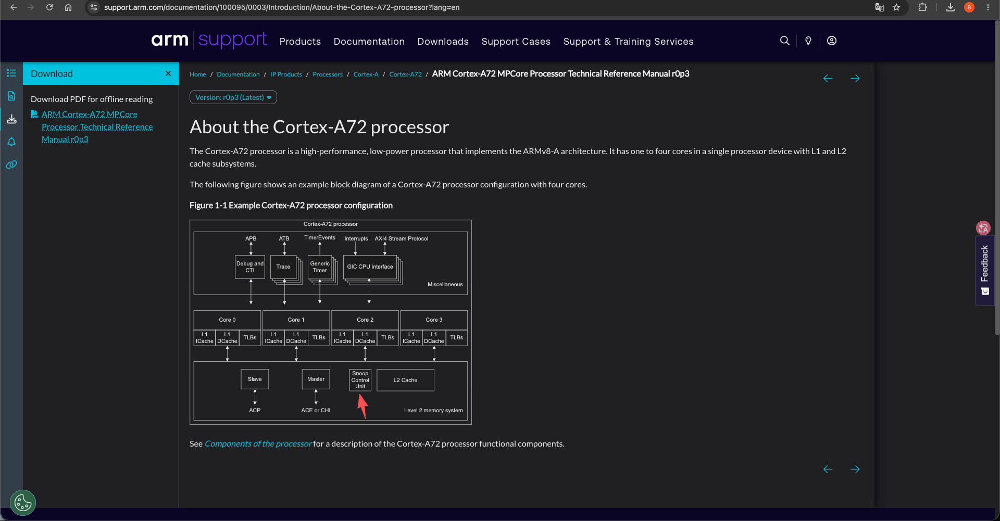
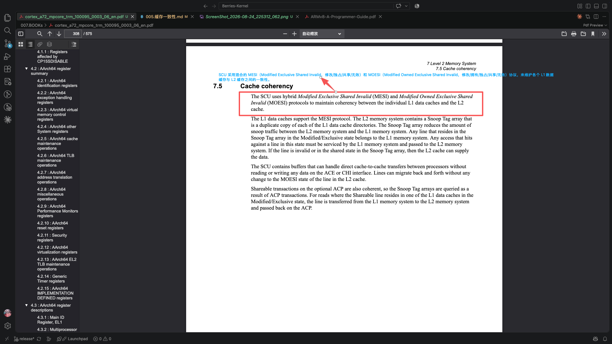
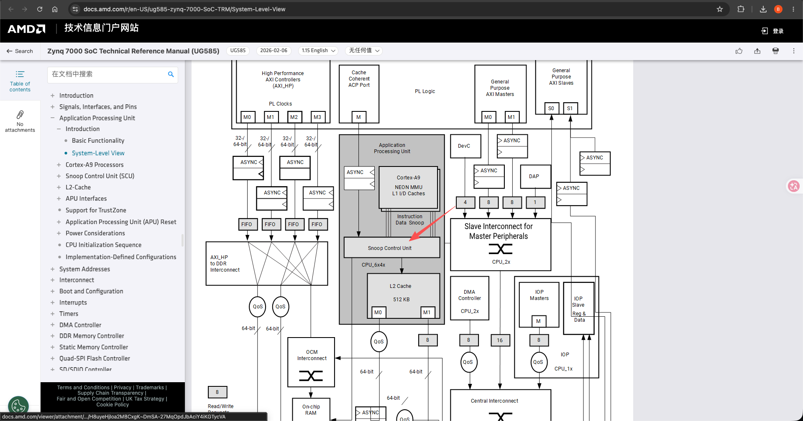
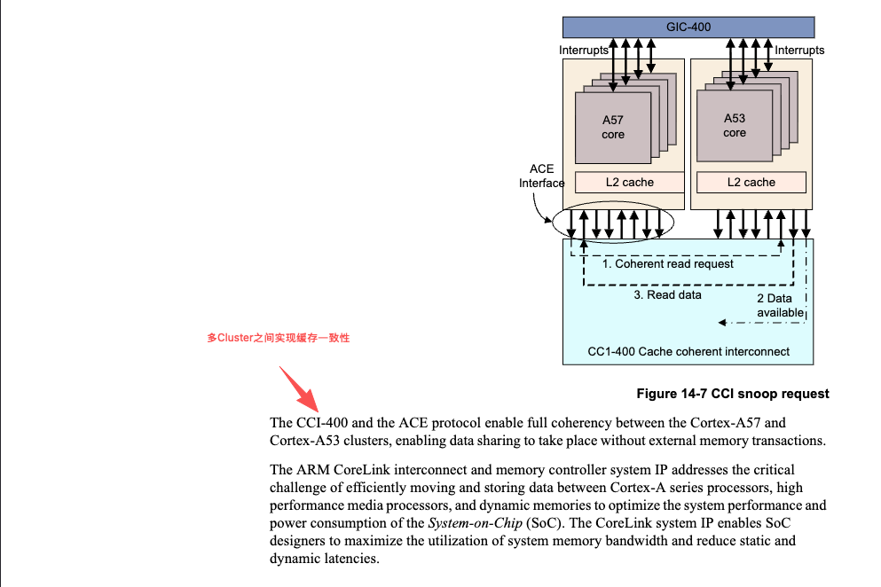

# 缓存一致性(Cache Coherency. ARM-v8+) 
> 学习:  - [000.DynamIQ Shared Unit.md(DSU)](../../007.BOOKs/000.ARM资料库/000.DynamIQ%20Shared%20Unit.md) - [002.CAS实现原理.md](../008.同步原语/001.原子指令/002.CAS实现原理.md) - [003.LLSC实现原理.md](../008.同步原语/001.原子指令/003.LLSC实现原理.md)  - [ARM® Cortex®-Series Version: 1.0 Programmer’s Guide for ARMv8-A](../../006.REFS/ARMv8-A-Programmer-Guide.pdf)#P14-18 - [ARM® Cortex®-A72 MPCore Processor Technical Reference Manual](../../007.BOOKs/cortex_a72_mpcore_trm_100095_0003_06_en.pdf)   - [Arm CoreLink CMN-600 Coherent Mesh Network Technical Reference Manual](../../007.BOOKs/corelink_cmn600_technical_reference_manual_100180_0302_01_en.pdf)   - [007.BOOKs/000.ARM资料库/003.CMN-600.md](../../007.BOOKs/000.ARM资料库/003.CMN-600.md)

- 多核之间的缓存一致性，由SCUSnoop Control Unit（DSU[DynamIQ Shared Unit](../../007.BOOKs/000.ARM资料库/000.DynamIQ%20Shared%20Unit.md)）硬件来执行维护，使用MESI协议
  + [ARM® Cortex®-A72 MPCore Processor Technical Reference Manual](../../007.BOOKs/cortex_a72_mpcore_trm_100095_0003_06_en.pdf)#P1-14
  +  [ARM® Cortex®-A72 MPCore Processor Technical Reference Manual](../../007.BOOKs/cortex_a72_mpcore_trm_100095_0003_06_en.pdf)#P7-308
  +  [ug585-zynq-7000-SoC-TRM](../../007.BOOKs/UG585.pdf)#P'System-Level View'
- 多cluster之间的缓存一致性，由 CCI如 [CCI-550](../../007.BOOKs/000.ARM资料库/002.CCI-550.md)/CMN CCI-550 ,CMN-600 功能类似，只是使用了不同协议，参考: [007.BOOKs/000.ARM资料库/003.CMN-600.md](../../007.BOOKs/000.ARM资料库/003.CMN-600.md)来执行维护，没有使用MESI协议
  + [ARM® Cortex®-Series Version: 1.0 Programmer’s Guide for ARMv8-A](../../006.REFS/ARMv8-A-Programmer-Guide.pdf)#P14-18

> **本文档是"缓存一致性"的概念篇**：只回答"一致性是什么、为什么需要、以及与原子指令的关系"。
> DSU/SCU 的硬件实现细节（DSU 集群结构、snoop filter、cache-to-cache、ACE/CHI 一致性事务、SYSCOREQ/SYSCOACK 握手、ACP、DSU-120 演进、页码索引）已迁移至 [000.DynamIQ Shared Unit.md(DSU)](../../007.BOOKs/000.ARM资料库/000.DynamIQ%20Shared%20Unit.md)。

---

## 1. 为什么需要缓存一致性：多核共享内存

多核处理器上多个核心共享同一份物理内存，而每个核心又有私有的 L1/L2 缓存（不理解? 和记忆中的有偏差? 看上面的图吧）。若某核心修改了某地址的缓存副本，其他核心必须看到最新值——否则共享内存编程（锁、消息传递、进程迁移）就会出错。缓存一致性（cache coherency）保证：**任意时刻，对任意共享地址，所有核心观察到一致的缓存行内容**。

- 集群（cluster）**内**多核之间的一致性，由 DSU 内的 **SCU** 硬件维护，使用 **MESI** 协议；
- 集群**间**的一致性，由 **CCI**（如 CCI-550）/ **CMN** 系统互连维护，不使用 MESI。

## 2. 一致性协议：MESI 家族

MESI 用四个状态描述缓存行在系统中的存在方式：

| MESI 状态 | 含义 | 可否写 |
| - | - | - |
| **M**（Modified） | 仅本核有该行且为脏（与内存不同） | 可写，无需通知他人 |
| **E**（Exclusive） | 仅本核有该行且干净 | 可写，无需通知他人 |
| **S**（Shared） | 多核持有该行副本，均干净 | 写前需先取得独占 |
| **I**（Invalid） | 本核副本无效 | - |

写共享数据需要"取得独占"（Invalidate/Unique），读共享数据则维持 S 态；这个状态机由 SCU 落地实现（详见 [DSU 文档中的 ACE/MESI 状态对应表](../../007.BOOKs/000.ARM资料库/000.DynamIQ Shared Unit.md)）。

## 3. 与原子指令的关系

缓存一致性是原子指令的**物理基础**：

- **LSE 原子指令（CAS/LDADD/SWP…）**把"读-比较-写"做成单笔一致性 RMW，在缓存行**独占态**上执行，由缓存一致性协议充当原子性保证者——见 [002.CAS实现原理.md](../008.同步原语/001.原子指令/002.CAS实现原理.md)。
- **LL/SC（LDXR/STXR）**靠独占监视器标记地址、条件写，本质仍依赖一致性域的访存序——见 [003.LLSC实现原理.md](../008.同步原语/001.原子指令/003.LLSC实现原理.md)。
- 即：**SCU 维护的缓存行状态（Unique/Dirty/Shared）正是原子指令赖以无锁生效的机制。**
