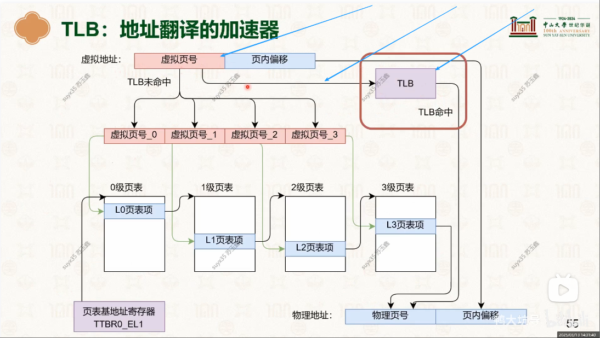
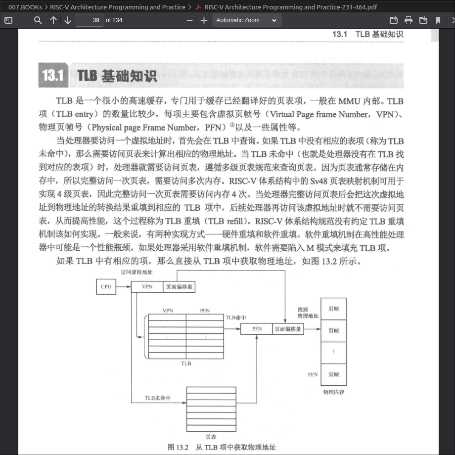
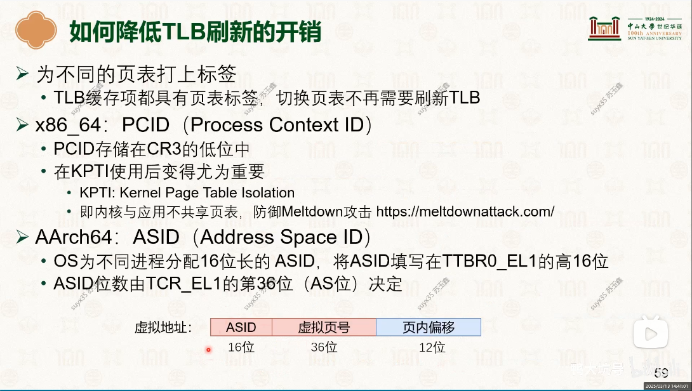
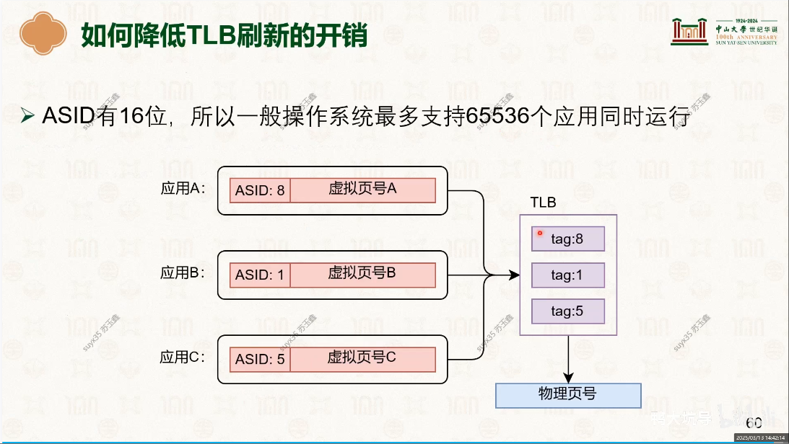

# TLB(Translation Lookaside Buffer)
- 
   + 缓存的 “虚拟页号” 与 “物理页号”的映射关系
- 
   - 着重学习一下: [RISC-V Architecture Programming and Practice#第13章 TLB管理](../../007.BOOKs/RISC-V%20Architecture%20Programming%20and%20Practice/RISC-V%20Architecture%20Programming%20and%20Practice-231-464.pdf)


---


## TLB刷新
### address space identifier (ASID)<sup>进程空间标识，16位，所以一般系统最多支持65536个应用同时运行，当溢出会重新分配</sup>
- [D8.16 Translation Lookaside Buffers#D8.16.3 Use of ASIDs and VMIDs to reduce TLB maintenance requirements](../../007.BOOKs/Arm%20Architecture%20Reference%20Manual%20for%20A-profile%20architecture/)
- [C5.5.10 TLBI ASIDE1, TLBI ASIDE1NXS, TLB Invalidate by ASID, EL1](../../007.BOOKs/Arm%20Architecture%20Reference%20Manual%20for%20A-profile%20architecture/)
  + A TLB entry associated with a specific ASID value, or a specific ASID and a VMID value, can only be used to translate a VA in a context that is associated with the same ASID value, or ASID and VMID value （与特定 ASID（地址空间标识符）值相关联，或与特定 ASID 及 VMID（虚拟机标识符）值相关联的 TLB（转换后备缓冲区）表项，仅能用于转换处于相同 ASID 值、或相同 ASID 及 VMID 值关联上下文中的虚拟地址（VA））
    - ASID (Address Space Identifier)：用于区分同一操作系统内不同的进程。这样在切换进程时，就不必刷新（Flush）整个 TLB。
    - VMID (Virtual Machine Identifier)：用于区分不同的虚拟机。在虚拟化环境中，它与 ASID 配合使用，确保二级地址转换的安全性
- 
- 
```c
   // 000.LINUX-5.9/arch/arm64/include/asm/tlbflush.h

```

## 参考资料
- [Arm® Architecture Reference Manualfor A-profile architecture](./../../007.BOOKs/Arm%20Architecture%20Reference%20Manual%20for%20A-profile%20architecture/)
- [虚拟内存管理I](../000.内存管理/998.REFS/000.中山大学-操作系统/3-0310-virtual-mem-1.pdf)# & [虚拟内存管理II](../000.内存管理/998.REFS/000.中山大学-操作系统/3-0313-virtual-mem-2.pdf)
- [RISC-V Architecture Programming and Practice#第13章 TLB管理](../../007.BOOKs/RISC-V%20Architecture%20Programming%20and%20Practice/RISC-V%20Architecture%20Programming%20and%20Practice-231-464.pdf)