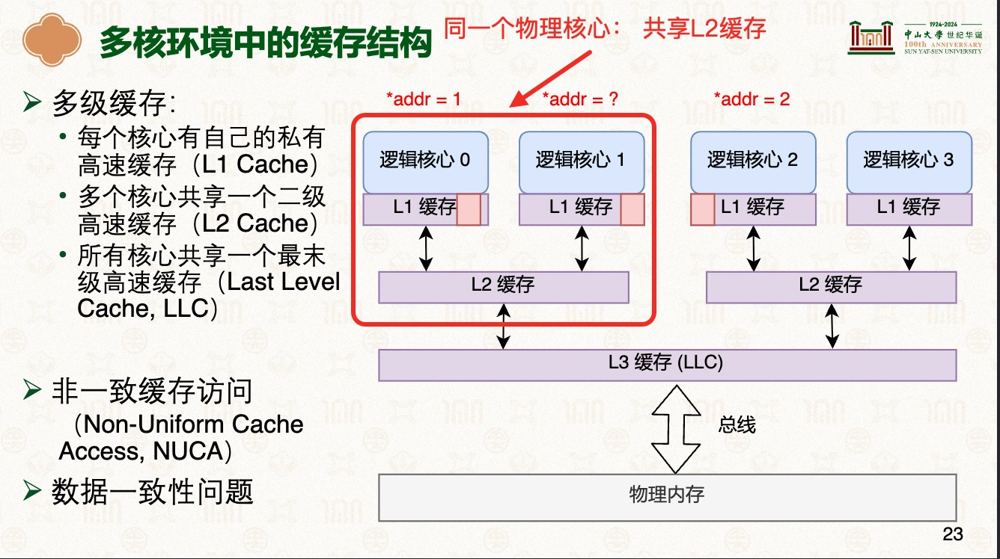

# 高速缓存 
> 学习:[1.1.5　高速缓存的工作方式](../../007.BOOKs/UNIX%20Network%20Programming%20Volume%201:%20Socket%20Networking%20API%20(3rd%20Edition).epub)   [27-多核处理器：缓存一致性 [中山大学 操作系统原理]](../000.内存管理/998.REFS/000.中山大学-操作系统/16-0609-multiprocessor-1.pdf)

---

## 多核环境中的缓存结构
- 

---

## 高速缓存经典架构

