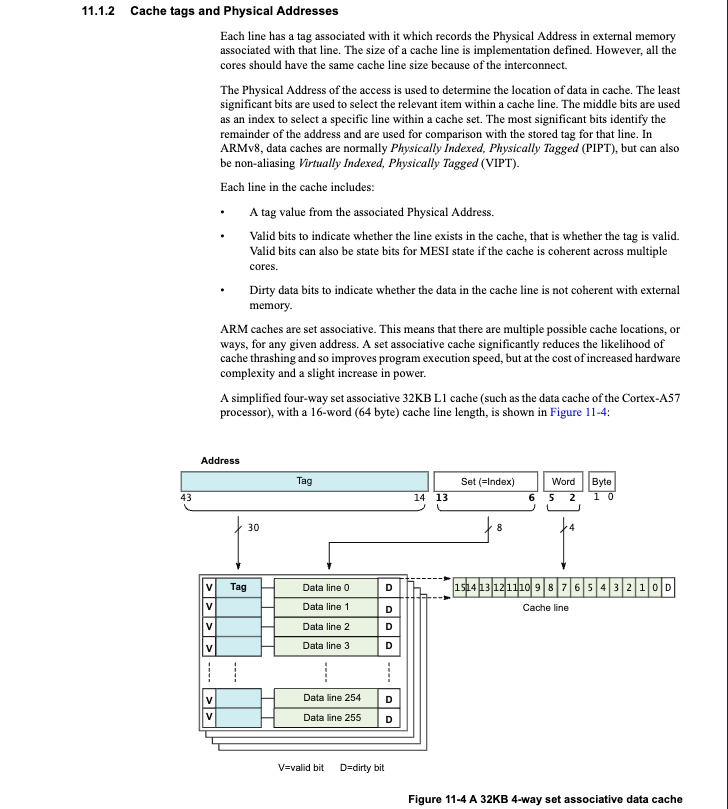
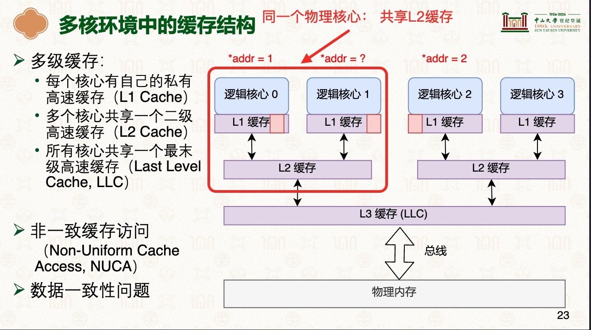
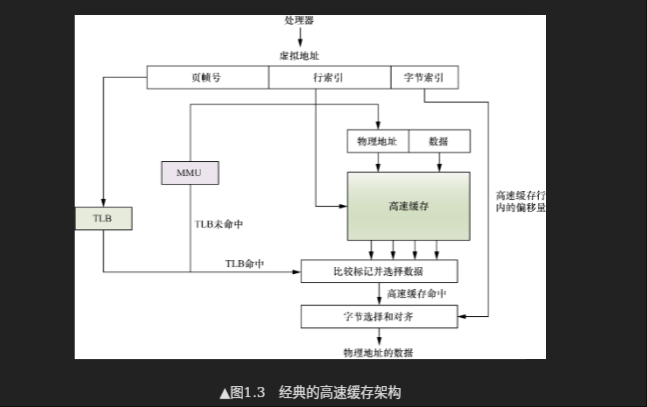

# 高速缓存 
> 学习:  [1.1.5　高速缓存的工作方式](../../007.BOOKs/UNIX%20Network%20Programming%20Volume%201:%20Socket%20Networking%20API%20(3rd%20Edition).epub)   [27-多核处理器：缓存一致性 [中山大学 操作系统原理]](../000.内存管理/998.REFS/000.中山大学-操作系统/16-0609-multiprocessor-1.pdf)   详细阅读:[ARM® Cortex®-A Series Programmer’s Guide for ARMv8-A](../../006.REFS/ARMv8-A-Programmer-Guide.pdf)#PChapter 11 Caches 

---

## 核心资料
|资料参考|说明|备注|
|-|-|-|
|- It would be inefficient to hold one word of data for each tag address, so several locations are typically grouped together under the same tag. This logical block is commonly known as a cache line, and refers to the smallest loadable unit of a cache, a block of contiguous words from main memory. 为每个标签地址保存一个数据字是低效的，因此通常将多个位置组合在同一个标签下。这个逻辑块通常称为高速缓存行，是指高速缓存的最小可加载单元，即来自主存储器的连续字块。|- 即：当你访问某个特定地址时，系统会将该地址及其相邻的内存数据作为一个连续的整体，一次性加载到缓存中。  - 多大?  一般是64字节,文档中有|- [ARM® Cortex®-A Series Programmer’s Guide for ARMv8-A](../../006.REFS/ARMv8-A-Programmer-Guide.pdf)|
|-|-|-|
|- A cache linefill causes the contents of a piece of main memory to be copied into the cache.缓存行填充会导致将一块主内存的内容复制到缓存中|-|- [ARM® Cortex®-A Series Programmer’s Guide for ARMv8-A](../../006.REFS/ARMv8-A-Programmer-Guide.pdf)|
|-|-|-|

---

## 多核环境中的缓存结构
- 

---

## 高速缓存经典架构

