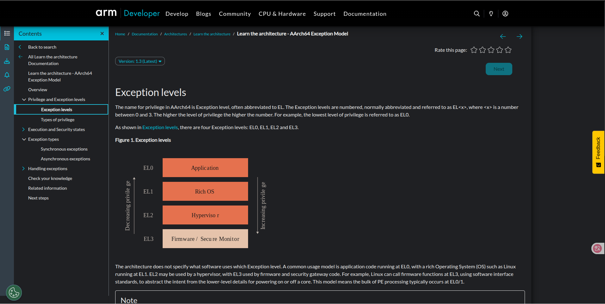
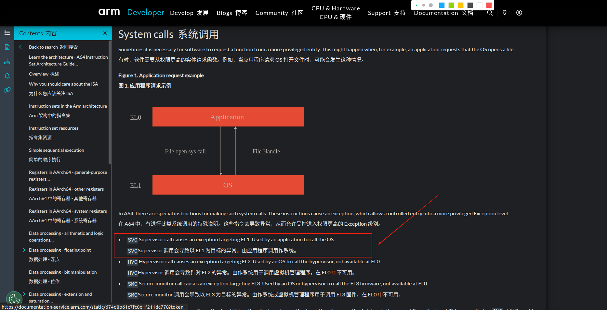
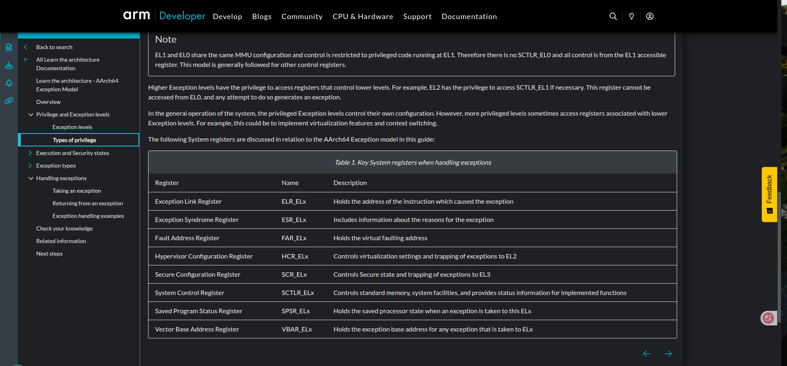
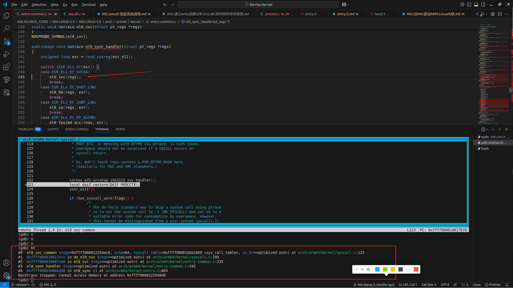
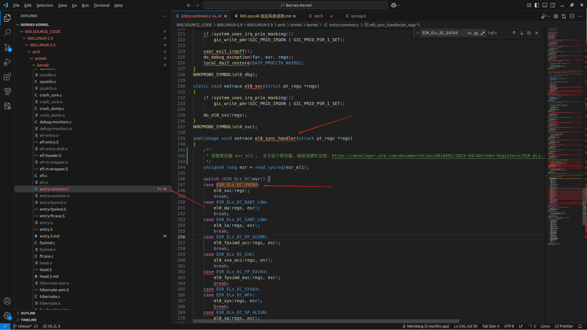
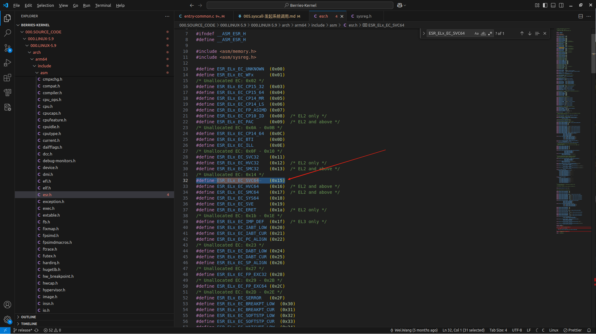
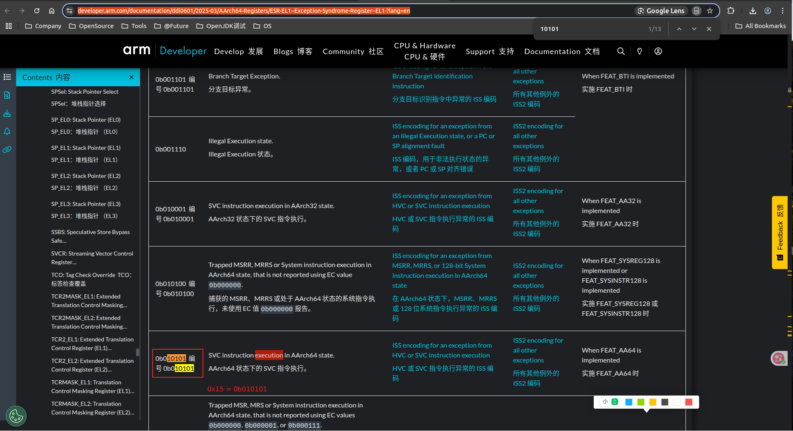

# syscall - 发起系统调用 <sup>arm64</sup>
> 在Linux中，通过 man 2 syscall 了解 syscall , 通过[write函数](./003.通过write函数分析从GLIBC到内核的调用链路.md)来分析

syscall()  is  a small library function that invokes the system call whose assembly language interface has the specified number with the specified arguments.  Employing syscall() is useful, for example, when invoking a system call that has no wrapper function in the C library.

syscall() saves CPU registers before making the system call, restores the registers upon return from the system call, and stores any error code returned by the system call in errno(3) if an error occurs. (syscall 在标记系统中断之前会保存CPU寄存器；在从系统调用中返回时会重置寄存器)

## syscall 定义与实现
```c

// 定义
   //002.GLIBC/000.GLIBC-2.40/posix/unistd.h:1091:extern long int syscall (long int __sysno, ...) __THROW;
   extern long int syscall (long int __sysno, ...) __THROW;

  // 实现: 000.SOURCE_CODE/002.GLIBC/000.GLIBC-2.40/sysdeps/unix/sysv/linux/aarch64/syscall.S
  ENTRY (syscall)
	uxtw	x8, w0
	mov	x0, x1
	mov	x1, x2
	mov	x2, x3
	mov	x3, x4
	mov	x4, x5
	mov	x5, x6
	mov	x6, x7
	svc	0x0             // 重要的是这个svc指令
	cmn	x0, #4095
	b.cs	1f
	RET
  1:
  	b	SYSCALL_ERROR
  PSEUDO_END (syscall)
```

---

## svc 指令 <sup>与硬件相关</sup>
> 先读:[Learn the architecture - AArch64 Exception Model:pdf](../006.REFS/learn_the_architecture_-_aarch64_exception_model_102412_0103_02_en.pdf) 或 [Learn the architecture - AArch64 Exception Model:HTML](https://developer.arm.com/documentation/102412/latest) 

在 ARM64 架构中，执行 SVC（Supervisor Call）指令会产生 同步异常（Synchronous Exception），具体来说属于 从较低异常级别发生的同步异常。

SVC was previously called SWI, Software Interrupt（SVC 以前称为 SWI，即 Software Interrupt）

### svc 与 异常
#### 异常级别
> [Exception levels](../006.REFS/learn_the_architecture_-_aarch64_exception_model_102412_0103_02_en.pdf)




  + [https://developer.arm.com/documentation/102374/0102/System-calls](https://developer.arm.com/documentation/102374/0102/System-calls)

#### 异常类型
> 阅读: [Exception Type](../006.REFS/learn_the_architecture_-_aarch64_exception_model_102412_0103_02_en.pdf) & [Exception types](https://developer.arm.com/documentation/102412/0103/Exception-types)
+ 同步异常: 指令产生，即 软中断
+ 异步异常: 外部产生，即 硬中断


### 异常向量表 & svc 如何跳转到对应异常处理器
+ 异常向量表定义: [000.SOURCE_CODE/000.LINUX-5.9/000.LINUX-5.9/arch/arm64/kernel/entry.S](../000.SOURCE_CODE/000.LINUX-5.9/000.LINUX-5.9/arch/arm64/kernel/entry.S.md)
  ```asm
      /*
       * Exception vectors.
       */
      	.pushsection ".entry.text", "ax"
      
      	.align	11
      SYM_CODE_START(vectors)
      	kernel_ventry	1, sync_invalid			// Synchronous EL1t
      	kernel_ventry	1, irq_invalid			// IRQ EL1t
      	kernel_ventry	1, fiq_invalid			// FIQ EL1t
      	kernel_ventry	1, error_invalid		// Error EL1t
      
      	kernel_ventry	1, sync				// Synchronous EL1h
      	kernel_ventry	1, irq				// IRQ EL1h
      	kernel_ventry	1, fiq_invalid			// FIQ EL1h
      	kernel_ventry	1, error			// Error EL1h
      
      	kernel_ventry	0, sync				// Synchronous 64-bit EL0
      	kernel_ventry	0, irq				// IRQ 64-bit EL0
      	kernel_ventry	0, fiq_invalid			// FIQ 64-bit EL0
      	kernel_ventry	0, error			// Error 64-bit EL0
      
      #ifdef CONFIG_COMPAT
      	kernel_ventry	0, sync_compat, 32		// Synchronous 32-bit EL0
      	kernel_ventry	0, irq_compat, 32		// IRQ 32-bit EL0
      	kernel_ventry	0, fiq_invalid_compat, 32	// FIQ 32-bit EL0
      	kernel_ventry	0, error_compat, 32		// Error 32-bit EL0
      #else
      	kernel_ventry	0, sync_invalid, 32		// Synchronous 32-bit EL0
      	kernel_ventry	0, irq_invalid, 32		// IRQ 32-bit EL0
      	kernel_ventry	0, fiq_invalid, 32		// FIQ 32-bit EL0
      	kernel_ventry	0, error_invalid, 32		// Error 32-bit EL0
      #endif
      SYM_CODE_END(vectors)
  ```

+ 异常处理流程图: [Exception handling examples](../006.REFS/learn_the_architecture_-_aarch64_exception_model_102412_0103_02_en.pdf)
+ 通过异常向量表基地址 + 偏移量，即可定位到异常处理指令 , 详见:[Taking an exception](../006.REFS/learn_the_architecture_-_aarch64_exception_model_102412_0103_02_en.pdf)
+ 每个级别的异常都有自己的异常向量表: 如下图的 `VBAR_ELx` , 其中 x 可以是 0 、1、 2、 3、，目前Linux只有0 、1 
+ 异常处理涉及到的寄存器： 1. 跳转到内核态需要处理的寄存器: 程序计数器(PC) 和 指令寄存器 
  - VBAR_EL1 : Vector Base Address Register
  - 
  - 参考: 异常处理流程图: [Exception handling examples](../006.REFS/learn_the_architecture_-_aarch64_exception_model_102412_0103_02_en.pdf)
  - PSTATE (Processor State) 是 ARM64 架构中用于表示处理器当前状态的一组关键寄存器字段的统称，它类似于其他架构中的"程序状态字"(PSW)或"标志寄存器"。


### svc 异常处理器
> [000.LINUX-5.9/arch/arm64/kernel/entry.S](000.SOURCE_CODE/000.LINUX-5.9/000.LINUX-5.9/arch/arm64/kernel/entry.S.md)

```asm
   /*
    * EL1 mode handlers.
    * kernel_entry 的主要任务是在异常/中断发生时，保存用户态（或低异常级别）的上下文（寄存器状态）到内核栈（struct pt_regs），并切换到内核态的执行环境。
    * 它是异常处理的入口基础步骤。
    */
   	.align	6
   SYM_CODE_START_LOCAL_NOALIGN(el1_sync)
   	kernel_entry 1
   	mov	x0, sp
   	bl	el1_sync_handler
   	kernel_exit 1
   SYM_CODE_END(el1_sync)
```
调用链路如下堆栈:
+ 

#### 关于寄存器
###### esr_el1
- [ESR_EL1, Exception Syndrome Register (EL1)](https://developer.arm.com/documentation/ddi0601/2025-03/AArch64-Registers/ESR-EL1--Exception-Syndrome-Register--EL1-?lang=en)
  + 这个文档里面有arm64/32所有寄存器描述:官方手册:[ESR_EL1, Exception Syndrome Register (EL1)#pdf](./../006.REFS/SysReg_xml_A_profile-2025-03.pdf)

- 
- 
- 


### 异常向量表加载到寄存器
+ [000.SOURCE_CODE/000.LINUX-5.9/000.LINUX-5.9/arch/arm64/kernel/head.S](../000.SOURCE_CODE/000.LINUX-5.9/000.LINUX-5.9/arch/arm64/kernel/head.S.md)
   ```asm
      // __primary_switched
   ```

### Linux 内核启动加载异常向量表
start_kernel → setup_arch

### 系统调用时寄存器&CPU状态如何存储到task_struct中
> 答案就在[kernel_entry 宏](../000.SOURCE_CODE/000.LINUX-5.9/000.LINUX-5.9/arch/arm64/kernel/entry.S.md)中


---


## 参考资料
- [https://www.arm.com/architecture/learn-the-architecture/a-profile](https://www.arm.com/architecture/learn-the-architecture/a-profile)
- [Learn the architecture - AArch64 Exception Model](https://developer.arm.com/documentation/102412/latest)