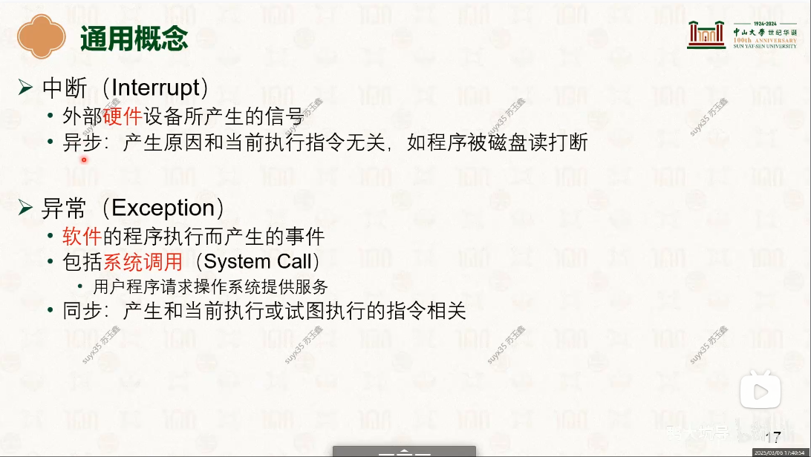
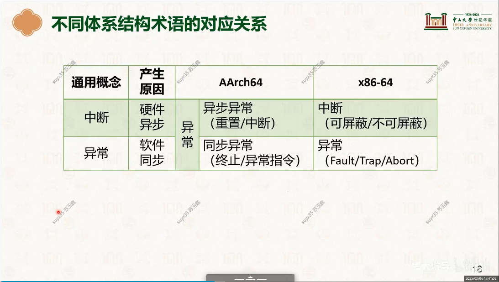
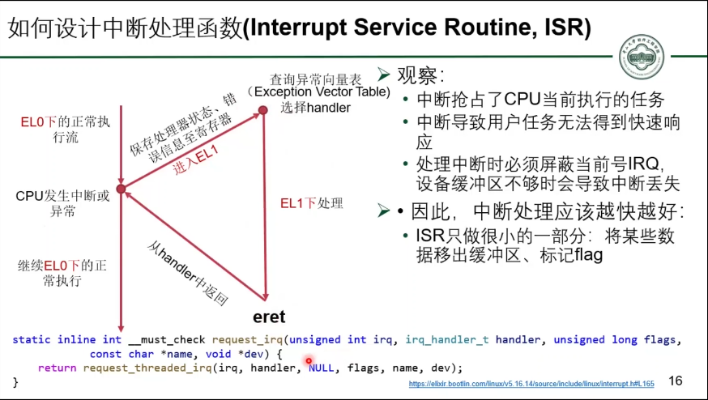
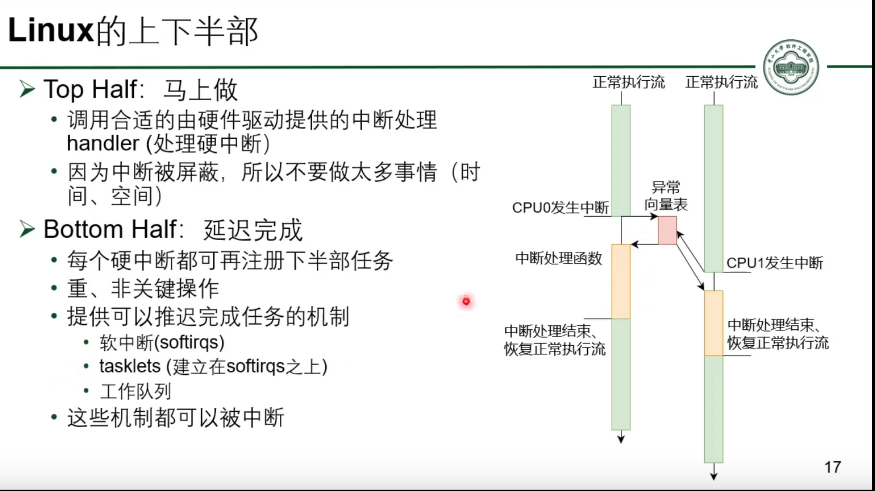

# 硬中断与软中断
|中断类型|区别|备注|
|-|-|-|
|硬中断（Hard Interrupt）|- 中断/异常(触发异常向量表跳转的)，用来通知CPU有重要的事件需要立即处理。|-   -    - 参考:[04-硬件环境与软件抽象：特权级模型与中断 [中山大学 操作系统原理]](../000.内存管理/998.REFS/000.中山大学-操作系统/2-0306-hardware-interrupt.pdf)|
|-|-|-|
|软中断（Soft Interrupt）|- 软中断是预留给系统中对时间要求较严格和重要的下半部使用的，而且目前驱动中只有块设备和网络子系统使用了软中断：[Run Linux Kernel (2nd Edition) Volume 2: Debugging and Case Analysis:2.6.1　软中断](../../001.UNIX-DOCS/../007.BOOKs/Run%20Linux%20Kernel%20(2nd%20Edition)%20Volume%201:%20Infrastructure.epub)  |- Linux内核目前不推荐软中断，而是建议 tasklet|
|-|-|-|

---

## 如何设计中断处理函数
- 

### 硬中断为什么需要为什么越快越好
- 硬件中断处理程序以异步方式执行，它会中断其他重要代码的执行，因此为了避免中断的程序停止时间太长，硬件中断处理程序必须尽快执行完。
- 硬件中断处理程序通常在关中断的情况下执行。所谓的关中断是指关闭了本地CPU的所有中断响应。关中断之后，本地CPU不能再响应中断，因此硬件中断处理程序必须尽快执行完。以ARM处理器为例，中断发生时，ARM处理器会自动关闭本地CPU的IRQ/FIQ，直到从中断处理程序退出时才打开本地中断，整个过程都处于关中断状态。[Run Linux Kernel (2nd Edition) Volume 2: Debugging and Case Analysis#2.6　软中断和tasklet](../../001.UNIX-DOCS/../007.BOOKs/Run%20Linux%20Kernel%20(2nd%20Edition)%20Volume%201:%20Infrastructure.epub)

- 6）当处理器完成中断服务，必须发送一个完成信号结束中断（End Of Interrupt，EOI）给GIC。[Run Linux Kernel (2nd Edition) Volume 2: Debugging and Case Analysis#2.1.2　ARM GIC-V2中断控制器#中断流程](../../001.UNIX-DOCS/../007.BOOKs/Run%20Linux%20Kernel%20(2nd%20Edition)%20Volume%201:%20Infrastructure.epub)

---

## Linux内核的上下半部
- 

---

## 硬中断&软中断配合工作场景
| 场景 | 说明 |
|------|------|
| 网络数据包接收 | 1. 硬中断处理函数负责从网络接口卡读取数据包，并将其存储在内核缓冲区中。   2. 软中断处理函数负责处理存储在缓冲区中的数据包，例如协议解析和数据传递给上层应用程序。   参考:[Run Linux Kernel (2nd Edition) Volume 2: Debugging and Case Analysis#2.6　软中断和tasklet](../../001.UNIX-DOCS/../007.BOOKs/Run%20Linux%20Kernel%20(2nd%20Edition)%20Volume%201:%20Infrastructure.epub)|

## 参考资料
- [操作系统如何响应设备：硬中断 [中山大学 操作系统原理]](https://www.bilibili.com/video/BV1qt42187An?spm_id_from=333.788.videopod.sections&vd_source=9eef164b234175c1ae3ca71733d5a727)