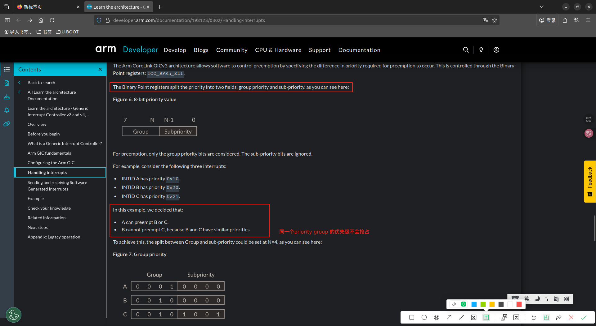

# GIC(Generic Interrupt Controller)
> GIC 就是中断模型中的‘中断控制器’ , 和 STM32 中的NVIC似乎类似在功能上类似，即都是ARM体系结构下的中断控制器，负责管理和处理中断，以提升CPU的效率。但GIC是NVIC的“超级加强版”，增加了对多核、大量中断源、虚拟化等高级功能的支持

### GIC 功能简介 详细需仔细阅读:[Learn the architecture - Generic Interrupt Controller v3 and v4](././../../006.REFS/learn_the_architecture_-_generic_interrupt_controller_v3_and_v4__overview_198123_0302_03_en.pdf) & [Arm CoreLink GIC-700 Generic Interrupt Controller Technical Reference Manual](../../007.BOOKs/corelink_gic_700_generic_interrupt_controller_trm_101516_0400_12_en.pdf) 
Small systems might have only a few interrupt sources and a single processor. However, larger systems might have many more potential interrupt sources and processors. The GIC performs the critical tasks of interrupt management, prioritization, and routing. The GIC marshals all interrupts from across the system, prioritizes them, and sends them to a core to be dealt with. GICs are primarily used to boost processor efficiency and to enable interrupt virtualizationFrom: [Learn the architecture - Generic Interrupt Controller v3 and v4#1. Overview](././../../006.REFS/learn_the_architecture_-_generic_interrupt_controller_v3_and_v4__overview_198123_0302_03_en.pdf) (小型系统可能只有少数中断源和单个处理器。然而，大型系统的潜在中断源和处理器数量可能远超于此。通用中断控制器（GIC）承担着中断管理、优先级排序和路由分配等关键任务。它能统合整个系统的中断信号，进行优先级排序后将其发送至相应核心进行处理。GIC的主要作用在于提升处理器效率并实现中断虚拟化功能。)

A Generic Interrupt Controller (GIC) takes interrupts from peripherals, prioritizes them, and delivers them to the appropriate processor core. From: [Learn the architecture - Generic Interrupt Controller v3 and v4#3. What is a Generic Interrupt Controller?](././../../006.REFS/learn_the_architecture_-_generic_interrupt_controller_v3_and_v4__overview_198123_0302_03_en.pdf)(通用中断控制器（GIC）负责接收来自外设的中断信号，对其进行优先级排序，并将其传递给相应的处理器核心进行处理。)

## How interrupts are signaled to the interrupt controller (中断如何传输到中断控制器上)
参考: [Learn the architecture - Generic Interrupt Controller v3 and v4#How interrupts are signaled to the interrupt controller](././../../006.REFS/learn_the_architecture_-_generic_interrupt_controller_v3_and_v4__overview_198123_0302_03_en.pdf)

### 两种传输方式
- Dedicated interrupt signal
- Message signaled interrupt signal 对大型系统设计有显著优势

> 如何路由的，详细参考文档，或需要时再研究透彻，目前目标研究内核，GIC知道大概就行了

### Running priority and preemption（优先级被切分为priority group & subpriority, 关于抢占，对比STM32 NVIC学习）
> 总结就是: priorityGroup 决定是否能被抢占，subPriority来决定处理的顺序(正在执行的中断(A)不会被后续产生的同等priorityGroup的中断(B)所抢占，即使B的subPriority的优先级更高) 

The Binary Point registers split the priority into two fields, group priority and sub-priority, as you can see here: From: [Learn the architecture - Generic Interrupt Controller v3 and v4#Running priority and preemption](../../006.REFS/learn_the_architecture_-_generic_interrupt_controller_v3_and_v4__overview_198123_0302_03_en.pdf)

## Interrupt state machine (中断信号状态变化)
包含异常处理流程的注意事项:1)怎么才是表示本次异常处理结束;

### Level sensitive interrupts(电平敏感中断) VS Edge-triggered interrupts(边沿触发中断)
> 根据文档描述,触发方式是可以配置[Learn the architecture - Generic Interrupt Controller v3 and v4#5. Configuring the Arm GIC](././../../006.REFS/learn_the_architecture_-_generic_interrupt_controller_v3_and_v4__overview_198123_0302_03_en.pdf) & [Arm CoreLink GIC-700 Generic Interrupt Controller Technical Reference Manual](../../007.BOOKs/corelink_gic_700_generic_interrupt_controller_trm_101516_0400_12_en.pdf) 的，方式不同，异常处理方法也不同

| 特性 | 边沿触发中断 | 电平触发中断 |
| :--- | :--- | :--- |
| **触发条件** | **信号的电平变化**（边沿） | **信号维持的有效电平** |
| **行为** | 一次性事件，被锁存 | 持续状态，只要电平有效就持续请求 |
| **中断处理期间** | 外设可以在CPU响应后立即撤销信号 | 外设**必须**保持有效电平，直到CPU清除中断原因 |
| **共享中断** | **不适合**，可能导致中断丢失 | **非常适合**，多个设备可以同时拉低电平 |
| **抗抖动/噪声** | 较差，毛刺可能被误认为是有效边沿 | 较好，短暂的毛刺只要不维持，就不会触发 |

The life cycle of an interrupt depends on whether it is configured to be level-sensitive or edge-triggered:
- For level-sensitive interrupts, a rising edge on the interrupt input causes the interrupt to become pending, and the interrupt is held asserted until the peripheral de-asserts the interrupt signal.对于电平敏感中断，中断输入信号的上升沿将触发中断进入挂起状态，且该中断信号会持续保持有效，直至外设撤销中断信号。
- For edge-sensitive interrupts, a rising edge on the interrupt input causes the interrupt to become pending, but the interrupt is not held asserted.对于边沿触发中断，中断输入信号的上升沿会触发中断进入挂起状态，但该中断信号不会持续保持有效。

---
## 缩写
### SPI PPI SGI LPI From: [Learn the architecture - Generic Interrupt Controller v3 and v4#4. Arm GIC fundamentals](././../../006.REFS/learn_the_architecture_-_generic_interrupt_controller_v3_and_v4__overview_198123_0302_03_en.pdf) & [Arm CoreLink GIC-700 Generic Interrupt Controller Technical Reference Manual](../../007.BOOKs/corelink_gic_700_generic_interrupt_controller_trm_101516_0400_12_en.pdf) 
The GIC can deal with four different types of interrupt sources:
- Shared Peripheral Interrupt (SPI). Peripheral interrupts that can be delivered to any connected core.
-  Private Peripheral Interrupt (PPI). Peripheral interrupts that are private to one core. An example of a PPI is an interrupt from the Generic Timer.
-  Software Generated Interrupt (SGI). SGIs are typically used for inter-processor communication and are generated by a write to an SGI register in the GIC.
-  Locality-specific Peripheral Interrupt (LPI). LPIs were first introduced in GICv3 and have a very different programing model to the other three types of interrupt. The configuration of LPIs is covered in the Arm CoreLink Generic Interrupt Controller v3 and v4: Locality-specific Peripheral Interrupts guide.

---
## 参考资料
- [https://developer.arm.com/documentation/198123/0302?lang=en](https://developer.arm.com/documentation/198123/0302?lang=en)
  + [Learn the architecture - Generic Interrupt Controller v3 and v4](././../../006.REFS/learn_the_architecture_-_generic_interrupt_controller_v3_and_v4__overview_198123_0302_03_en.pdf)

- [Arm® CoreLink™ GIC-700 Generic Interrupt Controller](./../../007.BOOKs/corelink_gic_700_generic_interrupt_controller_trm_101516_0400_12_en.pdf)
  + [https://developer.arm.com/documentation/101516/0400/About-the-GIC-700/Component-overview?lang=en](https://developer.arm.com/documentation/101516/0400/About-the-GIC-700/Component-overview?lang=en)
  + The GIC-700 implements version 3, 3.1, and 4.1 of the Arm® Generic Interrupt Controller Architecture Specification, GIC architecture version 3 and version 4. To use GIC-700 with a core, the core must:(GIC-700 实现了 Arm® 通用中断控制器架构规范的第 3、3.1 和 4.1 版本、GIC 架构第 3 版和第 4 版。要使用 GIC-700 带核心，核心必须：)