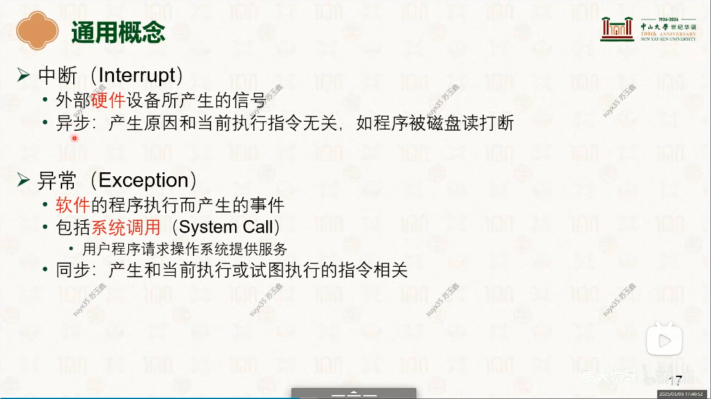
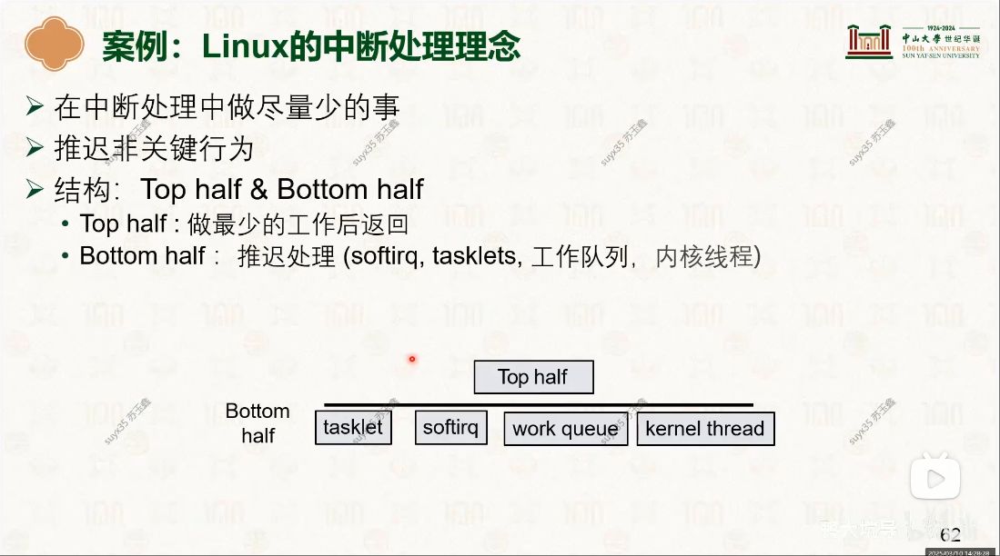
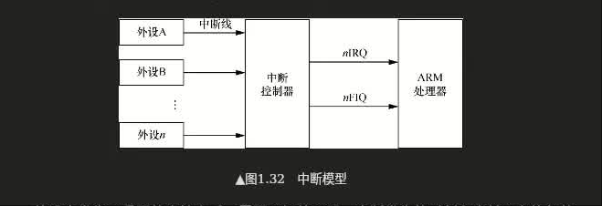

# 中断与异常
学习: [奔跑吧Linux内核（第2版）卷1：基础架构#1.7　ARM64异常处理](../../007.BOOKs/Run%20Linux%20Kernel%20(2nd%20Edition)%20Volume%201:%20Infrastructure.epub)  & [learn_the_architecture_-_aarch64_exception_model_102412_0103_02_en.pdf](../../006.REFS/learn_the_architecture_-_aarch64_exception_model_102412_0103_02_en.pdf) & [Learn the architecture - Generic Interrupt Controller v3 and v4](././../../006.REFS/learn_the_architecture_-_generic_interrupt_controller_v3_and_v4__overview_198123_0302_03_en.pdf)

## 异常/中断是什么
An interrupt is a signal to the processor that an event has occurred which needs to be dealt with. Interrupts are typically generated by peripherals.From: [Learn the architecture - Generic Interrupt Controller v3 and v4#1. Overview](././../../006.REFS/learn_the_architecture_-_generic_interrupt_controller_v3_and_v4__overview_198123_0302_03_en.pdf)  ，中断与异常的处理使用同一套机制，差异仅在选择handler中提现： [04-硬件环境与软件抽象：特权级模型与中断 [中山大学 操作系统原理]](../../001.UNIX-DOCS/000.内存管理/998.REFS/000.中山大学-操作系统/2-0306-hardware-interrupt.pdf)
- 
- 

## AArch64状态的异常等级

## 异常分类
- 中断
- 中止
- 复位
- 软件产生的异常

##### 中断
在ARM处理器中，中断请求分成中断请求（Interrupt Request，IRQ）和快速中断请求（Fast Interrupt Request，FIQ）两种，其中FIQ的优先级要高于IRQ。在芯片内部，分别有连接到处理器内部的IRQ和FIQ两根中断线。通常系统级芯片内部会有一个中断控制器，众多的外部设备的中断引脚会连接到中断控制器，由中断控制器来负责中断优先级调度，然后发送中断信号给ARM处理器，中断模型如图1.32所示

[006.BOOKs/Run Linux Kernel (2nd Edition) Volume 1: Infrastructure.epub#1.7.1　异常类型]
- 

##### 中止
中止主要有指令中止（instruction abort）和数据中止（data abort）两种，它们通常是指访问外部存储单元时候发生了错误，处理器内部的MMU捕获这些错误并且报告给处理器。

指令中止是指当处理器尝试执行某条指令时发生的错误。而数据中止是指使用加载或者存储指令读写外部存储单元时发生的错误。

##### 复位
复位（reset）操作是优先级最高的一种异常处理。复位操作通常用于让CPU复位引脚产生复位信号，让CPU进入复位状态，并重新启动。

##### 软件产生的异常
ARMv8架构中提供了3种软件产生的异常。这些异常通常是指软件想尝试进入更高的异常等级而造成的错误。
- SVC指令：允许用户模式的程序请求操作系统服务。
- HVC指令：允许客机（guest OS）请求主机服务。
- SMC指令：允许普通世界（normal world）中的程序请求安全监控服务。
---

## 参考资料
- [https://developer.arm.com/documentation/198123/0302?lang=en](https://developer.arm.com/documentation/198123/0302?lang=en)
  + [Learn the architecture - Generic Interrupt Controller v3 and v4](././../../006.REFS/learn_the_architecture_-_generic_interrupt_controller_v3_and_v4__overview_198123_0302_03_en.pdf)

- [Arm® CoreLink™ GIC-700 Generic Interrupt Controller](./../../007.BOOKs/corelink_gic_700_generic_interrupt_controller_trm_101516_0400_12_en.pdf)
  + [https://developer.arm.com/documentation/101516/0400/About-the-GIC-700/Component-overview?lang=en](https://developer.arm.com/documentation/101516/0400/About-the-GIC-700/Component-overview?lang=en)
  + The GIC-700 implements version 3, 3.1, and 4.1 of the Arm® Generic Interrupt Controller Architecture Specification, GIC architecture version 3 and version 4. To use GIC-700 with a core, the core must:(GIC-700 实现了 Arm® 通用中断控制器架构规范的第 3、3.1 和 4.1 版本、GIC 架构第 3 版和第 4 版。要使用 GIC-700 带核心，核心必须：)

