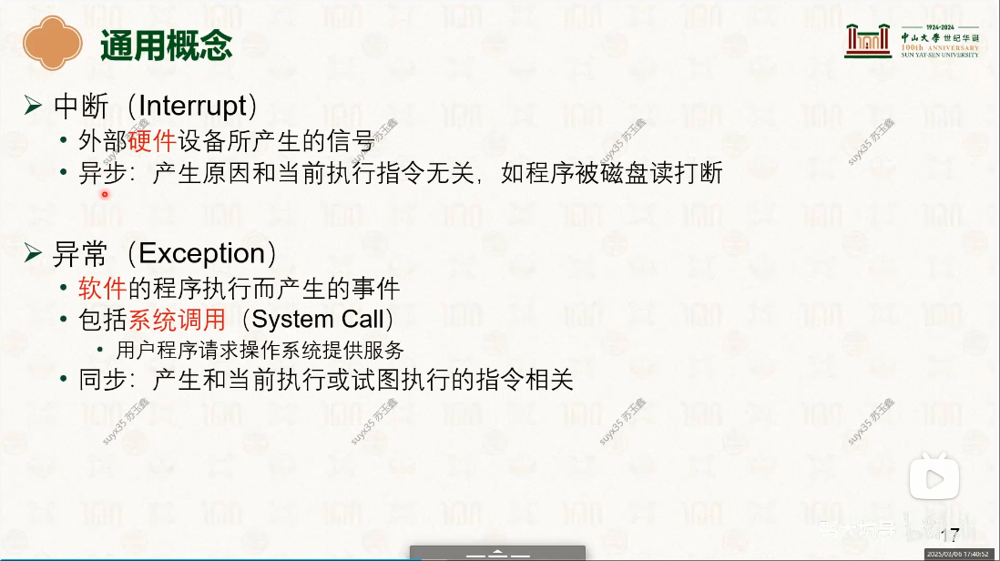
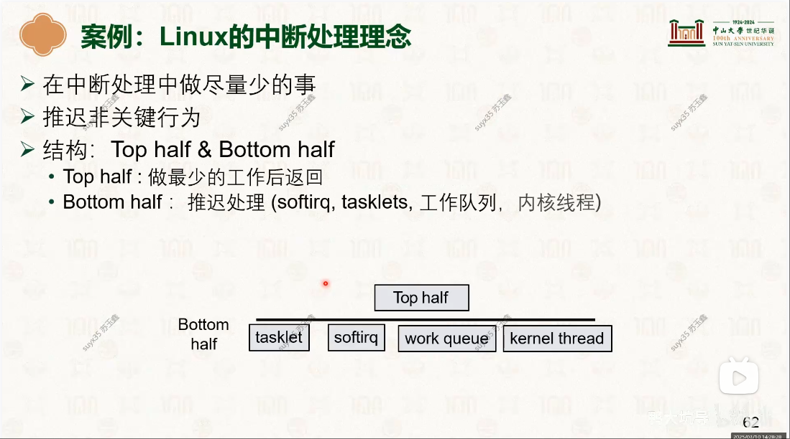
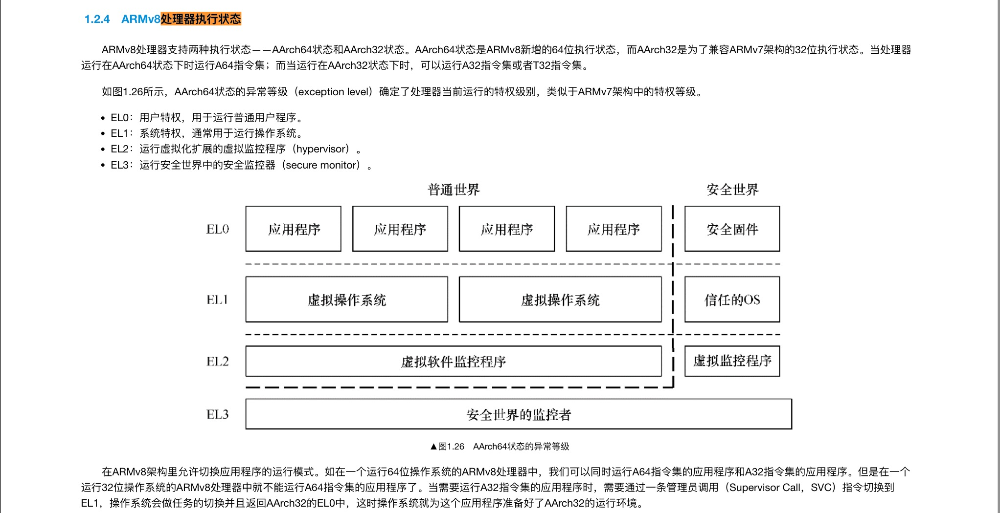
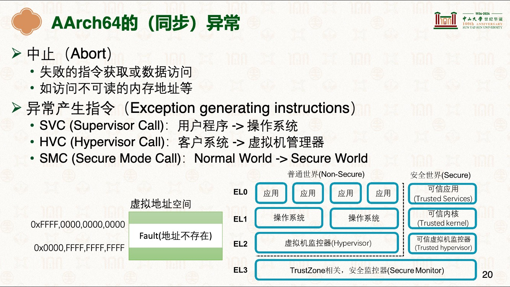
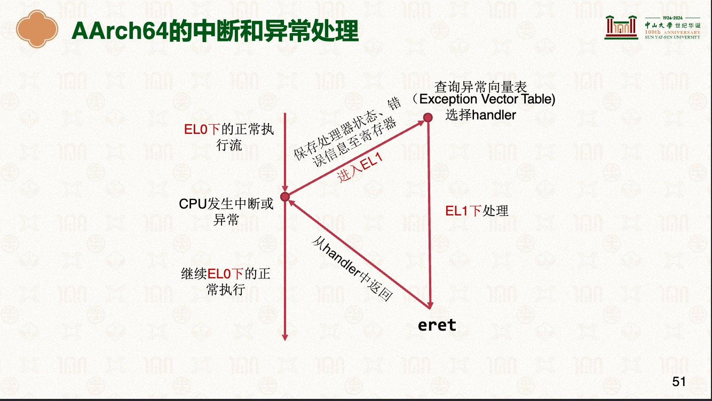
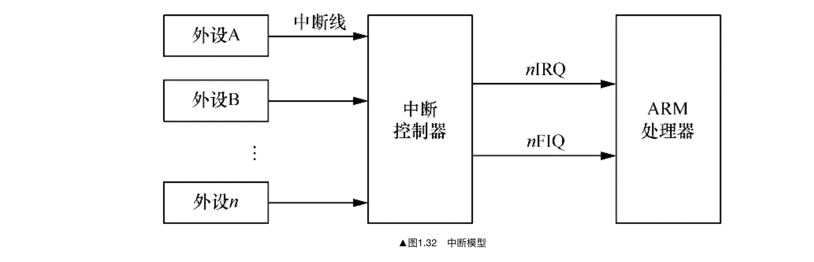
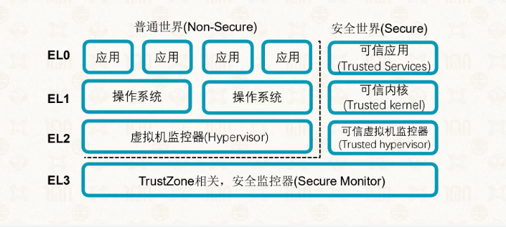

# 中断与异常
学习: <br/>- [奔跑吧Linux内核（第2版）卷1：基础架构#1.7　ARM64异常处理](../../007.BOOKs/Run%20Linux%20Kernel%20(2nd%20Edition)%20Volume%201:%20Infrastructure.epub)  <br/>-  [learn_the_architecture_-_aarch64_exception_model_102412_0103_02_en.pdf](../../006.REFS/learn_the_architecture_-_aarch64_exception_model_102412_0103_02_en.pdf) <br/>-  [Learn the architecture - Generic Interrupt Controller v3 and v4](././../../006.REFS/learn_the_architecture_-_generic_interrupt_controller_v3_and_v4__overview_198123_0302_03_en.pdf)<br/>- [04-硬件环境与软件抽象：特权级模型与中断 [中山大学 操作系统原理]](../../001.UNIX-DOCS/001.操作系统课程/000.中山大学-操作系统2025/2-0306-hardware-interrupt.pdf) <br/>-  [001.中山大学-操作系统2026/第二周：硬件环境与软件抽象-特权级模型与中断.pdf](../../001.UNIX-DOCS/001.操作系统课程/001.中山大学-操作系统2026/第二周：硬件环境与软件抽象-特权级模型与中断.pdf)

## 异常/中断是什么
An interrupt is a signal to the processor that an event has occurred which needs to be dealt with. Interrupts are typically generated by peripherals.<sup>From: [Learn the architecture - Generic Interrupt Controller v3 and v4#1. Overview](././../../006.REFS/learn_the_architecture_-_generic_interrupt_controller_v3_and_v4__overview_198123_0302_03_en.pdf)</sup> <sup> ，中断与异常的处理使用同一套机制，差异仅在选择handler中体现： [04-硬件环境与软件抽象：特权级模型与中断 [中山大学 操作系统原理]](../../001.UNIX-DOCS/001.操作系统课程/000.中山大学-操作系统2025/2-0306-hardware-interrupt.pdf) & [001.中山大学-操作系统2026/第二周：硬件环境与软件抽象-特权级模型与中断.pdf](../../001.UNIX-DOCS/001.操作系统课程/001.中山大学-操作系统2026/第二周：硬件环境与软件抽象-特权级模型与中断.pdf)</sup>
- 
- 
  + 参考:[001.UNIX-DOCS/009.中断与异常/003.硬中断与软中断.md](../../001.UNIX-DOCS/009.中断与异常/003.硬中断与软中断.md) 理解

## AArch64状态的异常等级
|资料|来源|备注|
|-|-|-|
|- 1.2.4　ARMv8处理器执行状态|- [007.BOOKs/Run Linux Kernel (2nd Edition) Volume 1: Infrastructure.epub](../../007.BOOKs/Run%20Linux%20Kernel%20(2nd%20Edition)%20Volume%201:%20Infrastructure.epub)|- |
|-|-|-|
|- AArch64的（同步）异常|- [04-硬件环境与软件抽象：特权级模型与中断 [中山大学 操作系统原理]](../../001.UNIX-DOCS/001.操作系统课程/000.中山大学-操作系统2025/2-0306-hardware-interrupt.pdf)|- |


## 异常分类
>   中断、中止、复位、软件产生的异常

|资料摘要|说明|备注|
|-|-|-|
|- AArch64的中断和异常处理|- |- 具体参考: [001.中山大学-操作系统2026/第二周：硬件环境与软件抽象-特权级模型与中断.pdf](../../001.UNIX-DOCS/001.操作系统课程/001.中山大学-操作系统2026/第二周：硬件环境与软件抽象-特权级模型与中断.pdf)#>=P42|


---

### 中断
|中断分类|说明|备注|
|-|-|-|
|- IRQ（Interrupt Request）|-|- 普通中断，优先级低，处理慢|
|-|-|-|
|- FIQ（Fast Interrupt Request）|- |- 一次只能有一个FIQ <br/> - 快速中断，优先级高，处理快 <br/> - 常为可信任的中断源预留 |
|-|-|-|
|- SError（System Error）|-|- 原因难以定位、较难处理的异常，多由异步中止（Abort）导致（如从缓存行（Cacheline）写回至内存时发生的异常）|
|-|-|-|
|- 在ARM处理器中，中断请求分成中断请求（Interrupt Request，IRQ）和快速中断请求（Fast Interrupt Request，FIQ）两种，其中FIQ的优先级要高于IRQ。在芯片内部，分别有连接到处理器内部的IRQ和FIQ两根中断线。通常系统级芯片内部会有一个中断控制器，众多的外部设备的中断引脚会连接到中断控制器，由中断控制器来负责中断优先级调度，然后发送中断信号给ARM处理器|- 中断模型：<br/>  |- [006.BOOKs/Run Linux Kernel (2nd Edition) Volume 1: Infrastructure.epub#1.7.1　异常类型]: 中断控制器·核心: <br/>- [001.UNIX-DOCS/009.中断与异常/005.GIC.md](./005.GIC.md) <br/> - [001.UNIX-DOCS/009.中断与异常/001.硬件中断/001.GIC-通用中断控制器.md](./001.硬件中断/001.GIC-通用中断控制器.md)|

---

### 中止（Abort）
中止主要有指令中止（instruction abort）和数据中止（data abort）两种，它们通常是指访问外部存储单元时候发生了错误，处理器内部的MMU捕获这些错误并且报告给处理器。

指令中止是指当处理器尝试执行某条指令时发生的错误。而数据中止是指使用加载或者存储指令读写外部存储单元时发生的错误。

---

### 复位（Reset）
复位（reset）操作是优先级最高的一种异常处理。复位操作通常用于让CPU复位引脚产生复位信号，让CPU进入复位状态，并重新启动。
- 最高级别的异常，用以执行代码初始化CPU核心

```asm
  
```

---

### 异常产生指令（Exception generating instructions）
|指令|说明|备注|
|-|-|-|
|- SVC指令(Supervisor Call)|- 用户程序 -> 操作系统|-|
|-|-|-|
|- HVC指令(Hypervisor Call)|- 客户系统(虚拟机) -> 虚拟机管理器|-|
|-|-|-|
|- SMC指令(Secure Mode Call)|- Normal World -> Secure World|-|
|-|-|-|
|-|-|- |


## 如何理解AArch64的异常

- 安全世界（Secure World）中的应用主要围绕高敏感数据处理和系统级安全信任根展开，其核心目标是确保即使普通世界（Non-Secure World）被攻破，关键数据和操作仍不可被窃取或篡改。
- 安全世界中典型应用的详细分类与说明：
  + 生物识别与身份认证: 指纹/人脸/虹膜识别处理<sub>摄像头或传感器采集的原始生物特征数据不进入普通操作系统，而是直接送入安全世界的可信应用进行比对和验证:支付宝刷脸支付时，图像数据在安全世界内完成匹配，普通应用仅接收“验证通过”或“失败”的结果</sub>;设备解锁与支付授权<sub>手机锁屏、银行App转账确认等场景，均依赖安全世界内的可信应用完成最终授权，防止恶意软件截获密码或伪造操作</sub>;
  + 数字版权保护
  + 金融与支付安全
    - 移动支付交易签名：微信、支付宝等应用在发起支付时，会将交易数据发送至安全世界，由可信应用使用硬件绑定的私钥进行签名，确保交易不可伪造。
    - 银行卡/信用卡信息存储：部分手机支持将虚拟卡信息存入安全世界，支付时由安全世界直接调用，避免敏感信息暴露在普通系统中。
  + 企业安全与合规
  + 物联网与嵌入式安全
    - 固件更新验签与安全启动：智能门锁、车载ECU等设备在启动或升级固件时，由安全世界验证签名，防止恶意固件注入。
    - 加密通信与密钥协商：IoT设备与云端通信时，TLS握手过程中的私钥运算在安全世界内完成，避免密钥泄露。
  + 区块链与数字资产
  + 系统级安全服务
    - 安全启动链验证：从BootROM到Loader、OP-TEE OS、U-Boot、Kernel，每一级都由安全世界验证签名，构建不可绕过的信任链。
    - 安全监控器调用处理：
      1. SMC 是普通世界请求安全服务的大门 — Normal World 中的操作系统或应用无法直接访问 Secure World 资源，必须先通过 SMC 指令陷入 EL3。
      2. EL3 的 Secure Monitor 负责上下文切换 — 当 SMC 触发时，Secure Monitor 需要：
         - 保存 Normal World 的寄存器状态（通用寄存器、系统寄存器）
         - 恢复 Secure World 的上下文
         - 切换 `SCR_EL3.NS` 位，将 CPU 从 Non-Secure 切换到 Secure 状态
         - 返回时再逆向操作
      3. 权限校验 — Secure Monitor 会验证 SMC 调用的合法性，例如检查 SMC Calling Convention 中定义的 Function ID 是否在允许范围内。
      4. SMC 处理存在两层分发，不是所有 SMC 都由 Secure Monitor 自己处理：
         | SMC 类型 | 处理者 | 说明 |
         |----------|--------|------|
         | Standard SMC（如 PSCI 电源管理） | EL3 Secure Monitor 直接处理 | ARM 体系结构定义的平台协调接口 |
         | Fast SMC（OP-TEE 相关） | 转发到 S-EL1 的 OP-TEE OS | Secure Monitor 只做世界切换，业务逻辑由 OP-TEE 内核中的 SMC 调度器（`thread_smc_handler`）处理 |
         | Yield SMC（OP-TEE 相关） | 同上，但支持抢占式调度 | 允许 OP-TEE 在长时间操作中主动让出 CPU |
      5. 完整的调用链：
         ```
         Normal World App
           → Linux Kernel (NS-EL1)
             → SMC 指令
               → EL3 Secure Monitor (ATF)     ← 上下文切换 + 基础校验
                 → OP-TEE OS (S-EL1)          ← SMC 调度 + 权限+参数验证
                   → Trusted Application (S-EL0) ← 实际业务逻辑
         ```


---

## 内存映射的输入输出(Memory-Mapped I/O)（MMIO） <sup>一种软件与硬件交互方式：通过操作指定的内存地址的方式来操作硬件单元（外设）</sup>
> 学习：[04-硬件环境与软件抽象：特权级模型与中断 [中山大学 操作系统原理]:>=P33](../../001.UNIX-DOCS/001.操作系统课程/000.中山大学-操作系统2025/2-0306-hardware-interrupt.pdf)</sup>

- MMIO: 复用ldr和str指令

---


## 参考资料
- [https://developer.arm.com/documentation/198123/0302?lang=en](https://developer.arm.com/documentation/198123/0302?lang=en)
  + [Learn the architecture - Generic Interrupt Controller v3 and v4](././../../006.REFS/learn_the_architecture_-_generic_interrupt_controller_v3_and_v4__overview_198123_0302_03_en.pdf)

- [Arm® CoreLink™ GIC-700 Generic Interrupt Controller](./../../007.BOOKs/corelink_gic_700_generic_interrupt_controller_trm_101516_0400_12_en.pdf)
  + [https://developer.arm.com/documentation/101516/0400/About-the-GIC-700/Component-overview?lang=en](https://developer.arm.com/documentation/101516/0400/About-the-GIC-700/Component-overview?lang=en)
  + The GIC-700 implements version 3, 3.1, and 4.1 of the Arm® Generic Interrupt Controller Architecture Specification, GIC architecture version 3 and version 4. To use GIC-700 with a core, the core must:(GIC-700 实现了 Arm® 通用中断控制器架构规范的第 3、3.1 和 4.1 版本、GIC 架构第 3 版和第 4 版。要使用 GIC-700 带核心，核心必须：)

