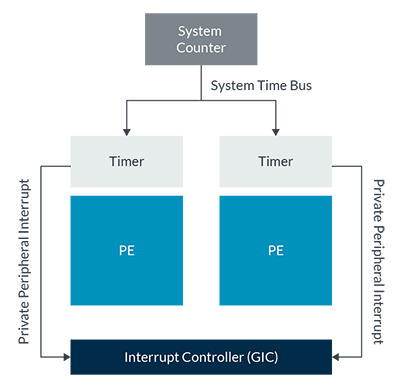

# Generic Interrupt Controller(通用中断控制器-GIC)
> 先学习: [Generic Interrupt Controller：pdf](../../006.REFS/learn_the_architecture_-_generic_interrupt_controller_v3_and_v4__overview_198123_0302_03_en.pdf) 或 [Generic Interrupt Controller](https://developer.arm.com/documentation/198123/0302?lang=en)

> 结合 [Run Linux Kernel (2nd Edition) Volume 2: Debugging and Case Analysis.epub]#2.4　ARM64底层中断处理 来学习

## PE 
PE（Processing Element，处理单元） 是 ARM 官方文档中对 可独立执行指令的硬件处理单元 的标准化术语

## 通用计时器中断
> 来自文档的 `Arm GIC fundamentals` 部分

Private Peripheral Interrupt (PPI). Peripheral interrupts that are private to one core. An example of a PPI is an interrupt from the Generic Timer.（私有外设中断 (PPI)。指仅供单个核心使用的外设中断。例如，来自通用定时器的中断就是一个 PPI 中断。）

+ 

---

### GIC 类型划分 ?待确认
对 GIC 来说，中断可以分成以下几种类型：ARMPG
- SGI(Software Generated Interrupt)，Interrupt IDs 0-15。系统一般用其来实现 IPI 中断。
- PPI(Private Peripheral Interrupt)，Interrupt IDs16-31。私有中断，这种中断对每个 CPU 都是独立一份的，比如 per-core timer 中断。
- SPI(Shared Peripheral Interrupt)，Interrupt numbers 32-1020。最常用的外设中断，中断可以发给一个或者多个 CPU。
- LPI(Locality-specific Peripheral Interrupt)。基于 message 的中断，GICv2 和 GICv1 中不支持。

---

## 参考资料
+ [Generic Interrupt Controller：pdf](../../../006.REFS/learn_the_architecture_-_generic_interrupt_controller_v3_and_v4__overview_198123_0302_03_en.pdf)
+ [Generic Interrupt Controller](https://developer.arm.com/documentation/198123/0302?lang=en)
+ [https://kernel.meizu.com/2016/09/02//linux-interrupt.html/#fn_ARMPG](https://kernel.meizu.com/2016/09/02//linux-interrupt.html/#fn_ARMPG)