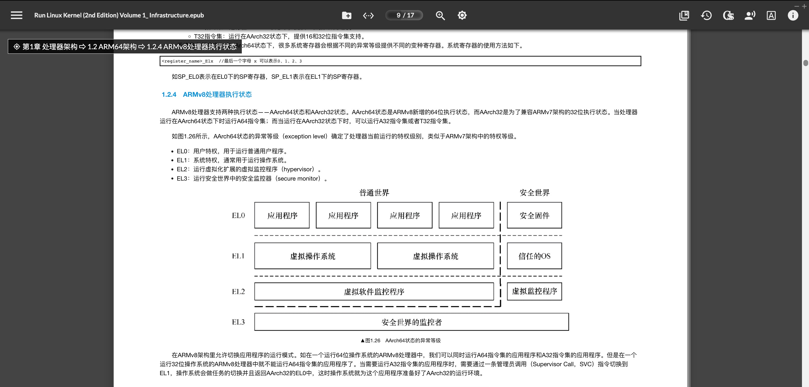
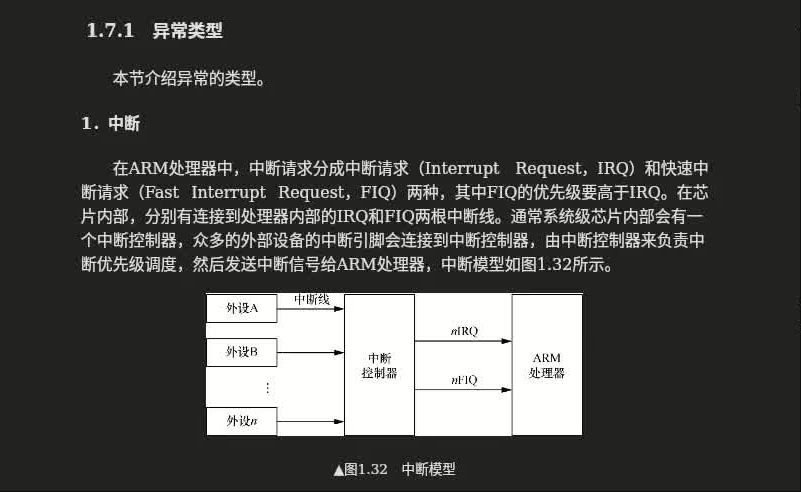

# 异常
学习: [奔跑吧Linux内核（第2版）卷1：基础架构#1.7　ARM64异常处理](006.BOOKs/Run Linux Kernel (2nd Edition) Volume 1: Infrastructure.epub) 另一个仓库

## AArch64状态的异常等级

## 异常分类
- 中断
- 中止
- 复位
- 软件产生的异常

##### 中断
在ARM处理器中，中断请求分成中断请求（Interrupt Request，IRQ）和快速中断请求（Fast Interrupt Request，FIQ）两种，其中FIQ的优先级要高于IRQ

[006.BOOKs/Run Linux Kernel (2nd Edition) Volume 1: Infrastructure.epub#1.7.1　异常类型]
- 

##### 中止
中止主要有指令中止（instruction abort）和数据中止（data abort）两种，它们通常是指访问外部存储单元时候发生了错误，处理器内部的MMU捕获这些错误并且报告给处理器。

指令中止是指当处理器尝试执行某条指令时发生的错误。而数据中止是指使用加载或者存储指令读写外部存储单元时发生的错误。

##### 复位
复位（reset）操作是优先级最高的一种异常处理。复位操作通常用于让CPU复位引脚产生复位信号，让CPU进入复位状态，并重新启动。

##### 软件产生的异常
ARMv8架构中提供了3种软件产生的异常。这些异常通常是指软件想尝试进入更高的异常等级而造成的错误。
- SVC指令：允许用户模式的程序请求操作系统服务。
- HVC指令：允许客机（guest OS）请求主机服务。
- SMC指令：允许普通世界（normal world）中的程序请求安全监控服务。

---

## 异常发生后的处理因为处理器硬件不同，异常处理方式不同，因此这里需要结合具体的CPU来分析: arm64
当一个异常发生时，CPU内核能感知异常发生，而且会对应生成一个目标异常等级（target exception level）。CPU会自动做如下一些事:
> 参考: [ARM Architecture Reference Manual, ARMv8, for ARMv8-A architecture profile]
