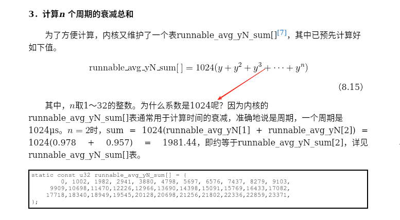
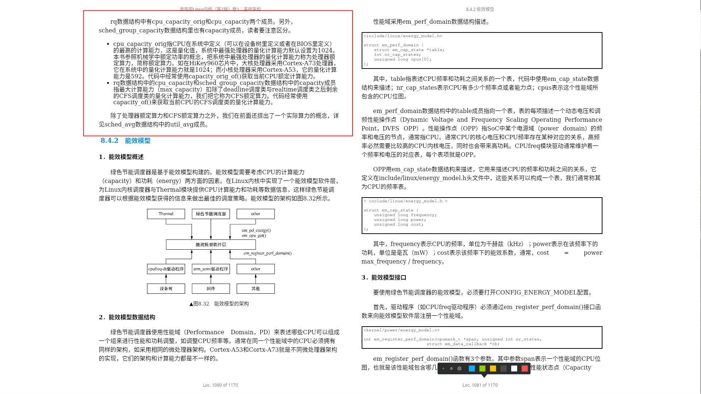

# 负载计算
## 一些概念
- 衰减: 信号在介质中传播的过程中，会有一部分能量转化成热能或者被介质吸收，从而造成信号强度不断减弱，这种现象称为衰减（decay）
   + 历史工作负载在时间轴上也会有衰减效应

- 半衰期： 半衰期（英語：Half-life）是指某種特定物質的濃度經過某種反應降低到剩下初始時一半所消耗的時間--[維基百科]
- 周期: 1ms（准确来说是1024μs，为了方便移位操作）的时间跨度算成一个周期（period），简称PI  <sup>[Run Linux Kernel (2nd Edition) Volume 1: Infrastructure.epub]#8.2.3　历史累计衰减的计算</sup>

---

## 公式 & 预计算
### 衰减系数
在 Linux 内核中，PELT（Per-Entity Load Tracking） 的衰减系数（decay factor）通常基于 32ms 半衰期（half-life） 计算，其近似值为：

```math
衰减系数：\quad  y \approx 0.97857206 \quad (\text{即 } 0.5^{1/32})
```

```math
 即： y^{32} = 0.5  \quad 推导出\quad y \approx 0.97857206 \quad (\text{即 } 0.5^{1/32})
```

---

### 工作负载和量化负载
把负载量化为权重，这样不同运行行为的进程就用一个量化的标准来衡量负载，本书<sup>[Run Linux Kernel (2nd Edition) Volume 1: Infrastructure.epub] 原文</sup>把这种用运行时间与采样总时间的比值来计算的权重，称为量化负载。另外，我们把时间与权重的乘积称为工作负载，这类似于电学中的功率

---

### 量化负载 <sub>详细内容请查看: [Run Linux Kernel (2nd Edition) Volume 1: Infrastructure.epub]#8.2.4　量化负载的计算</sub>
通过计算进程的可运行时间与总采用时间的比值，然后乘以进程的权重，作为`量化负载`。把`前面提到的量化负载`和`历史累计衰减`这两个概念合并起来，我们称为`历史累计衰减量化负`载，本书中`简称为量化负载`。Linux内核使用量化负载来计算和比较一个进程以及就绪队列的负载。

计算进程的量化负载意义在于，把负载量化到权重里。当一个进程的decay_sum_runnable_time无限接近decay_sum_period_time时，它的量化负载就无限接近权重值，这说明这个进程一直在占用CPU，满负荷工作，即CPU占用率很高。一个进程的decay_sum_runnable_time越小，它的量化负载就越小，这说明这个进程的工作负载很小，占用的CPU资源很少，即CPU占用率很低。这样，对负载做一个统一和标准化的量化计算之后，不同行为的进程就可以进行标准化的负载计算和比较了

> 查看量化负载计算公式，着重需要注意的是 —— 计算的是时间，而不是负载。把时间乘以就绪队列或实体的权重，得出工作负载


##### 为什么需要量化负载
> 来自于:[Run Linux Kernel (2nd Edition) Volume 1: Infrastructure.epub]#8.2.4　量化负载的计算

计算进程的量化负载意义在于，把负载量化到权重里??? 

---

### 历史累计衰减<sub>详细内容请查看: [Run Linux Kernel (2nd Edition) Volume 1: Infrastructure.epub]#8.2.3　历史累计衰减的计算</sub>
从物理学知识中我们知道，信号在介质中传播的过程中，会有一部分能量转化成热能或者被介质吸收，从而造成信号强度不断减弱，这种现象称为衰减（decay）

因此，历史工作负载在时间轴上也会有衰减效应

从Linux 3.8内核[4]以后进程的负载计算不仅考虑权重，而且跟踪每个调度实体的历史负载情况，该算法称为PELT（Per-entity Load Tracking）算法。在PELT算法里，引入了“the accumulation of an infinite geometric series”，英文本义是无穷几何级数的累加，本书把这个概念简单称为历史累计计算。

##### 概念
- 历史累计衰减总时间: 是什么？怎么计算


### 工作负载
工作负载的计算: [Run Linux Kernel (2nd Edition) Volume 1: Infrastructure.epub]#8.2.7　PELT代码分析 #5．工作负载的计算

历史累计衰减工作负载(累计工作负载)  = 历史累计衰减总时间(累计衰减时间)<sub>注意：这里计算进程在过去几个周期可运行时间的衰减累计值，是可运行时间</sub>  * 进程权重


### 计算n 个周期的衰减总和


### CPU总负载
`把CPU对应的就绪队列中所有进程的量化负载累加起来就得到CPU总负载`


### 处理器额定算力 & 实际算力 <sup>[Run Linux Kernel (2nd Edition) Volume 1: Infrastructure.epub]#8.2.5　实际算力的计算</sup>
把系统中处理器的最大量化计算能力称为处理器额定算力。我们把一个进程或者就绪队列当前计算能力称为实际算力，它是当前的计算能力需求的一个体现

> CPU实际计算能力由量化计算能力计算而来 , 而CPU的量化计算能力通过设备树或者BIOS等方式提供给Linux内核

## 参考资料
- [Run Linux Kernel (2nd Edition) Volume 1: Infrastructure.epub]
- 一些字段解释: 