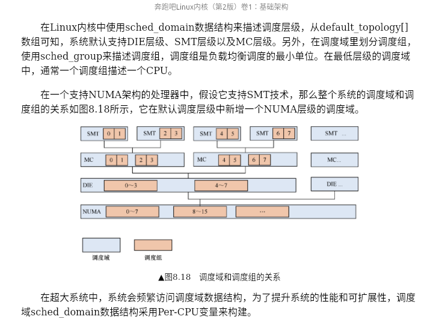

# SMP 负载均衡
> 请先学习:[Run Linux Kernel (2nd Edition) Volume 1: Infrastructure.epub]#8.3　SMP负载均衡

内核对CPU的管理是通过位图（bitmap）变量来管理的

在Linux内核中使用sched_domain数据结构来描述调度层级，从default_topology[]数组可知，系统默认支持DIE层级、SMT层级以及MC层级。另外，在调度域里划分调度组，使用sched_group来描述调度组，调度组是负载均衡调度的最小单位。在最低层级的调度域中，通常一个调度组描述一个CPU。

DECLARE_BITMAP 定义于 [000.LINUX-5.9/include/linux/types.h]


## 核心概念
- 调度域 & 调度组
  + 
  + 调度组是负载均衡的最小单位


- SDTL： Linux内核通过数据结构sched_domain_topology_level来描述CPU的层次关系，简称为SDTL


## 负载均衡的触发
- 负载均衡机制从注册软中断开始，每次系统处理调度节拍时会检查当前是否需要处理负载均衡。
  ```c
      start_kernel()->sched_init()->init_sched_fair_class

      __init void init_sched_fair_class(void)
     {
     #ifdef CONFIG_SMP
     	open_softirq(SCHED_SOFTIRQ, run_rebalance_domains);
     
     #ifdef CONFIG_NO_HZ_COMMON
     	nohz.next_balance = jiffies;
     	nohz.next_blocked = jiffies;
     	zalloc_cpumask_var(&nohz.idle_cpus_mask, GFP_NOWAIT);
     #endif
     #endif /* SMP */
     
     }
  ```

### 负载均衡流程
[Run Linux Kernel (2nd Edition) Volume 1: Infrastructure.epub] # 8.3.4 负载均衡 # 2．load_balance()函数


### 进程迁移
[进程迁出: detach_tasks ] -> [进程迁入，添加到指定的就绪队列: attach_tasks]


### 进程唤醒
wake_up_process [00.LINUX-5.9/kernel/sched/core.c]