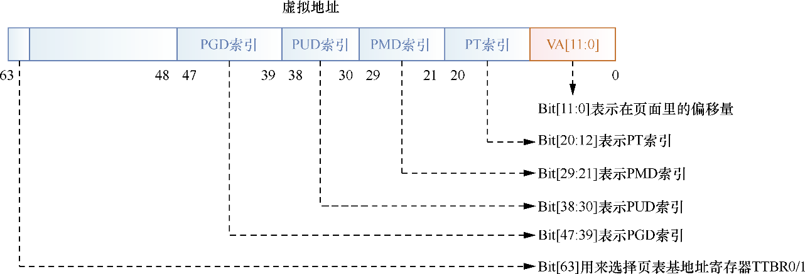

# 内存管理
- 学习:[Run Linux Kernel (2nd Edition) Volume 1: Infrastructure.epub]#2.1　ARM64内存管理
- 学习: 000.LINUX-5.9/Documentation/translations/zh_CN/arm64/memory.txt (Linux 在 AArch64 中的内存布局)

## 内存管理数据结构
在大部分Linux操作系统中，内存设备的初始化一般在BIOS或BootLoader中完成，然后把DDR存储设备的大小传递给Linux内核，因此从Linux内核的角度来看，DDR存储设备其实就是一段物理内存空间 [Run Linux Kernel (2nd Edition) Volume 1: Infrastructure.epub]#3.3.2　内存管理之数据结构

Linux内核为每个物理页面都分配了一个page数据结构，采用mem_map[]数组来存放这些page数据结构，并且它们和物理页面是一对一的映射关系[Run Linux Kernel (2nd Edition) Volume 1: Infrastructure.epub]#图3.9　mem_map[]数组和物理页面的关系

###  pglist_data
pglist_data数据结构用来描述一个内存节点的所有资源

在UMA架构中，只有一个内存节点，即系统有一个全局的变量contig_page_data来描述这个内存节点。在NUMA架构中，整个系统的内存由一个pglist_data *的指针数组node_data[ ]来管理，在系统初始化时通过枚举BIOS固件（ACPI）来完成

---

## Linux内核中的页表
4级分页模型在64位虚拟地址的划分:

## Linux 在 AArch64 中的内存布局
> [000.LINUX-5.9/Documentation/translations/zh_CN/arm64/memory.txt](../../000.SOURCE_CODE/000.LINUX-5.9/000.LINUX-5.9/Documentation/translations/zh_CN/arm64/memory.txt
)