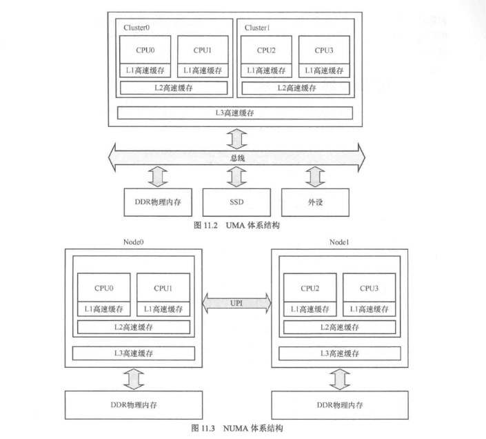
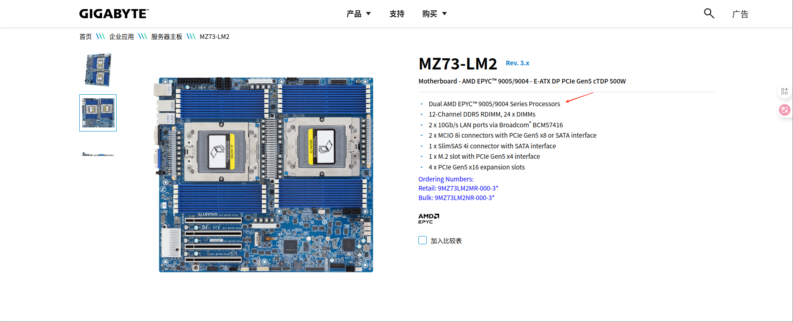
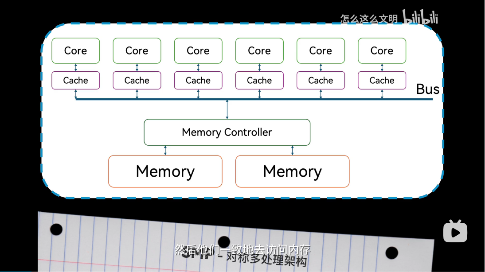

# NUMA
先学习[001.UNIX-DOCS/025.NUMA/README.md(另一个Git仓库)](Berries-Kernel:001.UNIX-DOCS/025.NUMA/README.md) & [006.BOOKs/RISC-V Architecture Programming and Practice.pdf#11.2 高速缓存的访问延时](../../006.BOOKs/RISC-V%20Architecture%20Programming%20and%20Practice.pdf) & [奔跑吧Linux内核（第2版）卷1：基础架构#1.1.17　NUMA](../006.BOOKs/Run%20Linux%20Kernel%20(2nd%20Edition)%20Volume%201:%20Infrastructure.epub) 再看以下内容



请注意，NUMA中的Node是什么意思? Node =  一个物理CPU + 属于他的物理内存插槽<sub>(含义为DDR内存)</sub> ， 例如，购买的 ’华硕STRIX B550-A GAMING 吹雪‘(一个CPU插槽(Socket)+四个物理内存插槽<sub>(含义为DDR内存)</sub>) ， 那么这一个物理内存插槽<sub>(含义为DDR内存)</sub>和所有的4个内存插槽构成一个Node。有些主板支持多Socket，那么每个Socket和属于他的内存插槽<sub>(含义为DDR内存)</sub>构成一个Node，即，这个多Socket主板则存在多个Node。
- 
  + MZ73-LM2
  + 结构框图 (Node = Socket + 所属于他的内存插槽 , 不同Node之间访问方式)
     - 
     - 参考手册：[User Manual: 对该图(该主板)有详细介绍](./999.IMGS/server_manual_e_mz73lm2_e_v3.0.pdf)
  + [https://www.gigabyte.cn/Enterprise/Server-Motherboard/MZ73-LM2-rev-3x](https://www.gigabyte.cn/Enterprise/Server-Motherboard/MZ73-LM2-rev-3x)
       - 

## 传统SMP架构

多个CPU对于内存属于同一层级，所有的CPU都通过总线访问内存(Intel)，ARM是通过‘Exclusive accesses’ ，单都是需要进行加锁操作， 随着CPU的处理速度越来越快，这种方式会成为系统瓶颈。NUMA架构能更好地解决这个问题，提升系统性能.

- X86_64: 目前的x86/x64的多核/多处理器系统是SMP结构，共享主存，内存是共享设备，多个处理器/核心要访问内存，首先要获得内存总线的控制权，任何时刻只有一个处理器/核心能获得内存总线的控制权，所以单就内存来说，不会出现多个处理器/核心同时访问一个内存地址的情况。但是每个处理器/核心可能有自己的cache（非共享的），所以，如果某个内存地址的数据在多个处理器/核心的cache中都存在的话，是可能出现并发读的情况，对于读写，或者写写的并发操作，处理器实现的cache一致性协议可以保证物理上不会出现真正的并发操作。

## R7-5700G 16G*2
```shell
wei@Berries:~/OPEN_SOURCE/Berries-Chat$ lscpu 
Architecture:             x86_64
  CPU op-mode(s):         32-bit, 64-bit
  Address sizes:          48 bits physical, 48 bits virtual
  Byte Order:             Little Endian
CPU(s):                   16
  On-line CPU(s) list:    0-15
Vendor ID:                AuthenticAMD
  Model name:             AMD Ryzen 7 5700G with Radeon Graphics
    CPU family:           25
    Model:                80
    Thread(s) per core:   2
    Core(s) per socket:   8
    Socket(s):            1
    Stepping:             0
    CPU max MHz:          4673.0000
    CPU min MHz:          400.0000
    BogoMIPS:             7586.09
    Flags:                fpu vme de pse tsc msr pae mce cx8 apic sep mtrr pge mca cmov pat pse36 clflush mmx fxsr sse sse2 ht syscall nx mmxext fxsr_opt pdpe1gb rdtscp lm constant_tsc rep_good nopl nonstop_tsc 
                          cpuid extd_apicid aperfmperf rapl pni pclmulqdq monitor ssse3 fma cx16 sse4_1 sse4_2 x2apic movbe popcnt aes xsave avx f16c rdrand lahf_lm cmp_legacy extapic cr8_legacy abm sse4a misali
                          gnsse 3dnowprefetch osvw ibs skinit wdt tce topoext perfctr_core perfctr_nb bpext perfctr_llc mwaitx cpb cat_l3 cdp_l3 hw_pstate ssbd mba ibrs ibpb stibp vmmcall fsgsbase bmi1 avx2 smep
                           bmi2 erms invpcid cqm rdt_a rdseed adx smap clflushopt clwb sha_ni xsaveopt xsavec xgetbv1 xsaves cqm_llc cqm_occup_llc cqm_mbm_total cqm_mbm_local user_shstk clzero irperf xsaveerptr 
                          rdpru wbnoinvd cppc arat npt lbrv svm_lock nrip_save tsc_scale vmcb_clean flushbyasid decodeassists pausefilter pfthreshold avic v_vmsave_vmload vgif v_spec_ctrl umip pku ospke vaes vpc
                          lmulqdq rdpid overflow_recov succor smca fsrm debug_swap
Caches (sum of all):      
  L1d:                    256 KiB (8 instances)
  L1i:                    256 KiB (8 instances)
  L2:                     4 MiB (8 instances)
  L3:                     16 MiB (1 instance)
NUMA:                     
  NUMA node(s):           1
  NUMA node0 CPU(s):      0-15
Vulnerabilities:          
  Gather data sampling:   Not affected
  Itlb multihit:          Not affected
  L1tf:                   Not affected
  Mds:                    Not affected
  Meltdown:               Not affected
  Mmio stale data:        Not affected
  Reg file data sampling: Not affected
  Retbleed:               Not affected
  Spec rstack overflow:   Vulnerable: Safe RET, no microcode
  Spec store bypass:      Mitigation; Speculative Store Bypass disabled via prctl
  Spectre v1:             Mitigation; usercopy/swapgs barriers and __user pointer sanitization
  Spectre v2:             Mitigation; Retpolines; IBPB conditional; IBRS_FW; STIBP always-on; RSB filling; PBRSB-eIBRS Not affected; BHI Not affected
  Srbds:                  Not affected
  Tsx async abort:        Not affected

```


## NUMA 和物理CPU 内存节点的关系


