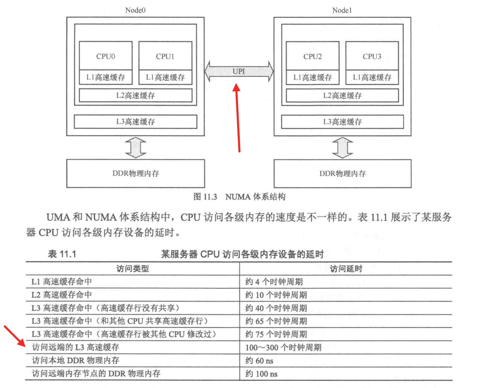
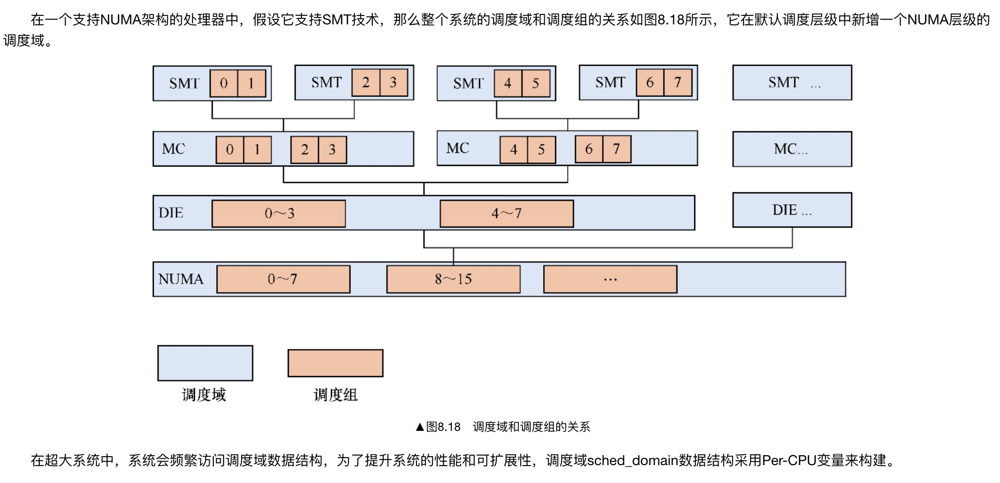

# SMP((对称多处理器.Symmetric Multi-Processor)) 负载均衡
> 学习: <br/> - [Run Linux Kernel (2nd Edition) Volume 1: Infrastructure.epub#8.3.2　CPU调度域](../../007.BOOKs/Run%20Linux%20Kernel%20(2nd%20Edition)%20Volume%201:%20Infrastructure.epub) <br/> - [RISC-V Architecture Programming and Practice: 图11.3 NUMA体系结构](../../007.BOOKs/RISC-V%20Architecture%20Programming%20and%20Practice/RISC-V%20Architecture%20Programming%20and%20Practice-231-464.pdf)

## 摘要
|摘要内容|说明|备注|
|-|-|-|
|- Linux 内核中 CPU 域（CPU Domain）、调度域（Scheduling Domain）和调度组（Scheduling Group）的划分，与内存（Memory）和高速缓存（Cache）有着极深的渊源|-|-|
|-|-“缓存亲和性”（Cache Affinity）和“内存访问代价”正是构建这套复杂层级结构的核心驱动力。|-|
|-|- 调度器划分这些域和组，就是为了让任务尽可能在“离数据最近”的 CPU 上运行，同时避免跨域迁移带来的性能惩罚。|-|
|-|-|- 阅读: [Documentation/scheduler/sched-domains.rst]|
|-|-|-|


---

## 调度域
根据系统的**内存**和**高速缓存**的布局，CPU域分成如下几类

|CPU域的分类|Linux内核分类|说明|
|-|-|-|
|- 超线程(Simultaneous MultiThreading,SMT)|- CONFIG_SCHED_SMT|- 一个物理核心可以有两个或者更多的运行线程，这称为超线程技术。超线程使用相同CPU资源且共享L1高速缓存，迁移进程不会影响高速缓存利用率|
|-|-|-|
|- 多核（Multi-Core，MC）|- CONFIG_SCHED_MC|- 每个物理核心独享L1高速缓存，多个物理核心可以组成一个簇，簇里的CPU共享L2高速缓存|
|- 处理器（SoC）|- 内核称为DIE|- SoC级别|

！注意，关于高速缓存，参考:[001.UNIX-DOCS/025.NUMA/README.md](../../001.UNIX-DOCS/025.NUMA/README.md)中的图
- 


### CPU物理域的层次结构
> [kernel/sched/topology.c:static struct sched_domain_topology_level default_topology[]](../../000.SOURCE_CODE/000.LINUX-5.9/000.LINUX-5.9/kernel/sched/topology.c)


### 调度组 调度层级
在Linux内核中使用sched_domain数据结构来描述调度层级，从default_topology[]数组可知，系统默认支持DIE层级、SMT层级以及MC层级。另外，在调度域里划分调度组，使用sched_group来描述调度组，**调度组是负载均衡调度的最小单位**。在最低层级的调度域中，通常一个调度组描述一个CPU。

在一个支持NUMA架构的处理器中，假设它支持SMT技术，那么整个系统的调度域和调度组的关系如图8.18所示，它在默认调度层级中新增一个NUMA层级的调度域。
- 

> 注意，这里还是有NUMA架构相关内容的： 多个物理CPU（Socket）也是支持的

### CPU调度域
##### CPU调度域拓扑关系
```txt
   // kernel/sched/topology.c
   int sched_init_domains(const struct cpumask *cpu_map)
   {
      // ,,,
   }
```

### CPU调度组
##### 创建调度组
```txt
   // kernel/sched/topology.c
   static int build_sched_groups(struct sched_domain *sd, int cpu)
   {
      // ,,,
   }
```


## 核心概念
- 调度域 & 调度组
  + 调度组是负载均衡的最小单位


- SDTL： Linux内核通过数据结构sched_domain_topology_level来描述CPU的层次关系，简称为SDTL


## 负载均衡的触发
- 负载均衡机制从注册软中断开始，每次系统处理调度节拍时会检查当前是否需要处理负载均衡。
  ```c
      start_kernel()->sched_init()->init_sched_fair_class

      __init void init_sched_fair_class(void)
     {
     #ifdef CONFIG_SMP
     	open_softirq(SCHED_SOFTIRQ, run_rebalance_domains);
     
     #ifdef CONFIG_NO_HZ_COMMON
     	nohz.next_balance = jiffies;
     	nohz.next_blocked = jiffies;
     	zalloc_cpumask_var(&nohz.idle_cpus_mask, GFP_NOWAIT);
     #endif
     #endif /* SMP */
     
     }
  ```

### 负载均衡流程
[Run Linux Kernel (2nd Edition) Volume 1: Infrastructure.epub] # 8.3.4 负载均衡 # 2．load_balance()函数


### 进程迁移
[进程迁出: detach_tasks ] -> [进程迁入，添加到指定的就绪队列: attach_tasks]


### 进程唤醒
wake_up_process [00.LINUX-5.9/kernel/sched/core.c]

##### 1. Nginx 进程绑定CPU核心，源码分析!!!