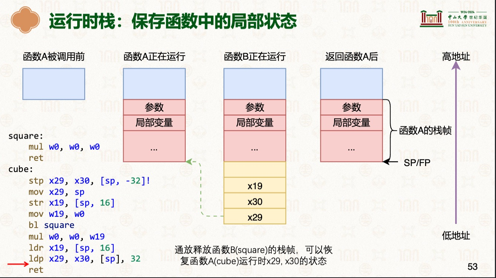
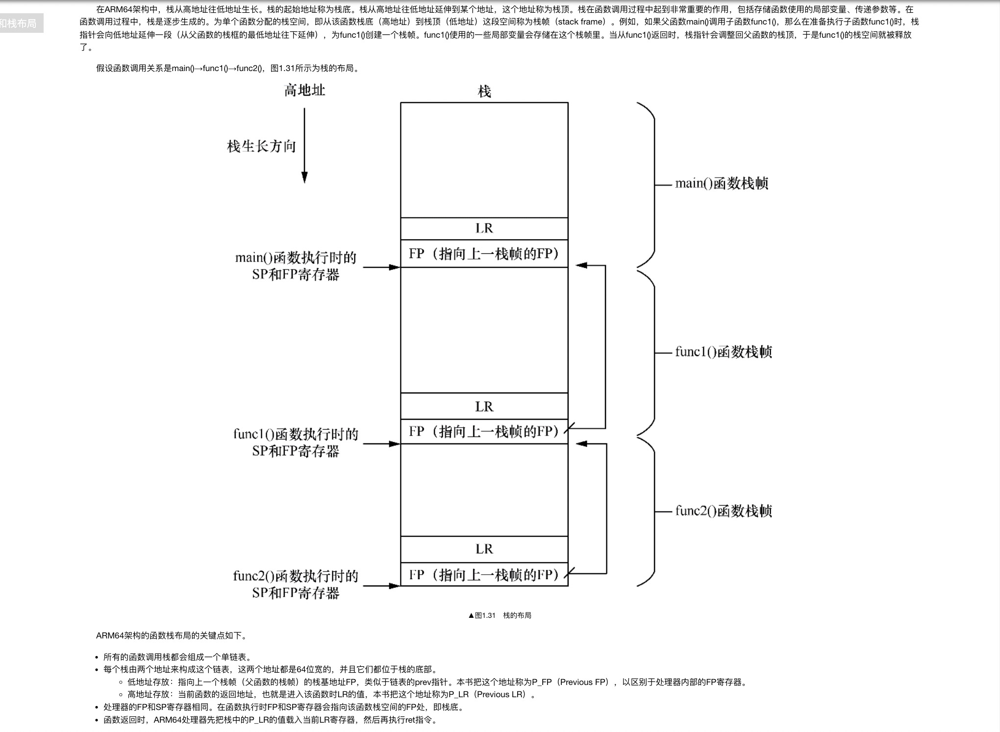
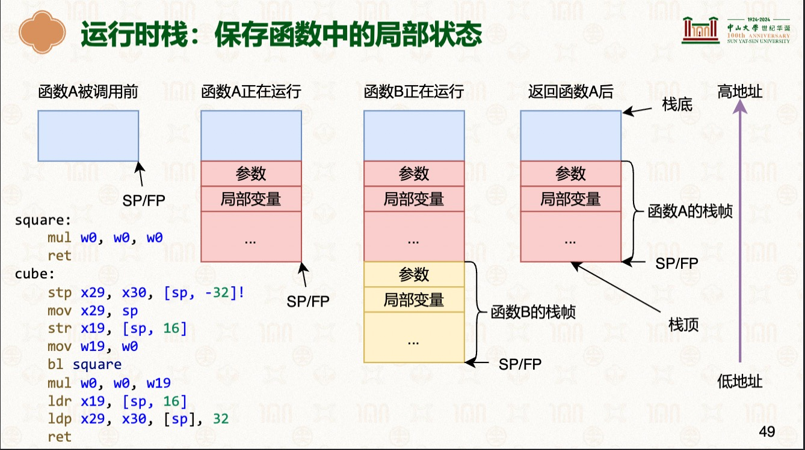
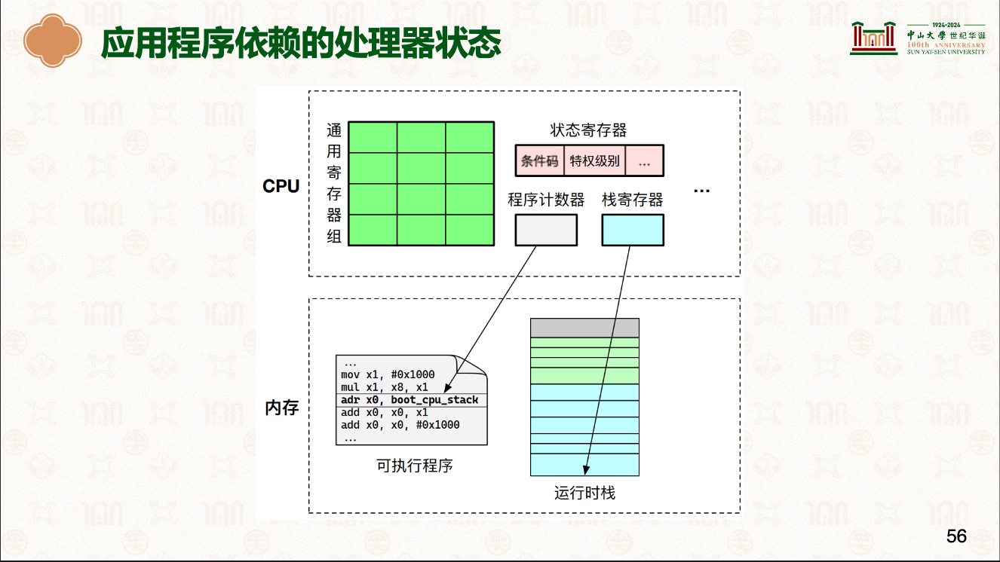

# 函数的调用、返回与栈
> 学习: <br/> - [硬件环境与软件抽象：ARM指令集架构 # >=P45](../../001.UNIX-DOCS/000.内存管理/998.REFS/000.中山大学-操作系统/2-0303-hardware-isa.pdf)<br/>- [第二周：硬件环境与软件抽象-ARM指令集架构.pdf](../../001.UNIX-DOCS/001.操作系统课程/001.中山大学-操作系统2026/第二周：硬件环境与软件抽象-ARM指令集架构.pdf) <br/> - [Arm® Architecture Reference Manualfor A-profile architecture](../../007.BOOKs/Arm%20Architecture%20Reference%20Manual%20for%20A-profile%20architecture/) <br/> - [Run Linux Kernel (2nd Edition) Volume 1: Infrastructure.epub]#1.6　函数调用标准和栈布局


## 着重学习内容
|知识点|说明|备注|
|-|-|-|
|- x30寄存器（别名：LR(Link Register)）|- 返回地址寄存器|-|
|-|-|-|
|- sp（Stack Pointer）存在（栈寄存器（Stack Register） 中）|- `指向当前栈帧的顶部` <br/> - 动态变化。每次执行PUSH、POP、CALL、RET指令时，SP的值都会自动增减，始终指向栈顶：|- 例如： - [SP_EL1](https://developer.arm.com/documentation/ddi0601/2025-12/AArch64-Registers/SP-EL1--Stack-Pointer--EL1-?lang=en) <br/> - 得参考芯片手册: [Arm® Architecture Reference Manualfor A-profile architecture](../../007.BOOKs/Arm%20Architecture%20Reference%20Manual%20for%20A-profile%20architecture/) <br/>|
|-|-|-|
|- 栈帧|- 每个函数拥有的连续内存空间称为函数的栈帧（Stack Frame）|- 函数在调用时，会先压栈 —— 创建栈帧|
|-|-|-|
|- FP (Frame Pointer) 即 x29|- 栈帧在内存中的起始位置称为帧指针(Frame Pointer, FP) <br/> - `指向栈帧起始位置` |- 存于x29 通用寄存器|
|-|-|-|
|- 运行时栈：保存函数中的局部状态|- |- 函数调用返回后，栈帧会被释放 <br/>|
|-|-|-|
|- 寻址方式(汇编指令)|- 学习：[寻址方式](#寻址方式)|- [硬件环境与软件抽象：ARM指令集架构 # >=P39](../../001.UNIX-DOCS/000.内存管理/998.REFS/000.中山大学-操作系统/2-0303-hardware-isa.pdf)|
|-|-|-|
|- [007.BOOKs/Run Linux Kernel (2nd Edition) Volume 1: Infrastructure.epub#1.6　函数调用标准和栈布局](../../007.BOOKs/Run%20Linux%20Kernel%20(2nd%20Edition)%20Volume%201:%20Infrastructure.epub)|- |- |
|-|-|-|
|-|-|-|
|-|-|-|


---

## 测试代码&分析 <sup>栈内存的申请&释放就藏在这些汇编代码之中</sup>
通过一下代码以及对应的汇编代码，理解函数的调用、返回与栈

```c
/**
 * gcc: arm-gnu-toolchain-14.3.rel1-darwin-arm64-aarch64-none-elf/bin/aarch64-none-elf-gcc -S 013.fun_call_ret_stack.c
 */  

__attribute__((noinline, noclone))
int square(int n) { return n * n; }

__attribute__((noinline, noclone))
int cube(int n) { return n * square(n); }

```
-> 对应汇编代码: 

-> -> 结合图:  <br/> -  分析
```arm
	.arch armv8-a
	.file	"013.fun_call_ret_stack.c"
	.text
	.align	2
	.global	square
	.type	square, %function
square:        
	sub	sp, sp, #16
	str	w0, [sp, 12]
	ldr	w0, [sp, 12]
	mul	w0, w0, w0
	add	sp, sp, 16
	ret
	.size	square, .-square
	.align	2
	.global	cube
	.type	cube, %function
cube:    ; 对应上图中的函数B         
    ; 为什么是 -32 :  [006.REFS/learn_the_architecture_-_aarch64_memory_attributes_and_properties_102376_0200_01_en.pdf] -> "The LDP and STP instructions load and store a pair of elements, respectively. To be aligned, the address must be a multiple of the size of the elements, not the combined size of both elements. "（LDP 和 STP 指令分别用于加载和存储一对元素。为了满足对齐要求，内存地址必须是单个元素大小的整数倍，而不是两个元素总大小的整数倍。）
	stp	x29, x30, [sp, -32]! ; 将sp寄存器的值-32（字节 (Byte)），再将x29 x30 寄存器的值存储到内存; [寄存器->内存：源在左，内存目标在右]  , p 表示pair,即成对 -- 这里会申请内存 -- "前变址寻址方式(pre-index addressing)：X1先更新再寻址"
	mov	x29, sp              ; 将sp寄存器的值拷贝到x29  ; [寄存器 -> 寄存器： 目标在左，源在右]
	str	w0, [sp, 28]         ; 将w0存储的值(传递的参数)存储到sp+28的地方; [寄存器->内存：源在左，内存目标在右] -- "变址寻址方式(offset addressing)"   
                             ; 为什么是28? 因为 int 占4个字节 ， 32 - 4 = 28  ， 则参数在当前函数栈的最上方
	ldr	w0, [sp, 28]         ; 将内存的值读取到w0 ; [内存->寄存器: 目标在左，源在右]  -- "变址寻址方式(offset addressing)"   ; w0 存储的第一个参数的值，作为传参使用
	bl	square               ; 调用 square 函数
	mov	w1, w0               ; 将w0寄存器的值读取到w1寄存器中
	ldr	w0, [sp, 28]         ; 将sp+28处的值加载到w0 , 不会修改 sp 的值
	mul	w0, w1, w0           ; 将w0 * w1的值存储到 w0 ; w0 存储的是返回值
	ldp	x29, x30, [sp], 32   ; 读取函数调用时的 x29 x30 ; [从内存中读取到寄存器] , 这里sp的值也会被更新，即释放内存 -- 将从栈上申请的内存还给系统; -- “后变址寻址方式(post-index addressing)：X1先寻址再更新”  ， 先将sp处的内容拷贝到x29 x30寄存器，再更新sp的值；
	ret                      ; 返回 读取 x30 寄存器的值 —— 返回地址 
	.size	cube, .-cube
	.ident	"GCC: (Arm GNU Toolchain 14.3.Rel1 (Build arm-14.174)) 14.3.1 20250623"
```

---

## 寻址方式
> 学习: <br/> - [006.REFS/learn_the_architecture_a64_instruction_set_architecture_guide_102374_0103_02_en.pdf](../../006.REFS/learn_the_architecture_a64_instruction_set_architecture_guide_102374_0103_02_en.pdf)#Page 34 of 56 <br/> 
## 基址寻址方式(Base register addressing)<sup>[第二周：硬件环境与软件抽象-ARM指令集架构.pdf](../../001.UNIX-DOCS/001.操作系统课程/001.中山大学-操作系统2026/第二周：硬件环境与软件抽象-ARM指令集架构.pdf)#P39</sup>
```asm
LDR    W0, [X1]
拿X1寄存器中的值，直接作为内存地址，然后找到内存空间的一个位置，然后把这个数据加载到W0上
```


### 变址寻址方式(offset addressing)<sup>[第二周：硬件环境与软件抽象-ARM指令集架构.pdf](../../001.UNIX-DOCS/001.操作系统课程/001.中山大学-操作系统2026/第二周：硬件环境与软件抽象-ARM指令集架构.pdf)#P40</sup>
```asm
LDR W0, [X1, #12] 
先把X1加12，加完12后新的值，作为内存地址，然后去找到内存空间的一个位置，将这个数据加载到W0上
> X1的值不会变
》 为什么不用多行指令呢？ 节省CPU时钟周期
```

### 前变址寻址方式(pre-index addressing)：X1先更新再寻址<sup>[第二周：硬件环境与软件抽象-ARM指令集架构.pdf](../../001.UNIX-DOCS/001.操作系统课程/001.中山大学-操作系统2026/第二周：硬件环境与软件抽象-ARM指令集架构.pdf)#P41</sup>
```asm
LDR    W0,  [X1，#12]!
Step 1. [地址生成 (Address Generation)] 先将X1加12，作为内存地址
Step 2. [内存访问与数据加载] X1加12的新的内存地址，找到内存空间的一个位置，将这个数据加载到W0上
Step 3. [基址寄存器写回] 将X1加12的新的内存地址存储到X1上

感叹号表示写回（Write-back）
```

### 后变址寻址方式(post-index addressing)：X1先寻址再更新<sup>[第二周：硬件环境与软件抽象-ARM指令集架构.pdf](../../001.UNIX-DOCS/001.操作系统课程/001.中山大学-操作系统2026/第二周：硬件环境与软件抽象-ARM指令集架构.pdf)#P42</sup>
```asm
LDR    W0,    [X1]，#12
Step 1. 先将X1中的地址去地址空间找到对应的值，然后存储到W0
Step 2. 将X1中的地址，加上12，存入到X1
```


## 为什么是16（sub	sp, sp, #16）和32 （stp	x29, x30, [sp, -32]!）

### 核心原因：AAPCS64 要求栈指针（SP）必须 16 字节对齐
>> 阅读: <br/> - Stack pointer alignment to a 16-byte boundary is configurable at EL1. For more information, see the Procedure Call Standard for the Arm 64-bit Architecture（在 EL1（异常级别 1）下，堆栈指针（Stack Pointer）的 16 字节边界对齐是可配置的。如需了解更多信息，请参阅《Arm 64 位架构过程调用标准》。） <sup>[007.BOOKs/Arm Architecture Reference Manual for A-profile architecture/DDI0487_M_a_a_a-profile_architecture_reference_manual-1-3000.pdf](../../007.BOOKs/Arm%20Architecture%20Reference%20Manual%20for%20A-profile%20architecture/DDI0487_M_a_a_a-profile_architecture_reference_manual-1-3000.pdf)</sup> <br/> - [007.BOOKs/Arm Architecture Reference Manual for A-profile architecture/DDI0487_M_a_a_a-profile_architecture_reference_manual-6001-9000.pdf](../../007.BOOKs/Arm Architecture Reference Manual for A-profile architecture/DDI0487_M_a_a_a-profile_architecture_reference_manual-6001-9000.pdf)#D1-7135

根据 AAPCS64（AArch64 Procedure Call Standard）<sup>[000.SOURCE_CODE/000.LINUX-5.9/000.LINUX-5.9/Documentation/arm64/sve.rst](../../000.SOURCE_CODE/000.LINUX-5.9/000.LINUX-5.9/Documentation/arm64/sve.rst) 引用 ARM IHI0055C</sup>，**AArch64 架构下栈指针（SP）必须保持 16 字节对齐**。这意味着每个函数的栈帧大小必须是 16 的整数倍。

仓库中多处 Linux 内核源码明确记录了这条规则：

- **`suspend.h`** <sup>[000.SOURCE_CODE/000.LINUX-5.9/000.LINUX-5.9/arch/arm64/include/asm/suspend.h](../../000.SOURCE_CODE/000.LINUX-5.9/000.LINUX-5.9/arch/arm64/include/asm/suspend.h)</sup> 直接写明：
  ```c
  /*
   * struct cpu_suspend_ctx must be 16-byte aligned since it is allocated on
   * the stack, which must be 16-byte aligned on v8
   * (struct cpu_suspend_ctx 结构体必须是 16 字节对齐的，因为它被分配在栈上，而在 ARMv8 架构中，栈本身必须保持 16 字节对齐。)
   */
  ```
- **`process.c` — `arch_align_stack()`** <sup>[000.SOURCE_CODE/000.LINUX-5.9/000.LINUX-5.9/arch/arm64/kernel/process.c](../../000.SOURCE_CODE/000.LINUX-5.9/000.LINUX-5.9/arch/arm64/kernel/process.c)</sup> 在运行期通过 `sp & ~0xf` 将 SP 低 4 位清零，强制对齐。
- **`bpf_jit_comp.c`** <sup>[000.SOURCE_CODE/000.LINUX-5.9/000.LINUX-5.9/arch/arm64/net/bpf_jit_comp.c](000.SOURCE_CODE/000.LINUX-5.9/000.LINUX-5.9/arch/arm64/net/bpf_jit_comp.c)</sup> 定义宏 `#define STACK_ALIGN(sz) (((sz) + 15) & ~15)` 并注释 `/* Stack must be multiples of 16B */`。
- **`ptrace.h`** <sup>[000.SOURCE_CODE/003.LINUX-7.1.3/000.LINUX-7.1.3/arch/arm64/include/asm/ptrace.h](../../000.SOURCE_CODE/003.LINUX-7.1.3/000.LINUX-7.1.3/arch/arm64/include/asm/ptrace.h)</sup> 编译期强制检查 `static_assert(IS_ALIGNED(sizeof(struct pt_regs), 16))`。
- **`nolibc.h`** <sup>[000.SOURCE_CODE/000.LINUX-5.9/000.LINUX-5.9/tools/include/nolibc/nolibc.h](../../000.SOURCE_CODE/000.LINUX-5.9/000.LINUX-5.9/tools/include/nolibc/nolibc.h)</sup> 用户态启动代码中同样要求：`"and sp, x1, -16\n"   // sp must be 16-byte aligned in the callee`。

> **对比：** ARM 32 位（AArch32）的 AAPCS 只要求 8 字节对齐 <sup>[../../000.SOURCE_CODE/000.LINUX-5.9/000.LINUX-5.9/tools/include/nolibc/nolibc.h] `"and %r3, %r1, $-8\n" // AAPCS : sp must be 8-byte aligned`</sup>，x86-64 同样要求 16 字节对齐<sup>[000.SOURCE_CODE/000.LINUX-5.9/000.LINUX-5.9/arch/x86/Makefile](../../000.SOURCE_CODE/000.LINUX-5.9/000.LINUX-5.9/arch/x86/Makefile) `# By default gcc and clang use a stack alignment of 16 bytes for x86.`</sup>。

权威规范出处为 ARM ARM（Arm Architecture Reference Manual for A-profile architecture）<sup>[007.BOOKs/Arm Architecture Reference Manual for A-profile architecture/](../../007.BOOKs/Arm Architecture Reference Manual for A-profile architecture/)</sup>，也可参考 ARMv8-A Programmer Guide <sup>[006.REFS/ARMv8-A-Programmer-Guide.pdf](../../006.REFS/ARMv8-A-Programmer-Guide.pdf)</sup>。

---

### 为什么 `square` 的栈帧是 16 字节？

`square` 函数只需存储一个 `int` 参数（4 字节），但受 16 字节对齐约束，**最小合法栈帧就是 16 字节**。

```
square 栈帧布局 (16 bytes):
┌─────────────────┐ sp+16（调用前 sp 位置）
│    (unused)     │
│    (unused)     │
│    (unused)     │
├─────────────────┤ sp+12
│  n (4 bytes)    │ ← str w0, [sp, 12]
├─────────────────┤
│    (padding)    │
│    (padding)    │
│    (padding)    │
├─────────────────┤ sp（调用后 sp 位置，16 字节对齐）
│  caller's frame │
└─────────────────┘
```

---

### 为什么 `cube` 的栈帧是 32 字节？

`cube` 函数需要保存：
| 内容 | 大小 |
|---|---|
| `x29`（FP，帧指针）| 8 字节 |
| `x30`（LR，返回地址）| 8 字节 |
| 参数 `n`（int）| 4 字节 |
| **实际需要** | **20 字节** |

20 字节不是 16 的整数倍，向上取整 → **32 字节**。

另外，`stp x29, x30, [sp, -32]!` 使用 32 而不是 16 的另一个原因：STP 指令存储一对 8 字节寄存器（共 16 字节），为保证对齐，**地址必须是单个元素大小（8 字节）的整数倍**，而非总大小（16 字节）的整数倍<sup>[../../006.REFS/learn_the_architecture_-_aarch64_memory_attributes_and_properties_102376_0200_01_en.pdf]</sup>。

```
cube 栈帧布局 (32 bytes):
┌─────────────────┐ sp+32（调用前 sp 位置）
│    (unused)     │
│    (unused)     │
│    (unused)     │
├─────────────────┤ sp+28
│  n (4 bytes)    │ ← str w0, [sp, 28]
├─────────────────┤
│    (padding)    │
│    (padding)    │
│    (padding)    │
├─────────────────┤ sp+16
│  x30 (LR)       │ ← stp 存储的返回地址
├─────────────────┤ sp+8
│  x29 (FP)       │ ← stp 存储的帧指针
├─────────────────┤ sp（更新后，16 字节对齐）
│  caller's frame │
└─────────────────┘
```

---

### 栈帧大小对比总结

| | square | cube |
|---|---|---|
| 实际需要 | 4 bytes（int n）| 20 bytes（FP+LR+int n）|
| 实际分配 | **16 bytes** | **32 bytes** |
| 原因 | 16 字节对齐（最小合法栈帧）| 20 → 向上取整到 16 的倍数 |
| 对齐指令 | `sub sp, sp, #16` | `stp x29, x30, [sp, -32]!` |