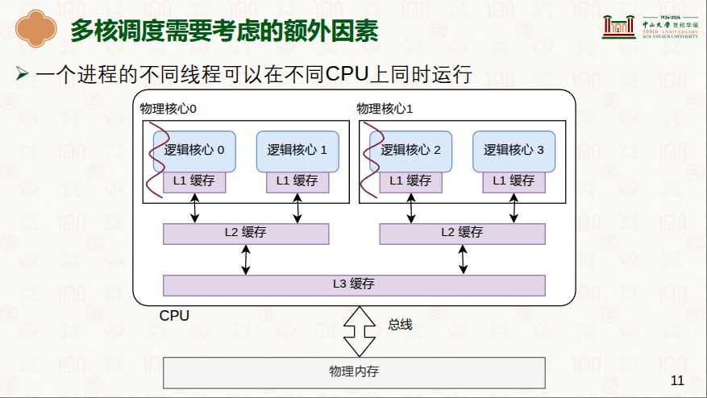
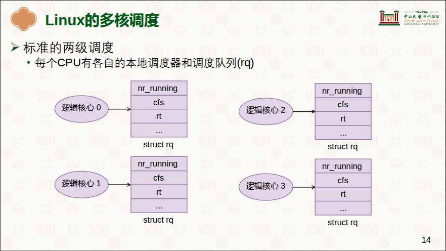
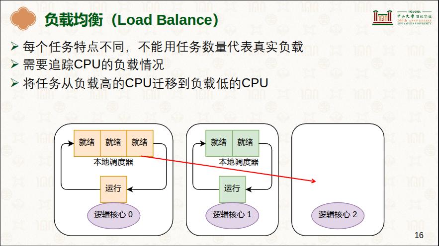

# 进程管理/调度
> 阅读: <br/> - [处理器调度：单核调度策略](../../../001.UNIX-DOCS/000.内存管理/998.REFS/000.中山大学-操作系统/6-0331-schedule-1.pdf) <br/> - [处理器调度：多核调度策略](../../../../001.UNIX-DOCS/000.内存管理/998.REFS/000.中山大学-操作系统/7-0407-schedule-2.pdf) <br/> - [Run Linux Kernel (2nd Edition) Volume 1: Infrastructure](../../../007.BOOKs/Run%20Linux%20Kernel%20(2nd%20Edition)%20Volume%201:%20Infrastructure.epub)

---

## 进程调度
|类型|核心概念|说明|备注|
|-|-|-|-|
|- 多核调度|- 任务在CPU核心之间频繁切换，对缓存不友好<sup>:因为可能之前的缓存无法使用<sup>|- 每个CPU核心(逻辑核心)都有自己的L1缓存 <br/> - 两个同属一个物理核心的逻辑核心，共享L2缓存 <br/> - 一个物理CPU上的所有物理核心共享L3缓存 |- |
|-|-|-|-|
|- Linux的多核调度： 标准的两级调度|- 每个CPU有各自的本地调度器和调度队列(rq)|-|- |
|- 两级调度问题: 负载均衡|-|-|- |
|-两级调度问题: 负载均衡: 负载追踪(负载计算) -> PELT(Per Entity Load Tracking)|-|-|- [处理器调度：多核调度策略](../../../../001.UNIX-DOCS/000.内存管理/998.REFS/000.中山大学-操作系统/7-0407-schedule-2.pdf) > P18|
|-|-|-|-|
|-程序主动选择用哪个CPU来运行|-|-|cpu_set_t mask;<br/>  CPU_ZERO(&mask);<br/> CPU_SET(0,&mask);<br/> CPU_SET(0,&mask);<br/> sched_setaffinity(0,sizeof(mask),&mask);|
|-|-|-|-|

---

## 进程优先级和权重
> 学习: <br/> [Run Linux Kernel (2nd Edition) Volume 1: Infrastructure#P7.4.2　进程优先级和权重](../../../007.BOOKs/Run%20Linux%20Kernel%20(2nd%20Edition)%20Volume%201:%20Infrastructure.epub)

- 关于进程优先级字段: [000.SOURCE_CODE/000.LINUX-5.9/000.LINUX-5.9/include/linux/sched.h](../../../000.SOURCE_CODE/000.LINUX-5.9/000.LINUX-5.9/include/linux/sched.h)
  |优先级字段|说明|备注|
  |-|-|-|
  |- prio|-|- 均参考 struct task_struct 代码注释|
  |- static_prio|-|-|
  |- normal_prio|-|-|
  |- rt_priority|-|-|

---

## 调度策略
在 [Run Linux Kernel (2nd Edition) Volume 1: Infrastructure#P7.4.2　进程优先级和权重](../../../007.BOOKs/Run%20Linux%20Kernel%20(2nd%20Edition)%20Volume%201:%20Infrastructure.epub) 中的优先级： 0 ~ 139 ， 其中 0 ~ 99 是实时优先级，100 ~ 139 是普通优先级。在task_struct结构体中，对应的是不同的字段: 为了在代码逻辑上实现硬隔离
- 0-99 (实时)：由实时调度类（Real-Time Scheduler）处理，遵循严格的优先级抢占。
- 100-139 (普通)：由完全公平调度器（Completely Fair Scheduler, CFS）处理，采用时间片轮转和优先级调整机制。


### 调度类
进程调度依赖于调度策略（schedule policy），Linux内核把相同的调度策略抽象成调度类（schedule class）。不同类型的进程采用不同的调度策略，目前Linux内核中默认实现了5种调度类，分别是stop、deadline、realtime、CFS和idle，它们分别使用sched_class来定义，并且通过next指针串联在一起
```txt
    # 按照优先级从高到低的顺序串联在一起的
    +----------+      +------------+      +------------+      +---------+      +----------+
    |   stop   | ---> |  deadline  | ---> |  realtime  | ---> |   CFS   | ---> |   idle   |
    +----------+      +------------+      +------------+      +---------+      +----------+
```

|调度类|调度策略|使用范围|说　　明|
|-|-|-|-|
|- stop|- 无|- 最高优先级的进程，比deadline进程的优先级高|（1）可以抢占任何进程。<br/>（2）在每个CPU上实现一个名为“migration/N”的内核线程，N表示CPU的编号。该内核线程的优先级最高，可以抢占任何进程的运行，一般用来运行特殊的功能。<br/>（3）用于负载均衡机制中的进程迁移、softlockup检测、CPU热插拔、RCU等|
|-|-|-|-|
|- deadline|- SCHED_DEADLINE|- 最高优先级的实时进程。优先级为−1|- 用于调度有严格时间要求的实时进程，如视频编/译码等。|
|-|-|-|-|
|- realtime|- SCHED_FIFO、SCHED_RR|- 普通实时进程。优先级为0～99|- 用于普通的实时进程，如IRQ线程化|
|-|-|-|-|
|- CFS|- SCHED_NORMAL、 SCHED_BATCH、 SCHED_IDLE|- 普通进程。 优先级为100～139|- 由CFS来调度|
|-|-|-|-|
|- idle|- 无|- 	最低优先级的进程|- 当就绪队列中没有其他进程时进入idle调度类。<br/> - idle调度类会让CPU进入低功耗模式|


