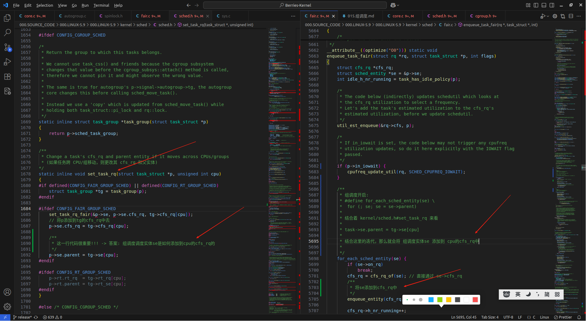
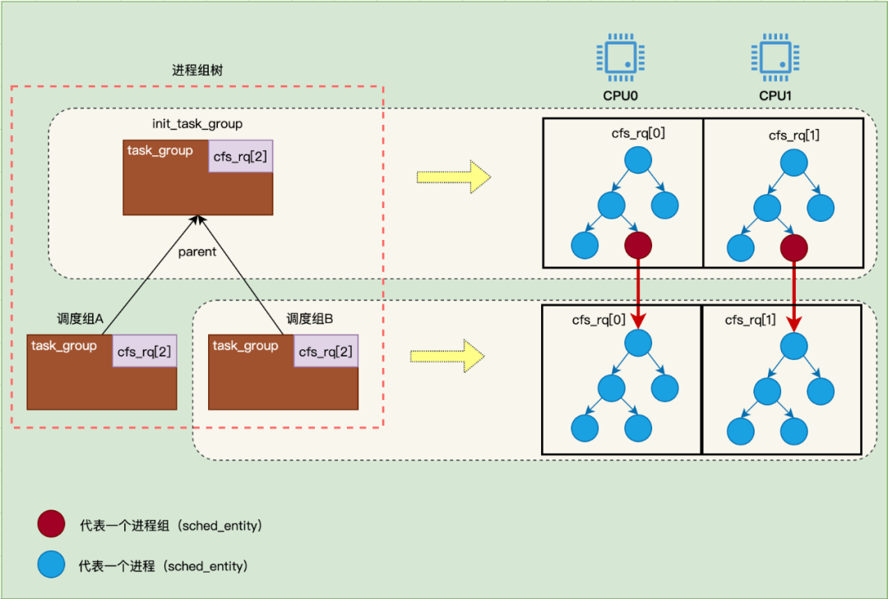

# 组调度
组调度属于cgroup架构中的cpu子系统，在系统配置时需要打开CONFIG_CGROUP_SCHED和CONFIG_FAIR_GROUP_SCHED宏。

组调度的目标： 保证每个调度组平均分配CPU时间

### 创建一个新的组调度
```c
// 000.SOURCE_CODE/000.LINUX-5.9/000.LINUX-5.9/kernel/sched/core.c
struct task_group *sched_create_group(struct task_group *parent);


// # 调度堆栈-随意摘取的一个
   // #0  sched_create_group (parent=0xffff800011e28dc0 <root_task_group>) at kernel/sched/core.c:7637
   // #1  0xffff8000100cca24 in autogroup_create () at kernel/sched/autogroup.c:71
   // #2  sched_autogroup_create_attach (p=0xffff00003d888000) at kernel/sched/autogroup.c:172
   // #3  0xffff80001008e7dc in ksys_setsid () at kernel/sys.c:1200
   // #4  0xffff80001008e818 in __arm64_sys_setsid (__unused=<optimized out>) at kernel/sys.c:1207
   // #5  0xffff800010017c44 in __invoke_syscall (syscall_fn=<optimized out>, regs=<optimized out>) at arch/arm64/kernel/syscall.c:36
   // #6  invoke_syscall (syscall_table=<optimized out>, sc_nr=<optimized out>, scno=<optimized out>, regs=<optimized out>) at arch/arm64/kernel/syscall.c:48
   // #7  el0_svc_common (regs=0xffff00003bd5c800, scno=<optimized out>, syscall_table=0x1, sc_nr=<optimized out>) at arch/arm64/kernel/syscall.c:149
   // #8  0xffff800010017d64 in do_el0_svc (regs=<optimized out>) at arch/arm64/kernel/syscall.c:195
   // #9  0xffff8000100072e0 in el0_svc (regs=<optimized out>) at arch/arm64/kernel/entry-common.c:235
   // #10 el0_sync_handler (regs=<optimized out>) at arch/arm64/kernel/entry-common.c:248
   // #11 0xffff800010002d98 in el0_sync () at arch/arm64/kernel/entry.S:663
```


### 把进程添加到组调度
```c
/**
 * 把进程添加到组调度的情况
 */
__attribute__((optimize("O0"))) static void cpu_cgroup_attach(struct cgroup_taskset *tset);
```

### 

### 组调度基本流程([Run Linux Kernel (2nd Edition) Volume 1: Infrastructure.epub#8.1.8　组调度机制])
组调度的基本策略如下。
1. 在创建组调度tg时，tg为每个CPU同时创建组调度内部使用的cfs_rq。
2. 组调度作为一个调度实体添加到系统的CFS就绪队列rq->cfs_rq中。
3. 进程添加到一个组中后，进程就脱离了系统的CFS就绪队列，并且添加到组调度里的CFS就绪队列tg->cfs_rq[]中。
   + 体现在?
     ```txt
         #0  sched_move_task (tsk=0xffff00003db0b800) at kernel/sched/core.c:7737
     ```
4. 在选择下一个进程时，从系统的CFS就绪队列开始，如果选中的调度实体是组调度tg，那么还需要继续遍历tg中的就绪队列，从中选择一个进程来运行。
   + 体现在?
      - 调度组会被作为一个调度实体entity挂在rq->cfs_rq上（每个tg数据结构中会有cpu_nr个se），从cpu的rq->cfs_rq上选择entity运行时，就有可能选择到代表调度组的entity，此时就需要在调度组tg中继续挑选任务，挑选的过程会先选当前cpu在此tg中对应的cfs_rq（每个tg数据结构中会有cpu_nr个cfs_rq），再从tg->cfs_rq[cpu_nr]上选择一个entity进行调度。若选择到的仍是代表tg的entity，则继续遍历。
      - 
         + 在 cpu_cgroup_attach 流程中 , set_task_rq 在函数 sched_change_group() 中
  + 

---

## 实验
### 组调度调度实体添加到CPU的cfs_rq中: 创建一个组调度，添加一个普通的进程到调度组中
```log
# 查看当前 cgroup 版本
mount | grep cgroup

# 如果未挂载，手动挂载（通常系统已自动挂载）
sudo mount -t cgroup2 none /sys/fs/cgroup

# 进入 cgroup 目录
cd /sys/fs/cgroup

# 创建一个新的 CPU 控制组（例如 "my_group"）
sudo mkdir my_group

# 将当前进程添加到指定的cgroup
echo $$ | sudo tee /sys/fs/cgroup/cpu/my_group/cgroup.procs
# 将指定进程添加到cgroup
echo ${pid} | sudo tee /sys/fs/cgroup/cpu/my_group/cgroup.procs


## 暂未实验通过
```


## 待办事项
- 组调度流程代码分析?

## 参考资料
- [Run Linux Kernel (2nd Edition) Volume 1: Infrastructure.epub#8.1.8　组调度机制]
- [示意图: 双核处理器系统中的组调度数据结构关系] ON [Run Linux Kernel (2nd Edition) Volume 1: Infrastructure.epub#8.1.8　组调度机制]