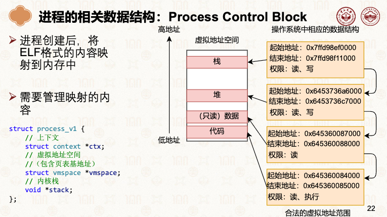

# 进程管理

## 进程的数据结构 + 内存管理 + ELF (Executable and Linkable Format（可执行与可链接格式）)
进程创建后，将ELF格式的内容映射到内存中

- [001.UNIX-DOCS/001.操作系统课程/001.中山大学-操作系统2026/第五周：进程与线程I.pdf](../../001.UNIX-DOCS/001.操作系统课程/001.中山大学-操作系统2026/第五周：进程与线程I.pdf)#P22