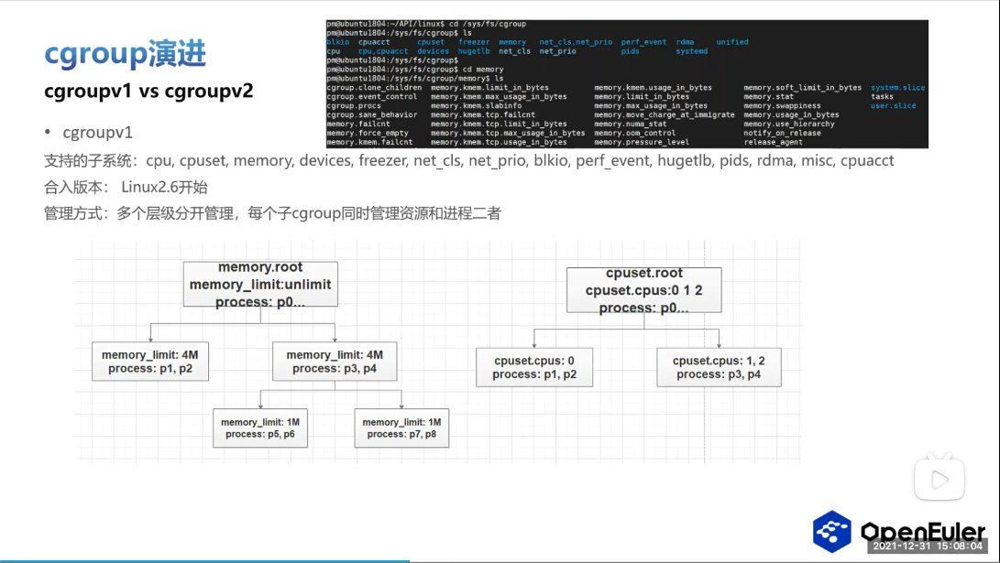
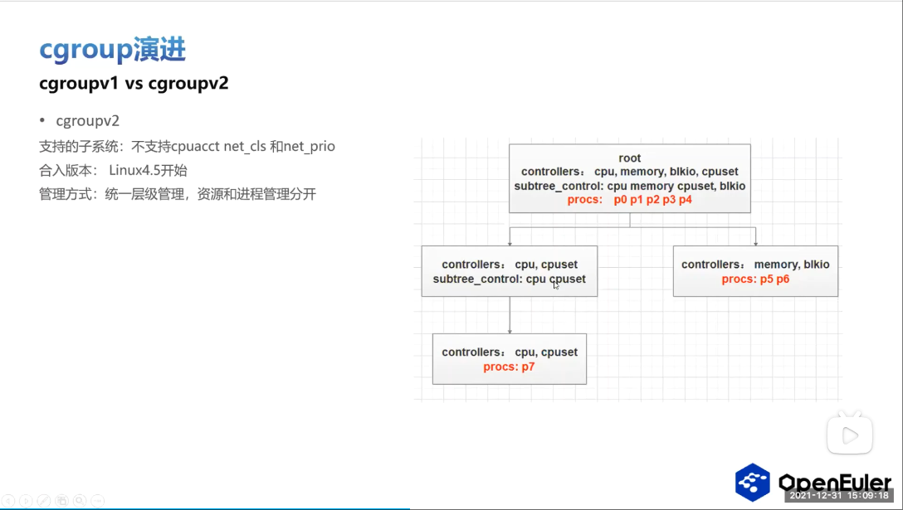

# 000.Hierarchy(层级)的区别
## 区别总览
- 

---

## CGroup v1
- 
   + “多个层级分开管理” 中的层级，每个不同的子系统构成一棵树(树，即层级)，即 每棵树(树，即层级)管理不同的资源
   + 非叶子节点能管理进程: 非叶子节点既管理资源，也管理进程,也说明了:
     - `进程之间存在资源方面的父子关系`

---

## CGroup v2
- 
   + 将所有支持的子系统划分为一棵树(一个层级)，进程只能在root下或者叶子节点上：
     - 非叶子节点管理资源，叶子节点管理进程