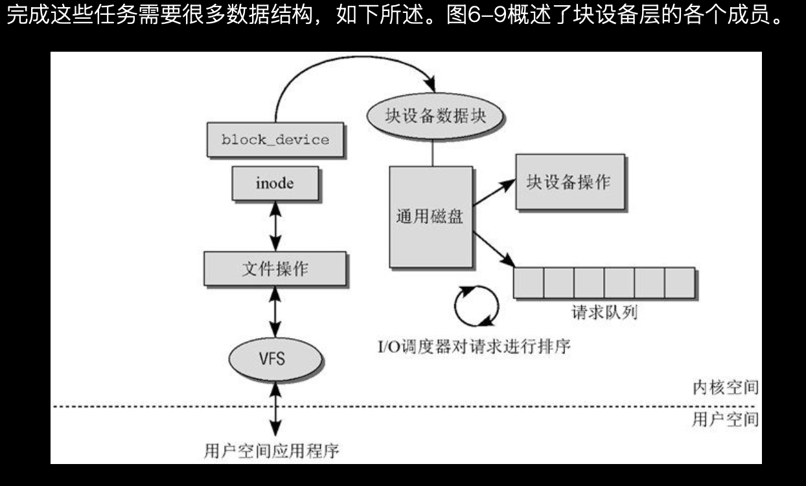

# 块设备的操作
> 学习: [深入Linux内核架构](../../../007.BOOKs/Professional-Linux-Kernel-Architecture.epub) [17-文件系统：基于inode的文件系统 [中山大学 操作系统原理]](../../001.UNIX-DOCS/001.操作系统课程/000.中山大学-操作系统2025/9-0424-fs.pdf)   [18-文件系统：使用文件系统 [中山大学 操作系统原理]](../../001.UNIX-DOCS/001.操作系统课程/000.中山大学-操作系统2025/10-0428-fs.pdf)    [深入理解Linux内核:虚拟文件系统](../../007.BOOKs/Professional-Linux-Kernel-Architecture.epub)    [文件系统崩溃一致性](../../001.UNIX-DOCS/001.操作系统课程/000.中山大学-操作系统2025/11-0508-fs-crash-1.pdf)    [文件系统崩溃一致性II](../../001.UNIX-DOCS/001.操作系统课程/000.中山大学-操作系统2025/12-0512-fs-crash-2.pdf)

|项|说明|参考|备注|
|-|-|-|-|
|- 页缓存|- The physical memory is volatile and the common case for getting data into the memory is to read it from files. Whenever a file is read, the data is put into the `page cache` to avoid expensive disk access on the subsequent reads. Similarly, when one writes to a file, the data is placed in the page cache and eventually gets into the backing storage device. The written pages are marked as `dirty` and when Linux decides to reuse them for other purposes, it makes sure to synchronize the file contents on the device with the updated data.物理内存是易失性的（断电即丢失），而数据进入内存最常见的途径就是从文件中读取。每当读取文件时，数据会被放入 page cache（页面缓存）中，以避免后续再次读取时产生高昂的磁盘访问开销。 同样地，当向文件写入数据时，数据也会被放入页面缓存，并最终写入底层的存储设备。这些被写入的页面会被标记为 dirty（脏页）。当 Linux 决定回收这些页面用于其他用途时，会确保将设备上该文件的内容与更新后的数据进行同步。|- [Documentation/admin-guide/mm/concepts.rst](../../../000.SOURCE_CODE/003.LINUX-7.1.3/000.LINUX-7.1.3/Documentation/admin-guide/mm/concepts.rst)|-|
|-|-|-|-|
|- 页缓存与脏页 读写都有缓存!|- |- 为提高读写效率，操作系统会设置文件缓存: &nbsp;&nbsp;&nbsp;&nbsp;- 不用每次read/write都去读写硬盘: &nbsp;&nbsp;&nbsp;&nbsp;- 数据没有真的写在硬盘中，而是写在内存中缓存   - 对块设备的访问有大规模的缓存，即已经读取的数据保存在内存中。如果再次需要，则直接从内存获得。**写入操作也使用了缓存，以便延迟处理**  - “对块设备的读写请求不会立即执行对应的操作。相反，这些请求会汇总起来，经过协同之后传输到设备。(请求队列)”|- [17-文件系统：基于inode的文件系统 [中山大学 操作系统原理]#P13](../../../001.UNIX-DOCS/001.操作系统课程/000.中山大学-操作系统2025/9-0424-fs.pdf)  - [深入Linux架构#“6.5　块设备操作”](../../../007.BOOKs/Professional-Linux-Kernel-Architecture.epub)|
|-|-|-|-|
|- 块设备的读写请求放置在一个队列上：请求队列|- 块设备操作数据结构: [include/linux/blkdev.h#struct block_device_operations](../../../000.SOURCE_CODE/000.LINUX-5.9/000.LINUX-5.9/include/linux/blkdev.h)|-|- [深入理解Linux内核#“6.5　块设备操作”](../../007.BOOKs/Professional-Linux-Kernel-Architecture.epub)|
|-|-|-|-|
|- 块设备层|- 块设备层不仅负责寻址设备，也负责执行其他任务，以提高系统中所有块设备的性能：包括预读算法的实现，在内核判断应用程序稍后将需要使用某数据时，会使用预读算法从块设备预先将数据读入内存|- |- [深入理解Linux内核#“6.5　块设备操作”](../../007.BOOKs/Professional-Linux-Kernel-Architecture.epub)|
|-|-|-|-|
|- 块设备的表示(块设备层的各个成员)|- |- 在 Linux 内核的块设备架构中，“块设备操作”与“请求队列”被画成平级，是因为它们并非上下级调用关系，而是协同工作的两个核心组件，共同构成块设备 I/O 处理的完整流程请求队列是“蓄水池”，而块设备操作（驱动程序）是“水龙头”: 块设备操作（即驱动程序代码）会向磁盘控制器发送指令（比如通过 DMA 传输数据），真完成数据的读取或写入。 &nbsp;&nbsp;&nbsp;- 块设备操作：指代的是块设备驱动层提供的操作接口集合（如 request_fn 或 mq_ops），它定义了“如何执行一个 I/O 请求”，包括读取、写入、设备重置等具体动作。它是“执行者”，负责最终将请求转化为硬件指令。 &nbsp;&nbsp;&nbsp;- 请求队列：是 I/O 请求的“缓冲区”和“调度器”的工作场所。所有来自上层的 I/O 请求（bio）首先被封装成 request 结构体并放入队列。I/O 调度器（如 CFQ、Deadline、BFQ）会在此队列中对请求进行排序、合并、优先级调整，以优化设备访问效率。|- [深入理解Linux内核#“6.5.1　块设备表示”](../../007.BOOKs/Professional-Linux-Kernel-Architecture.epub)|
|-|-|-|-|
|-|-|-|-|