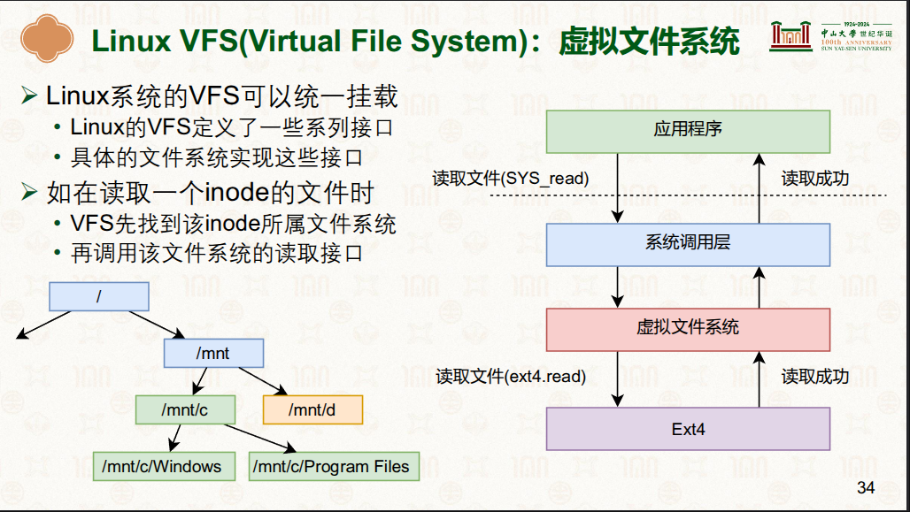
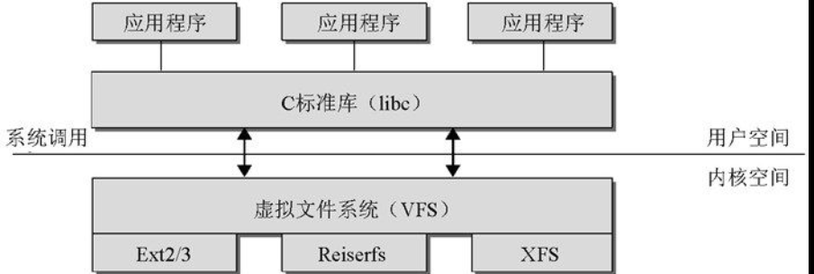

# 虚拟文件系统VFS(Virtual File System.VFS)

## VFS 架构
- 

## 虚拟文件系统应用
|应用|文件系统名称|说明|
|-|-|-|
|cgroup|wei@Berries:/sys/fs/cgroup$ stat -f -c %T .   cgroup2fs|参考:[001.UNIX-DOCS/032.Control-Groups(CGroups)](../../../001.UNIX-DOCS/032.Control-Groups(CGroups))|
|-|-|-|
|- struct file_operations |- 由VFS层用来与用户空间通信，会调用 stuct block_device_operations 中的函数，来实现与块设备通信 |-|
|-|-|-|
|- Linux 内核在用户进程（或C标准库）和文件系统实现之间引入了一个抽象层： 虚拟文件系统（Virtual File System.VFS）|-    - 用来提供一种操作文件、目录及其他对象的统一方法 - 必须能够与各种方法给出的具体文件系统的实现达成妥协 - 内核支持多种文件系统: 网络文件系统（NFS、coda）、虚拟的文件系统（proc）、ReiserFS 和 XFS 都是基于块设备（Block Device）的日志文件系统|-|
|-|-|-|

---

## 参考资料
- [18-文件系统：使用文件系统 [中山大学 操作系统原理]](./000.REFS/001.文件系统-2.pdf)#P34
- [深入理解Linux内核:虚拟文件系统](../../../007.BOOKs/Professional-Linux-Kernel-Architecture.epub)