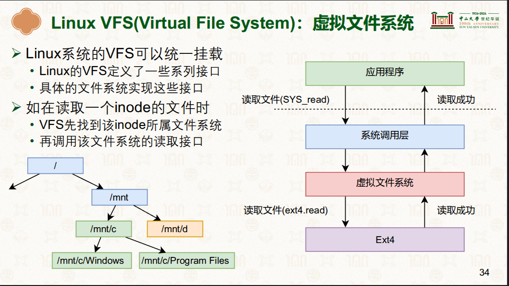

# 虚拟文件系统VFS(Virtual File System.VFS)

## VFS 架构
- 

## 虚拟文件系统应用
|应用|文件系统名称|说明|
|-|-|-|
|cgroup|wei@Berries:/sys/fs/cgroup$ stat -f -c %T .   cgroup2fs|参考:[001.UNIX-DOCS/032.Control-Groups(CGroups)](../../../001.UNIX-DOCS/032.Control-Groups(CGroups))|
|-|-|-|
|-|-|-|
|-|-|-|

---

## 参考资料
- [18-文件系统：使用文件系统 [中山大学 操作系统原理]](./000.REFS/001.文件系统-2.pdf)#P34
- [深入理解Linux内核:虚拟文件系统](../../../007.BOOKs/Professional-Linux-Kernel-Architecture.epub)