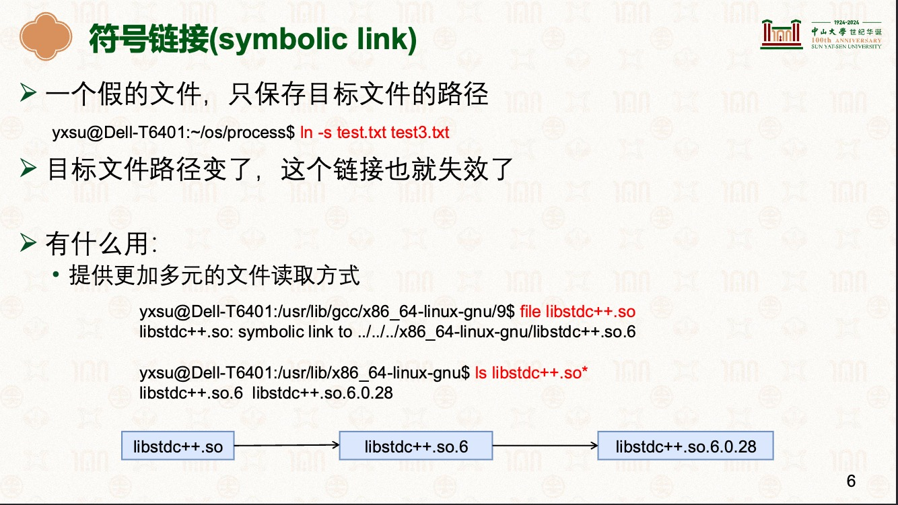
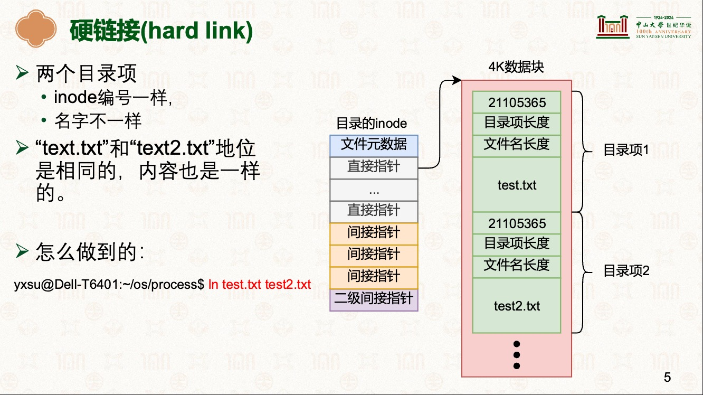

# 符号链接和硬链接
|名称|区别|备注|
|-|-|-|
|符号链接(symbolic link)|- 假的文件，只保存目标文件的路径,路径变了，链接也就失效了   - 相应的inode的数据段包含一个字符串：链接目标的路径|- |
|-|-|-|
|硬链接(hard link)|- 两个目录项，inode编号一样，只是名字不一样  - 创建的目录项使用了一个现存的inode编号|- |
|-|-|-|

## 参考文件
- [操作系统原理:文件系统II](../000.内存管理/998.REFS/000.中山大学-操作系统/10-0428-fs.pdf)
- [007.BOOKs/Professional-Linux-Kernel-Architecture.epub#8.2.2 链接](../../007.BOOKs/Professional-Linux-Kernel-Architecture.epub)