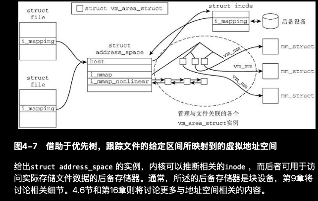

# 地址空间
> 学习: <br/> - [Professional-Linux-Kernel-Architecture.epub#"163. 地址空间"](../../../007.BOOKs/Professional-Linux-Kernel-Architecture.epub) <br/> - [Professional-Linux-Kernel-Architecture.epub#"“4.6　地址空间"](../../../007.BOOKs/Professional-Linux-Kernel-Architecture.epub)
## 简介
- 内核使用通用的 地址空间 方案，建立缓存数据与其来源之间的关联。
  + 尽管文件构成缓存数据的一大部分，但是地址空间接口非常通用，使得缓存也可以容纳其他来源的数据，并快速访问.

- 文件的内存映射可以认为是两个不同的地址空间之间的映射： 一个地址空间是用户进程的虚拟地址空间；另一个是文件系统所在的地址空间。
  + “在内核创建一个映射时，必须建立两个地址空间之间的关联，以支持二者以读写请求的形式通信。vm_operations_struct结构即用于完成该工作，”，“但该操作不了解映射类型或其性质的相关信息。由于存在许多种类的文件映射（不同类型文件系统上的普通文件、设备文件等），因此需要更多的信息。实际上，内核需要更详细地说明数据源所在的地址空间。”（“address_space 结构，即为该目的定义，包含了有关映射的附加信息。”）
    - 
       + 优先查找树: “优先查找树（priority search tree）用于建立文件中的一个区域与该区域映射到的所有虚拟地址空间之间的关联。”

## 数据结构
```c
// include/linux/fs.h
struct address_space {
	struct inode		*host;
	struct xarray		i_pages;
	gfp_t			gfp_mask;
	atomic_t		i_mmap_writable;
#ifdef CONFIG_READ_ONLY_THP_FOR_FS
	/* number of thp, only for non-shmem files */
	atomic_t		nr_thps;
#endif
	struct rb_root_cached	i_mmap;
	struct rw_semaphore	i_mmap_rwsem;
	unsigned long		nrpages;
	unsigned long		nrexceptional;
	pgoff_t			writeback_index;
	const struct address_space_operations *a_ops;
	unsigned long		flags;
	errseq_t		wb_err;
	spinlock_t		private_lock;
	struct list_head	private_list;
	void			*private_data;
} __attribute__((aligned(sizeof(long)))) __randomize_layout;
```