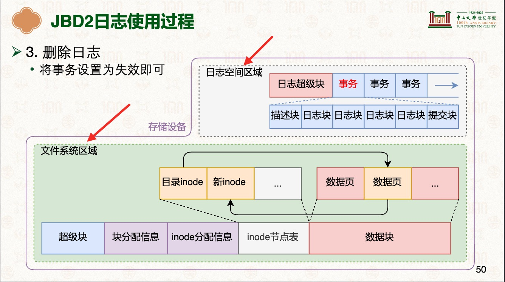

# 文件系统崩溃一致性
先学习:   [17-文件系统：基于inode的文件系统 [中山大学 操作系统原理]](./000.REFS/000.文件系统-1.pdf)   [18-文件系统：使用文件系统 [中山大学 操作系统原理]](./000.REFS/001.文件系统-2.pdf)   [深入理解Linux内核:虚拟文件系统](../../007.BOOKs/Professional-Linux-Kernel-Architecture.epub)   [文件系统崩溃一致性](../000.内存管理/998.REFS/000.中山大学-操作系统/11-0508-fs-crash-1.pdf)    [文件系统崩溃一致性II](../000.内存管理/998.REFS/000.中山大学-操作系统/12-0512-fs-crash-2.pdf) 

## 文件系统一致性约束
- inode中保存的文件大小，应该与其索引中保存的数据块个数相匹配
- inode中保存的链接数，应与指向其的目录项个数相同
- 超级块中保存的文件系统大小，应该与文件系统所管理的空间大小相同
- 所有inode分配表中标记为空闲的inode均未被使用
- 标记为已用的inode 均可以通过文件系统操作访问

## 文件系统崩溃一致性应对方案
### 文件系统崩溃一致性说明
+ 不是追求不丢失数据，而是尽量保证文件系统结构不被损坏（一致性）
+ 事务如果没写完就崩溃了：扔掉不完整的事务就好
+ 事务写完之后再崩溃: 根据事务的记录，重启时可以恢复对文件系统的修改

### 应对方案
|方案名称|说明|备注|
|-|-|-|
|日志: 日志系统JBD2|- 原子更新技术|- [文件系统崩溃一致性](../000.内存管理/998.REFS/000.中山大学-操作系统/11-0508-fs-crash-1.pdf)P53   - Ext4文件系统内部结构图: |
|-|-|-|
|写时复制|- 原子更新技术|-|
|-|-|-|
|Soft Updates|-|-|
|-|-|-|
|日志文件系统|- 只留日志，不要原文件系统了|- [文件系统崩溃一致性II](../000.内存管理/998.REFS/000.中山大学-操作系统/12-0512-fs-crash-2.pdf)   - 这里的 “段(Segment)” 思想和MySQL Innodb-Page-Structure中的 “段”[007.参考资料/MySQL Technical Insider-InnoDB Engine.epub]#4.2.2　段 思想是一样的： 逻辑上的随机访问与物理上的顺序写入之间的矛盾 |
|-|-|-|
